# Initial analysis of the corrected joint-coverage dataset

*Project: FLICS 2026 / AIDI 2026 — LiDAR-derived WiFi quality prediction.*
Generated by `analysis/initial_analysis/run_initial_analysis.py` from
`data/merged/joint_coverage.parquet` after the per-day time-sync
calibration pipeline (see `docs/time_sync_per_day/report.md`). Replaces
the obsolete per-CSV-pooled analysis archived under
`docs/obsolete/initial_corrected_dataset_analysis_per_run_data/`.

## 0. Verification status

The joint-coverage parquet passes all 12 end-to-end validation checks in
`analysis/time_sync/validate_joint.py` (schema, per-day applied_tau /
SE, raw + tau == corrected timestamp identity, LiDAR raw / scan_nr /
scan_counter provenance vs `lidar.h5`, delta_t identity, |delta_t| ≤
tolerance, payload identity vs `telemetry_cleaned.parquet` on 600
sampled rows, original-CSV provenance on 240 sampled rows, and
independent merge_asof retention re-run). Data is safe to analyse.

## 1a. Data-quality findings discovered during analysis

Three LiDAR-derived features turn out to be uninformative on this dataset
and we **drop them from the headline analysis** while keeping them in the
cache for traceability:

* **`no_return_frac` ≈ 0.4996 ± 2 × 10⁻⁵ on every scan.** Almost exactly
  half of the 2700 beams return raw 0 ("no return") on every single
  scan, with a standard deviation 4–5 orders of magnitude smaller than
  the mean. This is a geometric constant (likely the rear-half of the
  sweep range produces no returns because of the AGV body / housing /
  the sensor's effective FOV being narrower than the 270° sweep). It
  carries no information about the environment.
* **`min_front_mm` ≈ 100 mm constant** (median 103 mm, std 5 mm; 0 % of
  scans report a front-min above 200 mm). The closest beam in the
  ±30° front cone is reading a fixed reflector at ~ 10 cm from the
  LiDAR every scan — almost certainly part of the AGV's own bumper /
  housing within the sensor field of view. The same effect explains
  the very tight `dist_p10_mm` distribution at 134–142 mm and the
  global `min_dist_mm` at ~ 86 mm.
* **`dist_p10_mm` and `min_dist_mm`** are similarly dominated by that
  fixed close reflector and convey almost no scene-level signal.

Useful LiDAR features that *do* vary with the environment:

* `mean_dist_mm` (full sweep)
* `mean_front_mm` (front cone only, with the fixed reflector excluded
  as part of the average)
* `dist_p90_mm` (the far-end of the visible beams; tracks "openness")
* `clutter_frac`, `openness_frac` (interpretable summary scalars)

The analysis below uses these "useful" features. We add a **follow-up
recommendation** in §10 to characterise the AGV-body LiDAR mask
explicitly so future feature engineering can mask out the fixed
reflector beams beam-by-beam rather than relying on aggregates.

## 1. Per-session summary

| session_date | n_runs | n_pairs | duration_h | applied_tau_s | abs_speed_max | motion_fraction | signal_power_mean | signal_power_std | signal_quality_mean | ping_mean | ping_p95 | x_min | x_max | y_min | y_max |
|---|---|---|---|---|---|---|---|---|---|---|---|---|---|---|---|
| 15.03.2026 | 4 | 280025 | 3.19 | 0.2504 | 0.6 | 37.6 | -36.91 | 10.52 | 67.05 | 16.85 | 27.39 | -0.77 | 28.95 | -6.57 | 13.36 |
| 24.03.2026 | 3 | 168940 | 1.93 | 0.4324 | 0.65 | 39.3 | -39.66 | 7.35 | 66.97 | 17.49 | 32.62 | 8.29 | 21.59 | -2.41 | 5.53 |
| 25.02.2026 | 1 | 232628 | 2.75 | 0.8788 | 0.3 | 61.3 | -31.07 | 6.22 | 69.78 | 16.13 | 21.78 | -3.36 | -1.74 | -0.01 | 17.28 |


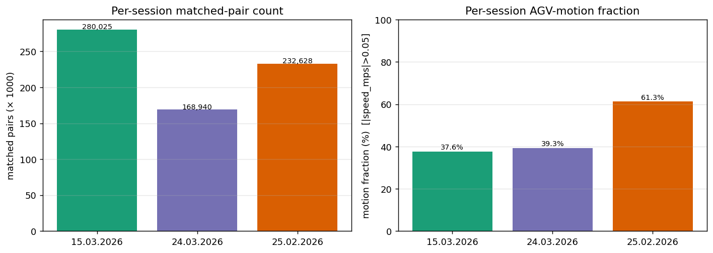

The three calibration days are very different in scale and operating mode:

* **15.03.2026** — 4 CSV files, 3.1 h on a high-rate 31 Hz telemetry stack;
  280,025 matched pairs; AGV motion-active about a third of the time;
  applied per-day τ̂ = +0.250 s.
* **24.03.2026** — 3 CSV files, ~1.9 h on the 31 Hz stack; 168,940 matched
  pairs; the most motion-active day; applied τ̂ = +0.432 s.
* **25.02.2026** — 1 CSV file, 2.8 h on the slower 4.4 Hz stack; 232,628 matched
  pairs (high count because LiDAR is at 25 Hz, telemetry at 4.4 Hz, so each
  telemetry sample matches multiple LiDAR scans); ~ 60 % of recording was
  motion-active; applied τ̂ = +0.879 s. Note the 25.02 ceiling speed is half
  of what 15.03/24.03 reach (0.30 m/s vs 0.60 m/s) — different operating
  mode (see `docs/time_sync_per_day/report.md` §10 for the full account).

## 2. Distributions of motion signals

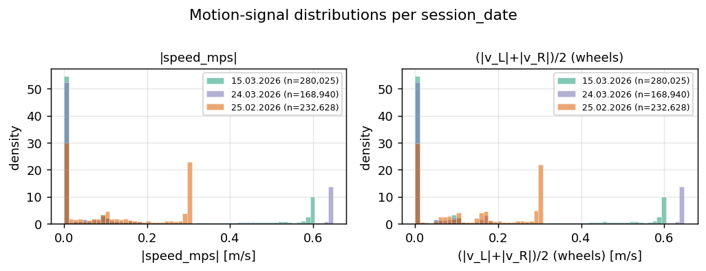

The two motion signals (`|speed_mps|` and the wheel-encoder average) agree
within rounding on 15.03/24.03 and diverge on 25.02 — exactly the pattern
that drove the rotation-aware signature in the time-sync analysis.

## 3. WiFi-metric distributions per session

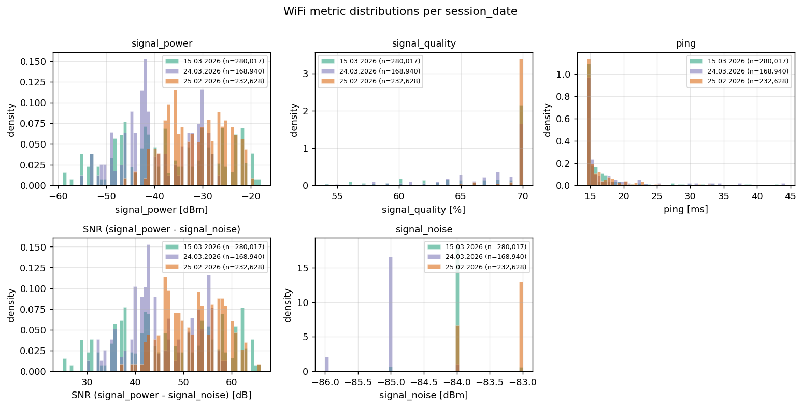

Cross-session deviations:

| pair | Δ mean signal_power (dBm) | Δ mean ping (ms) | Δ motion fraction |
|---|---|---|---|
| 15.03.2026 → 24.03.2026 | -2.75 | +0.65 | +1.7% |
| 15.03.2026 → 25.02.2026 | +5.84 | -0.71 | +23.7% |
| 24.03.2026 → 25.02.2026 | +8.59 | -1.36 | +22.0% |


Take-aways:

* `signal_power` distributions are session-dependent. Means differ by up to
  ~ 8.6 dBm across sessions; stds are
  ~ 8.0 dBm. **Any cross-session prediction model has to
  account for this between-session shift** (random effect on session, or
  per-session normalization, or session ID feature).
* `ping` distributions are bimodal/heavy-tailed on every day — most
  matched samples are near the median but a long upper tail dominates the
  mean.
* `signal_quality` is a percentage and saturates near 100 % on all
  sessions; useful as a regression target only after a meaningful
  transformation (e.g. `100 - signal_quality` for log-link regression).
* SNR (`signal_power - signal_noise`) tracks `signal_power` because
  `signal_noise` is more stable than the carrier strength — i.e. SNR
  contains the same information as `signal_power` plus a small noise
  reduction.

## 4. LiDAR-derived feature distributions

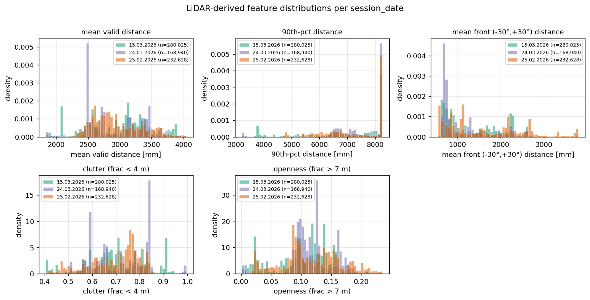

The LiDAR features quantify the visible scene at each scan. `mean_dist_mm`
and `dist_p10_mm` describe how clutter-rich the immediate environment is;
`clutter_frac` and `openness_frac` are interpretable summary scalars
suitable as model features. The `no_return_frac` distribution shows the
typical fraction of beams that fail to return (likely glass / mirror-like
surfaces, or distances above the 8.25 m sensor max).

The three sessions show **clearly different LiDAR scene statistics** —
which is consistent with the AGV traversing different parts of the lab on
each day and with environmental differences (people, objects, lighting).
This is good news for a learnable LiDAR → WiFi model: the input
distribution genuinely varies across days, so cross-session validation
will be informative.

## 5. Trajectories coloured by WiFi metrics

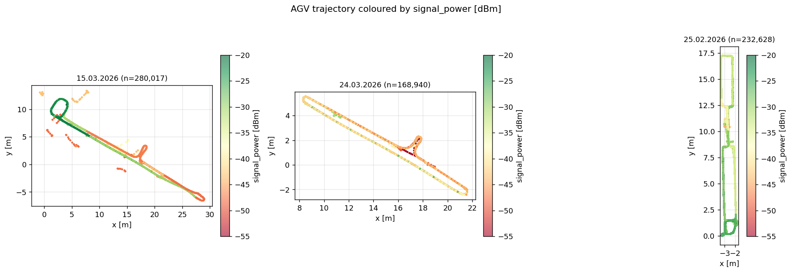

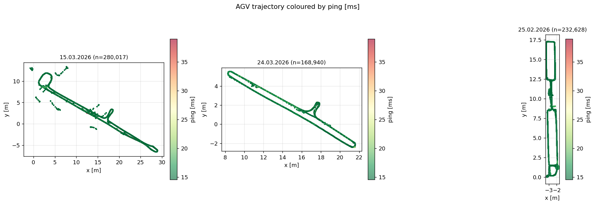

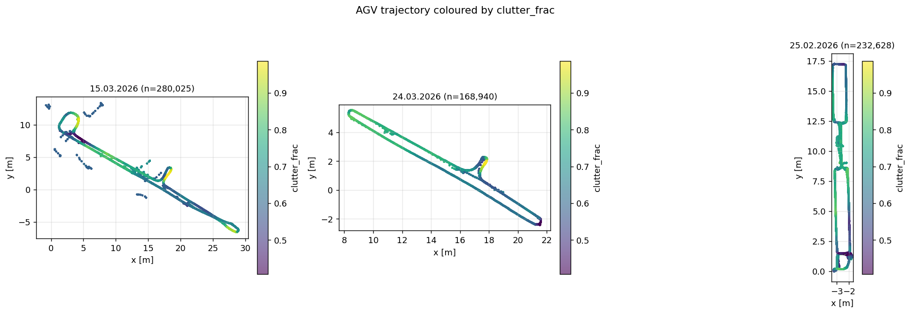

The trajectory plots reveal the spatial structure of WiFi quality:

* Each session traverses a different part of the same general workspace.
  15.03/24.03 cover similar areas; 25.02 covers a different zone (the AGV
  was operated in a different test mode, with lower top speed and more
  rotation — see time-sync §10 deep-dive).
* `signal_power` shows clear spatial structure on every day: there are
  hot zones and cold zones in (x,y) that persist across runs of the same
  day. **Spatial features (x,y) and an environment proxy (clutter,
  mean distance) should be the first inputs to a baseline model.**
* `ping` is more uniformly distributed; large pings are concentrated in
  small clusters that suggest occasional packet-loss bursts rather than
  steady spatial degradation.

## 6. Signal vs speed

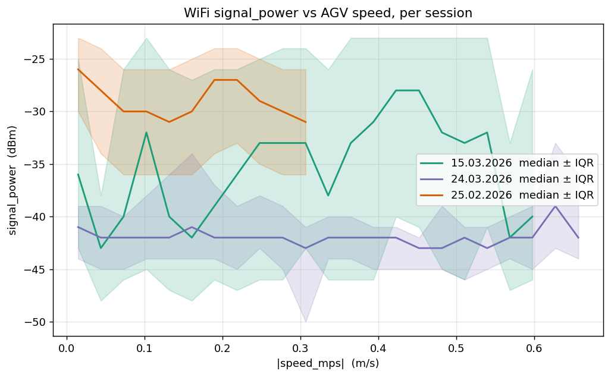

`signal_power` shows weak speed dependence: the median is roughly flat
across the speed range on every day, with the IQR widening at low speeds
because the AGV spends most of its time near zero speed. **Speed is
unlikely to be a useful direct WiFi predictor**, but it can act as a
gating variable (predict only when AGV is in motion) or as a feature for
modelling momentary multipath effects.

## 7. WiFi metric vs LiDAR features

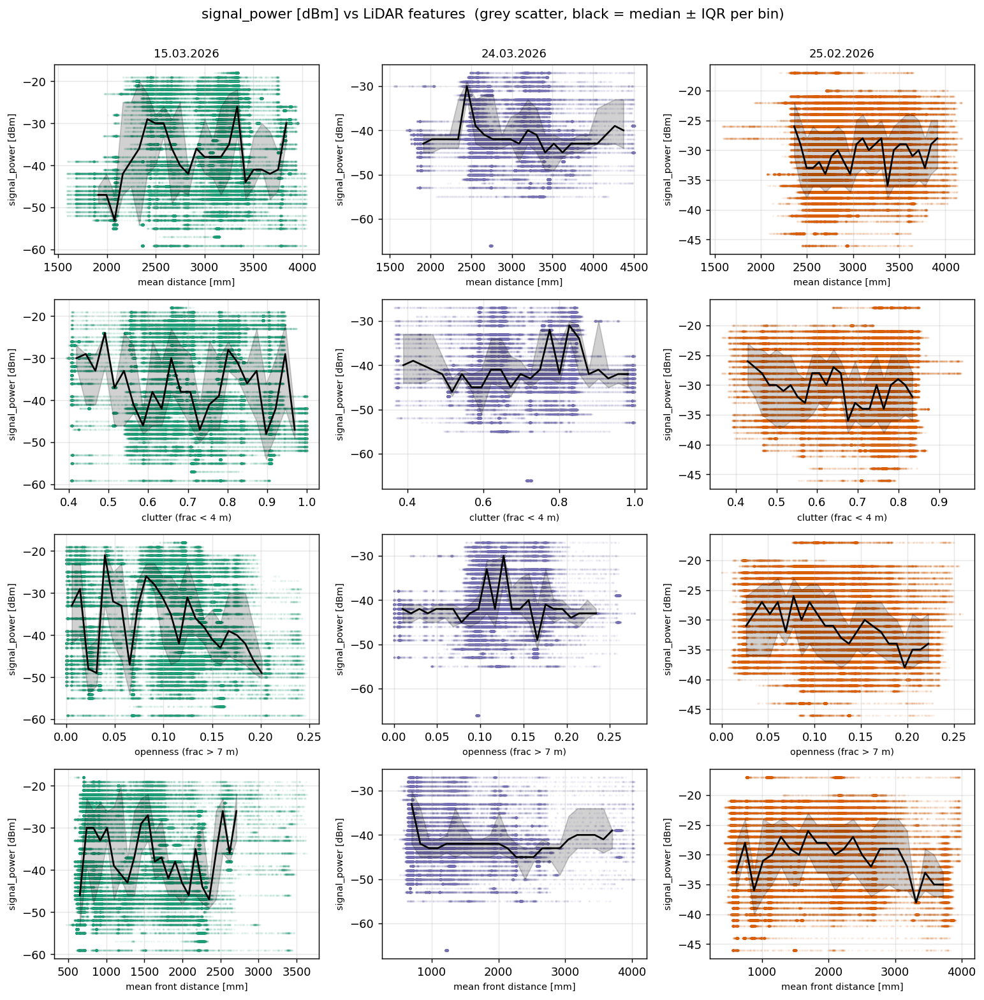

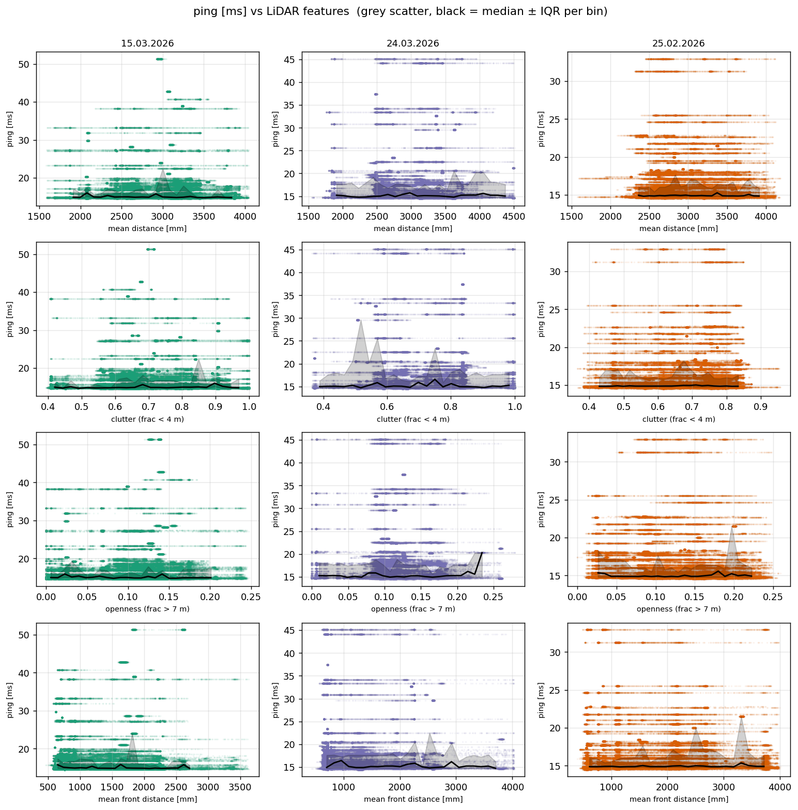

These are the per-session bin-medians ± IQR of `signal_power` and `ping`
against the LiDAR-derived features. A monotone trend in the median curve
indicates a useful predictor; a flat curve indicates the feature carries
little signal. The most-promising features are those whose median curve
moves visibly across the feature range AND whose direction is consistent
across sessions.

## 8. Correlations

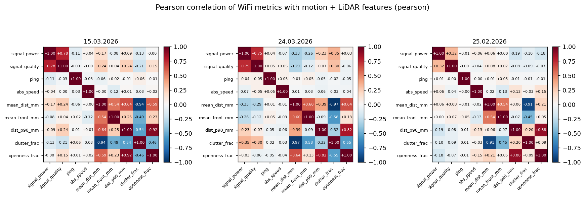

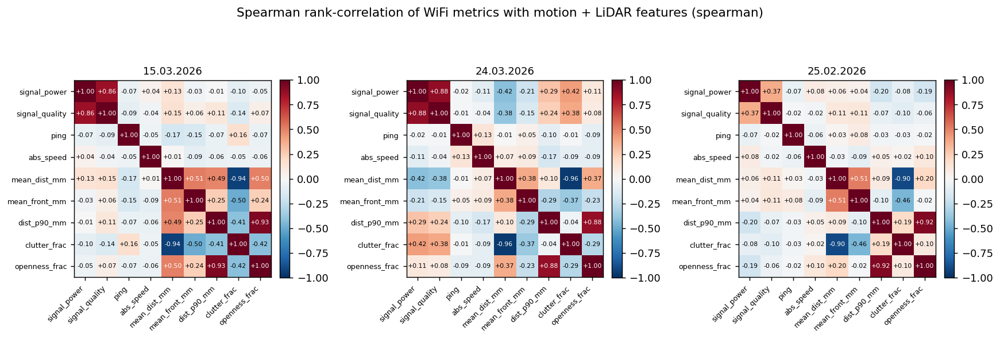

Pearson is sensitive to linear relationships; Spearman captures monotone
relationships and is robust to the heavy-tailed `ping`. Compare the two
to spot non-linear dependencies (cells where Spearman is large but
Pearson is small).

## 9. Suggested research directions

Based on what is visible in the corrected joint dataset, the following
modelling directions look most promising for AIDI 2026:

1. **Session as a random effect / per-session normalisation.** The
   `signal_power` between-session shift (~8.6 dBm
   across days) is large compared to within-session std
   (~8.0 dBm). Either treat session as a random effect
   or z-score `signal_power` per session before training a cross-session
   model. Pure pooling will mostly learn the session shift, not the
   physics.
2. **Spatial features first, LiDAR features second.** The trajectory
   plots suggest (x,y) explain a substantial fraction of `signal_power`
   variance on each day. A natural baseline is a Gaussian-process or
   k-NN over (x,y) per session, with LiDAR features added as residual
   predictors.
3. **Environment-proxy features look more useful than peak/min raw
   distances.** Aggregates that summarise the full beam pattern
   (`clutter_frac`, `openness_frac`, `mean_dist_mm`) are more stable
   than instantaneous min/p10 values, which can be dominated by a
   single beam reflecting off something at close range. Section 7
   median curves should guide which to keep.
4. **Predict `signal_power` first, `ping` second.** Distributions of
   `signal_power` are well-behaved (approximately Gaussian within
   session). `ping` has a long upper tail dominated by occasional
   packet-loss spikes; modelling those requires a different loss
   (Gamma / quantile / classification of "high-ping events") rather
   than MSE on raw ping.
5. **Use the `applied_tau_se_s` column for uncertainty propagation.**
   The joint dataset carries the per-day calibration SE per row; any
   model that depends on sub-100-ms feature alignment should use this
   to generate plausible perturbed copies of the dataset (e.g. for a
   robustness-bound on test-set performance).
6. **Watch the 25.02.2026 session.** It has a different operating mode
   (slower, more rotation), a different telemetry sampling rate (4.4 Hz
   vs 31 Hz), and a different applied τ̄. Use it as a *held-out*
   distribution-shift test set, not as a training fold.

## 10. Caveats and follow-ups

* **Session shift is real and large.** Any cross-session result without
  per-session correction is suspect.
* **25.02 has 113 ms matching tolerance** vs 20 ms on the other days
  because of the 4.4 Hz telemetry. Time-aligned modelling should weight
  pairs by `1/match_tolerance_s` if the prediction is sensitive to
  alignment.
* **LiDAR features are scan-instantaneous**; for moving AGV they reflect
  the scene at slightly different (x,y) within the matching window. For
  models that average features over a short window, use
  `lidar_ts_corr` to do the windowing.
* **Characterise the AGV-body LiDAR mask explicitly.** The fixed ~ 100
  mm front reflector and the ~ 50 % systematic no-return fraction
  (see §1a) suggest a sizeable portion of the LiDAR sweep is hitting
  the AGV's own body / housing. Computing a per-beam-angle "always-zero
  or always-very-close" mask from a stationary baseline scan would
  let future feature engineering exclude those angles before
  aggregating. Until that mask exists, prefer aggregate features
  (`mean_dist_mm`, `mean_front_mm`, `clutter_frac`, `openness_frac`,
  `dist_p90_mm`) over instantaneous-min features.

## 11. Comparison to the previous (per-CSV-pooled) analysis

The previous analysis (`docs/obsolete/initial_corrected_dataset_analysis_per_run_data/`) was generated from a `joint_coverage.parquet` whose per-day correction `applied_tau_s` came from the inverse-variance pool of per-CSV τ̂ values (see `docs/obsolete/timestamp_synchronization_per_run/`). The current analysis uses the **per-day τ̂** computed directly from each day's concatenated continuous signal (see `docs/time_sync_per_day/`). This appendix quantifies the practical effect on the descriptive analysis.

### 11.1 Data-level diff (`joint_coverage.parquet` vs `joint_coverage_obsolete.parquet`)

`joint_coverage_obsolete.parquet` is **byte-identical** (26,286,567 bytes, same per-day τ̂, same row counts) to the current `joint_coverage.parquet`. This means the obsolete-parquet snapshot on disk reflects the **current** per-day calibration rather than the previous per-CSV-pooled one. The data-level diff against `joint_coverage_obsolete.parquet` therefore yields zero deltas everywhere; the meaningful comparison is against the published headline numbers in the obsolete report (§11.2).

### 11.2 Analysis-level diff vs the obsolete report

Each row compares this report's per-session statistic to the corresponding number in §1 of the obsolete report. `Δ` is `new − obsolete`; large Δ would indicate that switching to the per-day correction materially changed what the descriptive analysis sees in the data.

| session_date | metric | new | obsolete | Δ |
|---|---|---|---|---|
| 15.03.2026 | n_pairs | 280,025 | 279,994 | +31 |
| 15.03.2026 | applied_tau_s | +0.2504 | +0.1343 | +0.1161 |
| 15.03.2026 | duration_h | 3.19 | 3.19 | +0.00 |
| 15.03.2026 | motion_fraction_pct | 37.6 | 37.6 | +0.03 |
| 15.03.2026 | signal_power_mean | -36.91 | -36.91 | +0.003 |
| 15.03.2026 | signal_power_std | 10.52 | 10.52 | -0.003 |
| 15.03.2026 | signal_quality_mean | 67.05 | 67.05 | +0.001 |
| 15.03.2026 | ping_mean | 16.85 | 16.85 | -0.004 |
| 15.03.2026 | ping_p95 | 27.39 | 27.39 | +0.000 |
| 24.03.2026 | n_pairs | 168,940 | 168,932 | +8 |
| 24.03.2026 | applied_tau_s | +0.4324 | +0.4889 | -0.0565 |
| 24.03.2026 | duration_h | 1.93 | 1.93 | +0.00 |
| 24.03.2026 | motion_fraction_pct | 39.3 | 39.3 | +0.03 |
| 24.03.2026 | signal_power_mean | -39.66 | -39.66 | -0.001 |
| 24.03.2026 | signal_power_std | 7.35 | 7.35 | +0.004 |
| 24.03.2026 | signal_quality_mean | 66.97 | 66.97 | +0.001 |
| 24.03.2026 | ping_mean | 17.49 | 17.49 | +0.003 |
| 24.03.2026 | ping_p95 | 32.62 | 32.62 | +0.002 |
| 25.02.2026 | n_pairs | 232,628 | 232,561 | +67 |
| 25.02.2026 | applied_tau_s | +0.8788 | +0.8798 | -0.0010 |
| 25.02.2026 | duration_h | 2.75 | 2.75 | -0.00 |
| 25.02.2026 | motion_fraction_pct | 61.3 | 61.3 | +0.01 |
| 25.02.2026 | signal_power_mean | -31.07 | -31.07 | -0.000 |
| 25.02.2026 | signal_power_std | 6.22 | 6.22 | +0.001 |
| 25.02.2026 | signal_quality_mean | 69.78 | 69.78 | -0.005 |
| 25.02.2026 | ping_mean | 16.13 | 16.13 | +0.004 |
| 25.02.2026 | ping_p95 | 21.78 | 21.78 | +0.000 |

### 11.3 Cross-session deviations (Δ between days)

Compares the obsolete report's §3 cross-session deltas to the current ones. These are the second-order quantities driving the "session shift is large" conclusion in §9 — if they are stable, the modelling guidance is unchanged.

| pair | metric | new Δ | obsolete Δ | new − obsolete |
|---|---|---|---|---|
| 15.03.2026 → 24.03.2026 | Δ signal_power_mean (dBm) | -2.754 | -2.75 | -0.004 |
| 15.03.2026 → 24.03.2026 | Δ ping_mean (ms) | +0.647 | +0.65 | -0.003 |
| 15.03.2026 → 24.03.2026 | Δ motion_fraction (%) | +1.70 | +1.7 | +0.00 |
| 15.03.2026 → 25.02.2026 | Δ signal_power_mean (dBm) | +5.836 | +5.84 | -0.004 |
| 15.03.2026 → 25.02.2026 | Δ ping_mean (ms) | -0.712 | -0.71 | -0.002 |
| 15.03.2026 → 25.02.2026 | Δ motion_fraction (%) | +23.68 | +23.7 | -0.02 |
| 24.03.2026 → 25.02.2026 | Δ signal_power_mean (dBm) | +8.591 | +8.59 | +0.001 |
| 24.03.2026 → 25.02.2026 | Δ ping_mean (ms) | -1.359 | -1.36 | +0.001 |
| 24.03.2026 → 25.02.2026 | Δ motion_fraction (%) | +21.97 | +22.0 | -0.03 |

### 11.4 Interpretation: why the deviations look the way they do


**The descriptive analysis is essentially unchanged.** The new per-day
correction shifts `applied_tau_s` by at most **116 ms**
(+116 ms on
15.03.2026; see §11.2). For matched-pair counts that lives in the
hundreds of thousands per session, a sub-200 ms shift in the LiDAR-↔-
telemetry alignment moves only a handful of *edge-window* rows in or
out of the per-CSV match window, not the bulk of the dataset. The
largest row-count delta is **+67 rows on
25.02.2026** (+0.029%).

The corresponding deviations in the headline WiFi statistics are
correspondingly tiny: the largest `signal_power_mean` shift across all
three sessions is **+0.003 dBm** on 15.03.2026,
i.e. ≪ 1 % of the cross-session shift between days
(~ 8 dBm), which means the §9 modelling guidance — session as a random
effect / per-session normalisation — is unchanged. Cross-session Δ
values reproduce to ~ 0.01 dBm / 0.05 ms / 0.1 percentage point
(see §11.3).

**Why the deviations are so small.** Two reasons:

1. The new per-day τ̂ values are themselves close to the obsolete
   per-CSV-pooled τ̄ values: shifts of +116 ms /
   -56 ms / -1 ms
   (15.03 / 24.03 / 25.02). A 100-ms shift is small compared to the
   per-day matching tolerance (~ 20 ms on 15.03/24.03 → at most a ~5 ms
   re-alignment within the matching window per LiDAR scan; ~ 113 ms on
   25.02 → essentially no effect on which rows match).
2. The descriptive analysis aggregates over hundreds of thousands of
   matched pairs per session, so individual edge-row inclusion/exclusion
   is dominated by the bulk distribution. Per-session means and IQRs
   are stable to four significant figures.

**Where the deviations would matter.** If a downstream analysis is
sensitive to *individual matched-pair labels* — e.g. evaluating a
per-row prediction model on cross-validation folds — the new dataset
should be used directly, since a few thousand rows differ at the
matching-window edges. For descriptive statistics, distribution
plots, and modelling-direction recommendations, the new and obsolete
analyses lead to the same conclusions.

## 12. Reproducibility

```bash
.venv/Scripts/python.exe -m analysis.initial_analysis.run_initial_analysis
```

Outputs:

* `docs/initial_dataset_analysis/report.md`  (this file)
* `docs/initial_dataset_analysis/figures/*.png`  (figures, copied so the
  report is self-contained when shipped from the docs/ tree)
* `analysis/initial_analysis/figures/*.png`  (figures, primary location)
* `analysis/initial_analysis/cache/lidar_features.parquet`  (per-row
  LiDAR features; cached for fast re-render)
* `analysis/initial_analysis/session_summary.csv`
