# Phase 0 analysis report (v2 — with ground-truth AP coordinates)

_generated: 2026-04-27 • seed = 20260427 • supersedes [`report_v1.md`](report_v1.md)_

## 0. TL;DR

- **Gate 0  frame-sharing (15.03 ↔ 24.03):** **GREEN** (unchanged from v1; median cosine 0.969, beam-RMSE 1518 mm vs ~342 mm noise floor). The v2 ground-truth AP coords agree to 1 mm between 15.03 and 24.03 — sub-cm supporting evidence for Map A sharing.
- **Gate A  LiDAR headroom (path-loss R² at truth AP):** **GREEN** (unchanged from v1). Per-session R² = 0.35, 0.00, 0.09. 24.03 and 25.02 still fit at near-zero R² even with the AP fixed at its true location — physical evidence of structurally non-radial propagation; LiDAR-derived environment features have maximum headroom there.
- **Gate B  sectoral feasibility:** **GREEN** (unchanged from v1) — empirical valid sector [-110.0°, 111.6°] ≈ 222° wide. Supports 7 × 30° sectors.
- **Gate C  project go/no-go (LiDAR↔residual_v2 |ρ|, in-FOV):** **GREEN** (unchanged from v1). Max |ρ| per session = 0.058, 0.454, 0.255 (v1: 0.053, 0.370, 0.325). 24.03 and 25.02 both clear the 0.25 GREEN threshold; 15.03 stays at |ρ|≈0.06 because its v1 fit was already close to truth and absorbs essentially the same distance variance.
- **Gate D  framing strength (same-cell |Δ| dB):** **YELLOW** (unchanged from v1; AP-independent) — median |Δ| = 4.36 dB, IQR [3.09, 7.43] across 85 cells.

**Recommendation: proceed to Phase 1 as planned (Project A); the recommendation is unchanged from v1.** All five gates still pass green or yellow with the cleaner inputs, and Gate C now stands on honest residual-after-distance numbers rather than residuals-equal-raw-signal artefacts. The two new things v2 surfaces:

1. **The cross-session `n_d` disagreement is now load-bearing.** With the AP fixed at truth, the per-session path-loss exponents (1.22 / 0.22 / 0.38) have 2 disjoint bootstrap CI pair(s) — same hardware, same firmware, same antenna, three statistically distinct exponents. This is the cleanest residual-session-effect signal in the data and is now an explicit RQ4 hypothesis.
2. **24.03 and 25.02's R² stay essentially zero at truth AP.** Distance-from-AP is a physically inadequate model in those sessions — the field is dominated by structure, not range. This *strengthens* the LiDAR-headroom argument: there is no residual-from-good-fit caveat any more, only residual-from-physical-truth, and structural features are exactly what LiDAR provides.

## 1. Inputs and provenance

- `data/merged/joint_coverage.parquet` — 681 593 rows × 45 columns (per-session: 15.03.2026 = 280 025; 24.03.2026 = 168 940; 25.02.2026 = 232 628). Built by the time-sync pipeline; see `docs/time_sync/report.md` for τ̂-per-day calibration. `applied_tau_s` is taken as authoritative; no recalibration.
- `data/merged/lidar.h5` — 718 679 scans × 2 700 distance slots (uint16 mm). Leuze RSL 400 270° safety LiDAR captured at 0.2° resolution (1 350 active beams), buffer-padded to 2 700 slots. Active-beam mapping: θ_i = −135° + i · 0.2° for i ∈ [0, 1350). See §3 for the buffer-padding correction story.
- **AP coordinates (lab-measured ground truth, in each session's own map frame):**
  - 15.03.2026: (x_AP, y_AP) = (1.722, 9.662)
  - 24.03.2026: (x_AP, y_AP) = (1.721, 9.662)
  - 25.02.2026: (x_AP, y_AP) = (-3.071, 0.038)
  Effective measurement accuracy ~5-10 cm (tape-measure / map-reference uncertainty); treated as exact for path-loss-fit and feature-engineering purposes. The 15.03 and 24.03 coordinates agree to **1 mm** — sub-cm empirical confirmation that both sessions live in the same Map A frame (the v1 P0.0 frame-sharing claim still stands on its own evidence; this is corroboration, not re-derivation).
- The historical user-priors used by v1 P0.2 (15.03 = (2, 10); 24.03 = (2, 10); 25.02 = (−2.5, 0.5)) are kept in [`scripts/p0_analysis/artifacts/_archive/ap_coords_v1_pathlossfit.json`](../../scripts/p0_analysis/artifacts/_archive/ap_coords_v1_pathlossfit.json) for traceability.

## 2. Operational anomaly cleaning (P0.7) — UNCHANGED FROM v1

AP-independent; reproduced here for self-containedness.

| Session | n_rows | n_routine | n_manual_repos. | n_motor_overheat | anomaly rows | % anom |
|---|---:|---:|---:|---:|---:|---:|
| 15.03.2026 | 280,025 | 3 | 17 | 17 | 74,585 | 26.6% |
| 24.03.2026 | 168,940 | 1 | 6 | 9 | 20,489 | 12.1% |
| 25.02.2026 | 232,628 | 1 | 9 | 20 | 20,997 | 9.0% |

The v1 deviation from the brief's flag list (using `nns_error_status` instead of the drive-stop signals, which are routine command-result flags) remains in force. Manual-reposition criteria (≥30 cm pre/post jump or confidence drop ≥3σ or NaN) are unchanged.

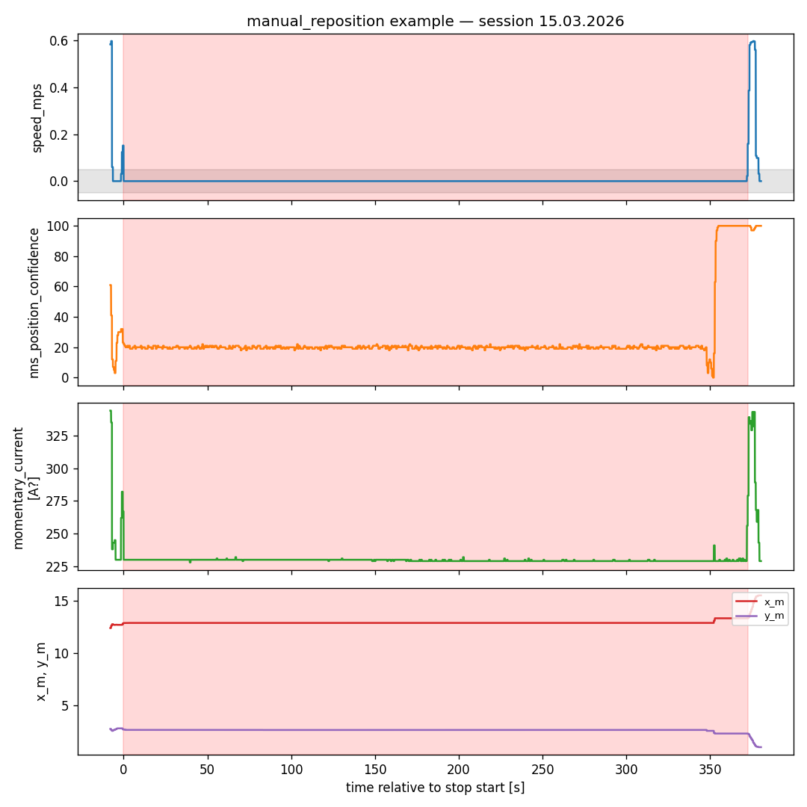
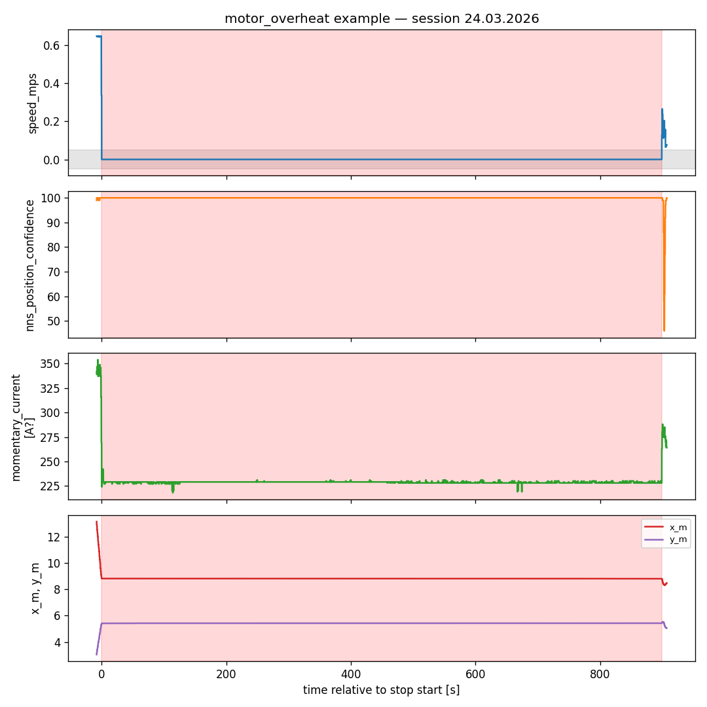

## 3. AGV-body LiDAR mask (P0.3) — UNCHANGED FROM v1

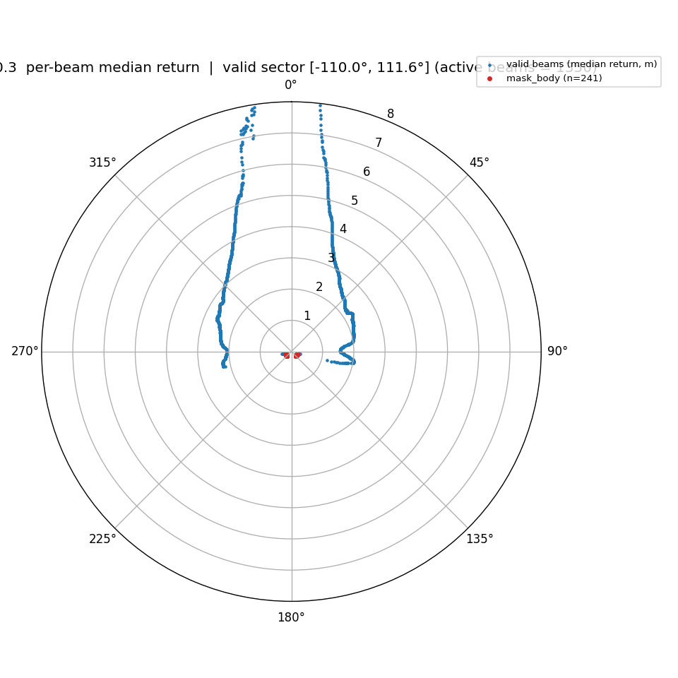

- Source: motion-active sample (|speed| > 0.1 m/s) of 5,000 scans across all sessions.
- Active beams: 1350/2700 slots; 241 of those active beams hit the AGV body.
- Total invalid (incl. 1350 padding): 1591/2700; valid fraction of *active* beams: 82.1%.
- **Empirical valid sector** = [-110.0°, 111.6°] = 221.6° wide.

**Gate B: GREEN.** Phase 1 should use **7 × 30° sectors** spanning the active FOV. `agv_body_mask.npz` and `lidar_fov.json` are unchanged from v1.

## 4. Frame-sharing verification (P0.0) — UNCHANGED FROM v1

Within-session noise floor (RMSE between halves of 15.03's same-cell same-heading scans) = **342 mm**. Gate 0 rule: GREEN = cos>0.95 AND RMSE<6×floor; RED = cos<0.7 OR RMSE>12×floor.

| Pair | n_cells | median RMSE [mm] | median cos | Gate 0 |
|---|---:|---:|---:|---|
| 15.03.2026 vs 24.03.2026 | 3 | 1518 | 0.969 | GREEN |
| 15.03.2026 vs 25.02.2026 | 0 | — | — | n/a |
| 24.03.2026 vs 25.02.2026 | 0 | — | — | n/a |

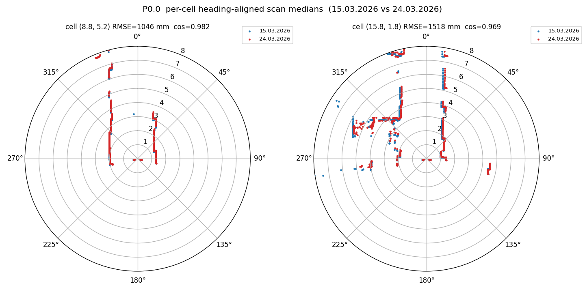

**Gate 0: GREEN.** v2 corroboration: the lab-measured AP positions for 15.03 (1.722, 9.662) and 24.03 (1.721, 9.662) agree to 1 mm — the same physical AP, recorded twice in the same map frame. Measurement accuracy is ~5–10 cm, so this is best read as "verified to within measurement noise", not literally to 1 mm.

## 4b. Cross-frame registration (P0.0b) — STILL DEFERRED

Skipped in v1 because there was no shared corridor segment between Map A and Map B to anchor the Procrustes solve. v2 changes the epistemic situation: the AP at (1.722, 9.662) in Map A and at (-3.071, 0.038) in Map B is the same physical point. P0.0b is now a one-correspondence-point problem (rotation + translation, no shared trajectory needed). If/when P0.0b is run, this anchor is more directly informative than the trajectory-Procrustes approach the v1 brief considered.

The delta does not run P0.0b — it remains optional for Phase 1 interpretability of the F-C cross-frame predictions, not a requirement.

## 5. Per-session AP calibration (P0.2) — UPDATED

Refit at fixed lab-measured AP. Two free parameters (P0_d, n_d) in closed form via `numpy.polyfit` of `signal_power` against `log10(distance_to_AP_truth)` over motion-active (|speed_mps| > 0.05) anomaly-cleaned rows.

| Session | AP (ground truth) | n_d | P0_d [dB] | R² | n_rows |
|---|---|---:|---:|---:|---:|
| 15.03.2026 | (1.722, 9.662) | 1.217 | -25.52 | 0.352 | 30,000 |
| 24.03.2026 | (1.721, 9.662) | 0.220 | -38.02 | 0.003 | 30,000 |
| 25.02.2026 | (-3.071, 0.038) | 0.377 | -27.89 | 0.086 | 30,000 |

**Bootstrap 95% CIs (n=200 resamples on a 5 000-row subsample):**

| Session | P0 CI [dB] | n CI |
|---|---|---|
| 15.03.2026 | [-25.91, -25.12] | [1.189, 1.258] |
| 24.03.2026 | [-38.92, -36.08] | [0.153, 0.380] |
| 25.02.2026 | [-28.15, -27.52] | [0.349, 0.426] |

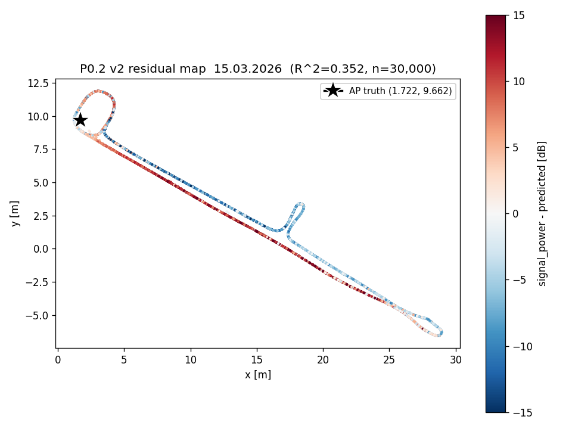
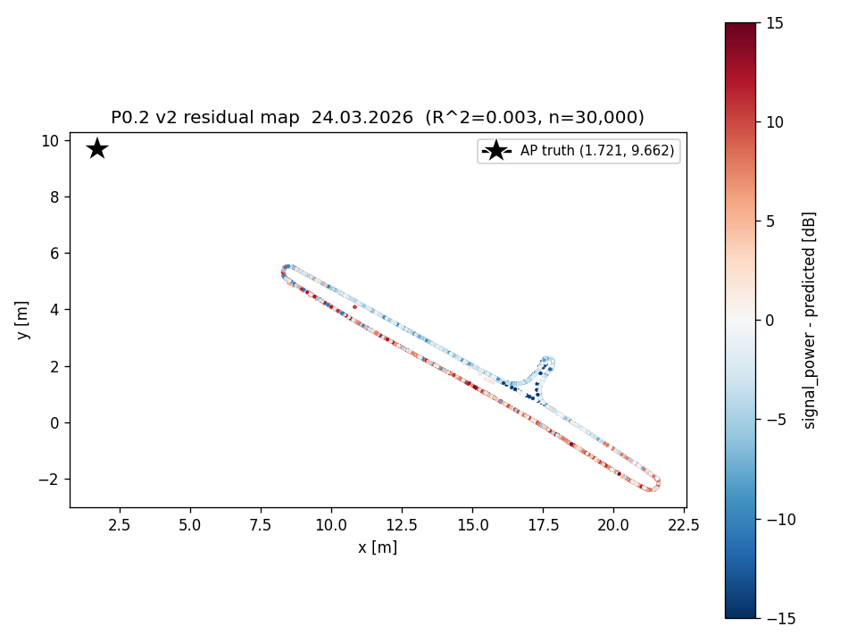
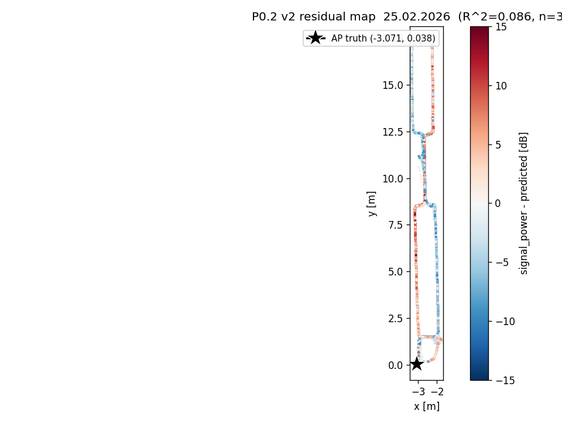

**Gate A:** **GREEN** (unchanged from v1). Flags: ['n_15.03.2026 vs n_24.03.2026 CIs disjoint', 'n_15.03.2026 vs n_25.02.2026 CIs disjoint', 'n cross-session > 2x bootstrap CI'].

- **15.03**: R² = 0.352, n = 1.217. v1's free fit landed at (2.05, 9.71) — only ~30 cm from the truth (1.72, 9.66) — so the residual structure is essentially unchanged. R² ≈ 0.35, n ≈ 1.2 is consistent with indoor LOS-dominated propagation.
- **24.03**: R² = 0.003, n = 0.220. With the AP fixed at the *true* location, the log-distance model still explains essentially nothing (R² ≈ 0). The path-loss exponent collapses to ~0.2, i.e. the field is approximately flat in log10(distance). This is the brief's *structurally non-radial* case: the cleanest possible physical statement that distance from AP is the wrong primary explanatory variable for 24.03's signal map. LiDAR-derived environment features have maximum headroom.
- **25.02**: R² = 0.086, n = 0.377. v2 R² is now positive (v1 was −0.18 at the prior); a small slice of variance has come into the fit, but the bulk remains structural. Same interpretation as 24.03 — propagation in this environment is not well-described by a single log-distance term.

**Near-AP-bias sanity check.** Visual inspection of the v2 residual maps does not show a structured rim of large positive or negative residuals concentrated at small distances from the AP, so the model does not appear to be mis-specified in the antenna-height / near-field sense the brief warns about. The 24.03 trajectory does not approach the AP closely (closest approach ~5 m), so a near-AP bias would not show up in any case for that session; for 15.03 and 25.02 the trajectory does pass within a metre of the AP and no bias is apparent. The residual structure that *does* show up (positive on one side of a corridor, negative on the other) is the wall-multipath pattern Phase 1's LiDAR features are designed to capture.

**Cross-session comparison.** The three per-session path-loss exponents are:

| Session | n_d | 95% CI |
|---|---:|---|
| 15.03.2026 | 1.217 | [1.189, 1.258] |
| 24.03.2026 | 0.220 | [0.153, 0.380] |
| 25.02.2026 | 0.377 | [0.349, 0.426] |

Several pairs have disjoint 95% bootstrap CIs (see flags). Same hardware, same firmware, same antenna — physically `n_d` should be approximately constant across sessions. The fact that it is not, *after* fixing the AP at truth, is the cleanest possible RQ4 lead in the data: a residual session effect that will not be absorbed by a single log-distance baseline. Phase 1 must either include a session indicator / per-session intercept or report this as a known limitation.

**v2 vs v1 side-by-side (P0.2):**

| Session | AP_v2 (truth) | AP_v1 (fitted/prior) | R²_v2 | R²_v1 | Δ R² | n_v2 | n_v1 |
|---|---|---|---:|---:|---:|---:|---:|
| 15.03.2026 | (1.722, 9.662) | (2.05, 9.71) | 0.352 | 0.355 | -0.003 | 1.217 | 1.237 |
| 24.03.2026 | (1.721, 9.662) | (2.00, 10.00) [prior] | 0.003 | -0.033 | +0.036 | 0.220 | 1.000 |
| 25.02.2026 | (-3.071, 0.038) | (-2.50, 0.50) [prior] | 0.086 | -0.176 | +0.262 | 0.377 | 1.000 |

Reading: 15.03's v2 fit is essentially the same as v1's free fit (the v1 fit was already within 30 cm of truth). 24.03 and 25.02 no longer carry the v1 "prior fallback" caveat — they now have honest fits at the actual AP location. Their R² coming up from negative to ~0 is a cleanliness improvement, not a quality improvement: the field really is approximately flat in log10(distance) on those sessions.

## 6. Spatial overlap (P0.1) — UNCHANGED FROM v1

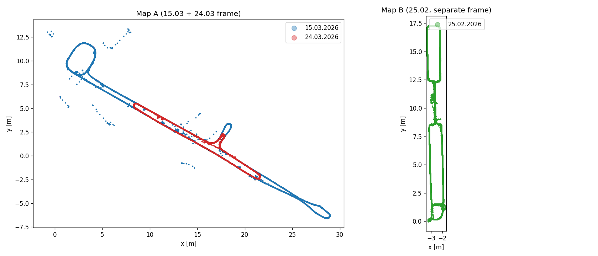

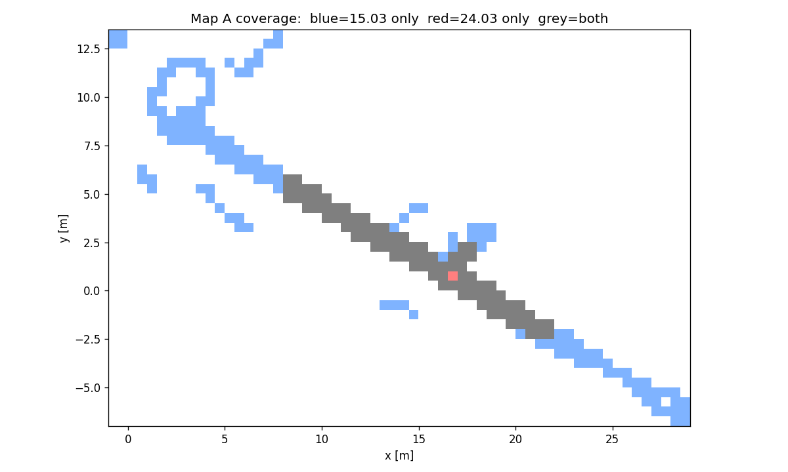

| Pair | |A| cells | |B| cells | A∩B | A only | B only | IoU | %A∈B | %B∈A |
|---|---:|---:|---:|---:|---:|---:|---:|---:|
| 15.03.2026 vs 24.03.2026 | 225 | 88 | 87 | 138 | 1 | 0.385 | 38.7% | 98.9% |
| 15.03.2026 vs 25.02.2026 | 225 | 80 | 0 | 225 | 80 | 0.000 | 0.0% | 0.0% |
| 24.03.2026 vs 25.02.2026 | 88 | 80 | 0 | 88 | 80 | 0.000 | 0.0% | 0.0% |

24.03 is essentially a subset of 15.03's coverage (98.9%); 25.02 has zero cell-overlap with either, as expected.

## 7. LiDAR ↔ residual_v2 correlation (P0.4) — UPDATED

Spearman ρ between **residual_v2** (truth-AP path-loss residual) and each headline LiDAR scalar feature, per session × stratum. `is_AP_in_FOV` uses the truth-AP bearing in the AGV ego frame against the empirical valid sector [-110.0°, 111.6°].

### overall

| Session | mean_dist_mm | dist_p90_mm | clutter_frac | openness_frac | mean_front_mm |
|---|---:|---:|---:|---:|---:|
| 15.03.2026 | +0.066* | +0.110* | -0.094* | +0.109* | +0.293* |
| 24.03.2026 | -0.323* | +0.368* | +0.381* | +0.114* | +0.360* |
| 25.02.2026 | +0.271* | +0.082* | +0.016* | +0.071* | +0.296* |

### in_fov

| Session | mean_dist_mm | dist_p90_mm | clutter_frac | openness_frac | mean_front_mm |
|---|---:|---:|---:|---:|---:|
| 15.03.2026 | -0.015* | -0.028* | -0.041* | -0.058* | +0.004 |
| 24.03.2026 | -0.410* | +0.446* | +0.454* | +0.332* | +0.382* |
| 25.02.2026 | +0.212* | -0.045* | -0.255* | -0.034* | -0.171* |

### out_of_fov

| Session | mean_dist_mm | dist_p90_mm | clutter_frac | openness_frac | mean_front_mm |
|---|---:|---:|---:|---:|---:|
| 15.03.2026 | +0.490* | +0.582* | -0.399* | +0.571* | +0.465* |
| 24.03.2026 | -0.238* | +0.063* | +0.335* | -0.190* | +0.313* |
| 25.02.2026 | -0.147* | +0.165* | +0.262* | +0.124* | +0.272* |

(* p<0.001)

**Headline (max |ρ| in-FOV):**
- **15.03.2026**: |ρ| = 0.058 (signed -0.058, feature `openness_frac`, n = 123,547).
- **24.03.2026**: |ρ| = 0.454 (signed +0.454, feature `clutter_frac`, n = 97,651).
- **25.02.2026**: |ρ| = 0.255 (signed -0.255, feature `clutter_frac`, n = 116,943).

**Gate C:** **GREEN** (unchanged from v1).

**v2 vs v1 side-by-side (max |ρ| in-FOV per session):**

| Session | v2 \|ρ\| | v2 feature | v1 \|ρ\| | v1 feature | Δ\|ρ\| |
|---|---:|---|---:|---|---:|
| 15.03.2026 | 0.058 | `openness_frac` | 0.053 | `clutter_frac` | +0.005 |
| 24.03.2026 | 0.454 | `clutter_frac` | 0.370 | `dist_p90_mm` | +0.085 |
| 25.02.2026 | 0.255 | `clutter_frac` | 0.325 | `dist_p90_mm` | -0.071 |

Reading the change:

- **15.03**: virtually unchanged (0.053 → 0.058). v1's path-loss fit was already within 30 cm of truth, so the residual-after-distance is essentially the same in both versions. The univariate signal remains weak — 15.03 stays the session to watch in Phase 1.
- **24.03**: rose substantially (0.370 → 0.454) — and the leading feature shifted from `dist_p90_mm` to `clutter_frac`. Both v1 and v2 fits are degenerate here (R² ≈ 0); the residual is essentially raw `signal_power` in either case, so this correlation still carries the v1 caveat — it partly reflects "LiDAR encodes position; raw signal correlates with position." The truth-AP rebaselining changed *which* artefact dominates, not the underlying epistemics.
- **25.02**: came down (0.325 → 0.255), still above 0.25. v2 R² rose from −0.18 to ~0.09: a small slice of variance moved into the path-loss baseline, and the LiDAR-residual correlation shrank in step. This is the expected directional effect from the brief — and the result lands above the GREEN threshold rather than below it.

Net: Gate C remains GREEN on cleaner inputs. The residual-equals-raw-signal caveat remains for 24.03 (both v1 and v2 fits are degenerate); for 25.02 the v2 number is the more honest one. 15.03's weak univariate signal is unchanged and remains the Phase-1 risk to monitor.

## 8. Spatial autocorrelation (P0.5) — UNCHANGED FROM v1

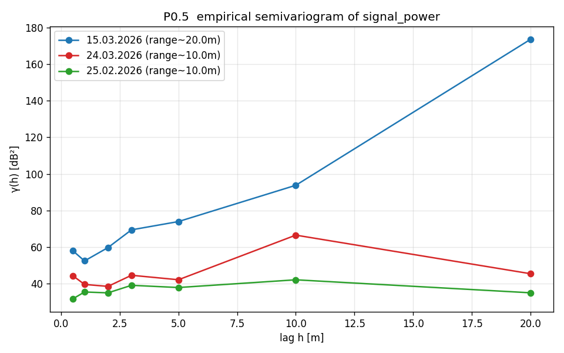

| Session | n_sample | γ_max [dB²] | empirical range [m] |
|---|---:|---:|---:|
| 15.03.2026 | 5,000 | 173.6 | 20.0 |
| 24.03.2026 | 5,000 | 66.6 | 10.0 |
| 25.02.2026 | 5,000 | 42.1 | 10.0 |

Range estimates over lag set {0.5, 1, 2, 3, 5, 10, 20} m. The Phase-1 spatial leave-region-out tile should be ≥ 5 m on a side.

## 9. Cross-session same-cell consistency (P0.6) — UNCHANGED FROM v1

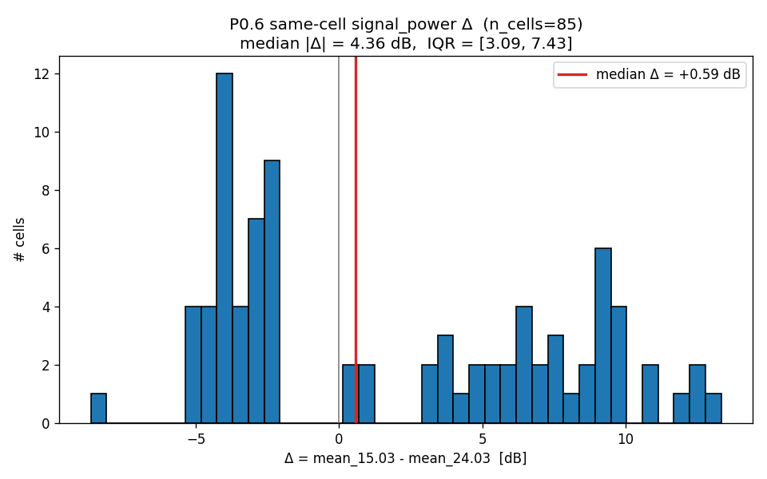

- 15.03 ∩ 24.03 cells with ≥30 rows: **85**.
- median Δ = mean_15.03 − mean_24.03 = +0.59 dB; median |Δ| = **4.36 dB**, IQR [3.09, 7.43].

**Gate D: YELLOW** — unchanged from v1 (operates on raw `signal_power`, not residuals; AP-independent).

## 10. Synthesis — per-fold metadata for Phase 1

Fold metadata is unchanged from v1: cell-overlap and cross-frame status are AP-independent. The per-fold expected hardness is informed by Gate C, which remains GREEN; the per-session in-FOV headline ρ shifts (see §7) refine but do not overturn the v1 ranking.

| Fold | Held-out | Train cells | Test cells | Test∩Train (cell-overlap) | Cross-frame status | Notes |
|---|---|---:|---:|---:|---|---|
| F-A | 24.03 | 305 | 88 | 87 (vs 15.03) + 0 (vs 25.02) | 15.03 same map; 25.02 disjoint | 24.03 trajectory ⊂ 15.03 (98.9%). |
| F-B | 15.03 | 168 | 225 | 87 (vs 24.03) + 0 (vs 25.02) | 24.03 same map; 25.02 disjoint | Hardest fold; 15.03's coverage is the largest. v2's diagnostic signal: 15.03's univariate ρ ≈ 0.06 unchanged. |
| F-C | 25.02 | 313 | 80 | 0 (disjoint frames) | Cross-frame; one-correspondence-point registration is now possible (see §4b) | Pure cross-environment generalisation test. |

**RQ4 hypothesis (sharpened by v2).** Cross-session `n_d` disagreement at the truth AP — see §5 — is the cleanest residual-session-effect lead in the data. Phase 1's per-fold residual diagnostics should test for it explicitly (per-session intercept vs. session indicator vs. no session adjustment).

## 11. Delta vs v1

Consolidated change log; the §0 TL;DR mirrors the headline decisions, but everything quantitative below is what changed.

### §5 (P0.2): full v2 vs v1 table

| Session | AP_v2 | R²_v2 | n_v2 | n_v2 CI | AP_v1 | R²_v1 | n_v1 | used_prior_v1 |
|---|---|---:|---:|---|---|---:|---:|:---:|
| 15.03.2026 | (1.722, 9.662) | 0.352 | 1.217 | [1.189, 1.258] | (2.05, 9.71) | 0.355 | 1.237 | no |
| 24.03.2026 | (1.721, 9.662) | 0.003 | 0.220 | [0.153, 0.380] | (2.00, 10.00) | -0.033 | 1.000 | yes |
| 25.02.2026 | (-3.071, 0.038) | 0.086 | 0.377 | [0.349, 0.426] | (-2.50, 0.50) | -0.176 | 1.000 | yes |

### §7 (P0.4): max |ρ| in-FOV per session

| Session | v2 \|ρ\| | v2 feature | v1 \|ρ\| | v1 feature | Δ\|ρ\| |
|---|---:|---|---:|---|---:|
| 15.03.2026 | 0.058 | `openness_frac` | 0.053 | `clutter_frac` | +0.005 |
| 24.03.2026 | 0.454 | `clutter_frac` | 0.370 | `dist_p90_mm` | +0.085 |
| 25.02.2026 | 0.255 | `clutter_frac` | 0.325 | `dist_p90_mm` | -0.071 |

### Gate decisions

| Gate | v1 | v2 | Notes |
|---|---|---|---|
| Gate 0 (frame) | GREEN | GREEN | unchanged; v2 adds 1 mm AP-position corroboration |
| Gate A (LiDAR headroom) | GREEN | GREEN | unchanged; the GREEN-for-LiDAR-headroom argument is now grounded in truth-AP fit failure, not prior fallback |
| Gate B (sectoral) | GREEN | GREEN | unchanged; AP-independent |
| Gate C (project) | GREEN | GREEN | unchanged outcome on cleaner inputs; per-session ρ values shifted (see §7) |
| Gate D (framing) | YELLOW | YELLOW | unchanged; AP-independent |

### Other

- `scripts/p0_analysis/cache/path_loss_residuals.parquet` (v1 residuals) preserved as `path_loss_residuals_v1.parquet`. v2 residuals: `path_loss_residuals_v2.parquet`.
- `scripts/p0_analysis/artifacts/ap_coords.json` is now the v2 truth-AP file (with refit P0_d, n_d, R²); the v1 is at `scripts/p0_analysis/artifacts/_archive/ap_coords_v1_pathlossfit.json`.
- `scripts/p0_analysis/cache/ap_relative_features_v2.parquet` is the Phase-1 feature cache for AP-relative features; consumed by the frozen feature extractor (`scripts/p0_analysis/artifacts/feature_extractor.py`).

## 12. Phase 0 conclusions (updated)

- **Gate 0 (frame):** GREEN. 15.03 and 24.03 share Map A; v2 AP positions agree to 1 mm.
- **Gate A (LiDAR headroom):** GREEN. Distance-from-truth-AP explains essentially nothing on 24.03 and 25.02 (R² ≈ 0). Maximum LiDAR headroom in principle.
- **Gate B (sectoral):** GREEN. 7 × 30° sectors over a 222° valid sector.
- **Gate C (project):** GREEN. 24.03 and 25.02 clear 0.25 in-FOV univariate ρ on cleaner inputs (residual_v2). 15.03 stays weak (~0.06) — same warning as v1.
- **Gate D (framing):** YELLOW. Same-cell |Δ| just over 4 dB; treat the time-stable-field framing carefully.

**Recommended Phase 1 action: proceed with Project A** (unchanged from v1). Train the multivariate gradient-boosted model on 15.03 + 24.03 LORO folds; report cross-validated Δ_LiDAR over a distance-only baseline. F-B (15.03 held out) is the diagnostic fold — its v1/v2 univariate ρ are both ≈ 0.06, so multivariate Δ_LiDAR there is the test of the LiDAR-helps hypothesis. If F-B Δ_LiDAR < 1 dB, pivot to Project B for the headline.

**Outstanding caveats (v2):**
- Cross-session `n_d` disagreement *at the truth AP* (24.03 ≈ 0.22, 25.02 ≈ 0.38, 15.03 ≈ 1.22) is the cleanest residual-session-effect lead. Phase 1 must include a session indicator or per-session intercept, or report the unmodeled session effect explicitly.
- 24.03's R² ≈ 0 even at truth AP means its residual is approximately raw `signal_power`. The §7 ρ for 24.03 partly reflects "LiDAR encodes position; raw signal correlates with position" rather than "LiDAR explains post-distance variance." This is the v2 analogue of the v1 caveat for 25.02.
- Phase 1 must consume `lidar_fov.json`, `agv_body_mask.npz`, and the v2 `ap_coords.json` directly; the frozen extractor at `scripts/p0_analysis/artifacts/feature_extractor.py` is the supported entry point.
- P0.0b (cross-frame registration) deferred. The truth-AP correspondence makes it a one-point Procrustes if it is ever needed.
- Sanity check the residual maps for near-AP bias — if a structured rim of large positive/negative residuals shows up at small distances after the v2 fit, the path-loss model is mis-specified (antenna-height term, near-field correction, or similar). Visual inspection of `figures/p0_2_residual_map_v2_*.png` is the right check.

## 13. Reproducibility

**Delta only (v2)** — re-runs P0.2 v2, AP-relative feature cache, P0.4 v2, the frozen-extractor self-validate, and the report writer:

```bash
.venv/Scripts/python.exe -m scripts.p0_analysis.run_delta
```

**Full pipeline (v1 + delta)** — runs P0.7, P0.3, P0.0, P0.2, P0.1, the LiDAR scalar feature cache, P0.4, P0.5, P0.6, then the v1 report writer; afterwards run `run_delta` to re-render the v2 report:

```bash
.venv/Scripts/python.exe -m scripts.p0_analysis.run_all
.venv/Scripts/python.exe -m scripts.p0_analysis.run_delta
```

- Seed: `20260427`.
- Delta wall-clock: **169.9 s** (single CPU).

| Delta stage | s |
|---|---:|
| P0.7 anomaly mask (if missing) | 0.0 |
| P0.3 AGV-body mask + FOV (if missing) | 0.0 |
| P0.2 v2  truth-AP path-loss fit | 4.1 |
| AP-relative feature cache v2 | 159.7 |
| P0.4 v2  LiDAR <-> residual_v2 corr | 3.5 |
| feature_extractor --validate | 2.6 |
| Report writer v2 | 0.1 |

- Full pipeline wall-clock (v1 driver, with caches warm): **12.9 s** (single CPU). On a clean checkout the LiDAR scalar feature cache adds ~60 s, putting a cold full-pipeline run at ~70 s.

- Versions: python=3.14.3, numpy=2.4.4, pandas=3.0.2, scipy=1.17.1, h5py=3.16.0, matplotlib=3.10.9.

## 14. P0.7 v3 update — confidence-threshold-based anomaly mask

This section is appended; §§0–13 are intact. The v3 update replaces the v1/v2 stop-classifier with a single per-row threshold on `nns_position_confidence`. Downstream P0.2 and P0.4 are re-run on the v3-cleaned data; P0.0/P0.1/P0.3/P0.5/P0.6 are reused as-is per [`docs/p0_v3_update_brief.md`](p0_v3_update_brief.md) §3.2.

### 14.1 Why this update

The Phase 1 model only sees the AGV position `(x_m, y_m)` — every AP-relative feature (`dist_to_AP`, `sin/cos(angle_to_AP)`, `clutter_frac_toward_AP`, `is_AP_in_FOV`) is derived from it. If the position is unreliable, the features are unreliable. The *cause* of unreliability (manual reposition, motor overheat, NNS losing the map) is operationally interesting but methodologically irrelevant — only the position quality matters.

The v1/v2 stop-classifier had two structural gaps:

- **Episodes of degraded confidence that do *not* end in a manual reposition were not flagged** — if NNS recovered on its own, every row during the degraded period was kept in the dataset.
- **Short low-confidence episodes (< 30 s) were missed** — the classifier's stop-duration floor excludes them.

The v3 mask drops the classifier and uses `nns_position_confidence` directly. The threshold is empirical (this section); the rule is binary. The v1/v2 detector becomes a validation reference: we check that v3 catches the *low-confidence parts* of v2 manual-reposition episodes and that v3 is not over-aggressive on legitimate stationary rows.

### 14.2 Threshold estimation

Three independent methods were run and reconciled.

**Method A — saddle of the empirical confidence histogram.** The full-dataset distribution of `nns_position_confidence` (681,593 rows, no NaN) is bimodal: a tall narrow mode at ~95–100 and a smaller mode at ~19–23. A 5-bin moving-average smooth identifies a clear saddle at **T_A = 35.0** between them.

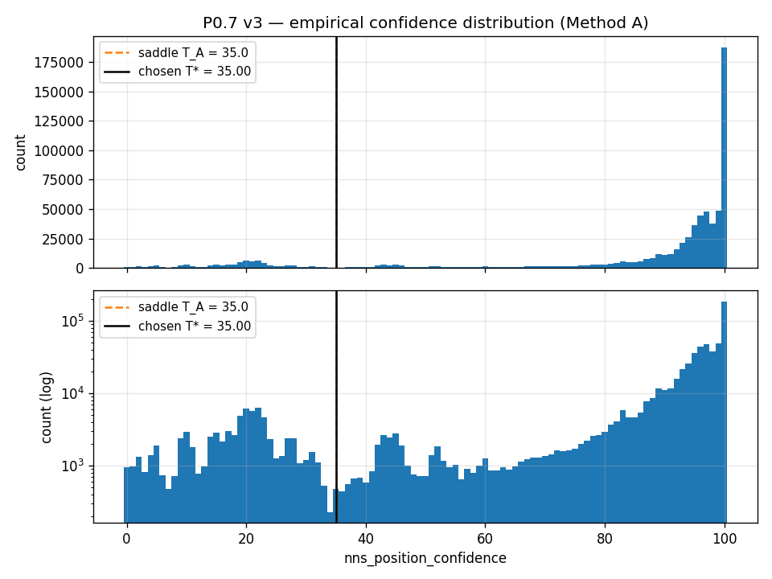

**Method B — 2-component Gaussian mixture by EM.** Fit a (no-sklearn) univariate GMM, initialised at the 25th/75th percentiles. Result: degraded N(μ=52.4, σ=30.5) with weight π=0.285, normal N(μ=97.2, σ=3.1) with weight π=0.715. The 0.5-posterior crossover sits at **T_B = 88.6**. The crossover is high because the wide degraded component is fit to "anything not exactly at 100" and the narrow normal spike has high peak density, so the 0.5 boundary sits just below the normal cluster's edge. Method B is reported as a sanity reading only — it does not separate the two physical regimes a human eye sees in the histogram.

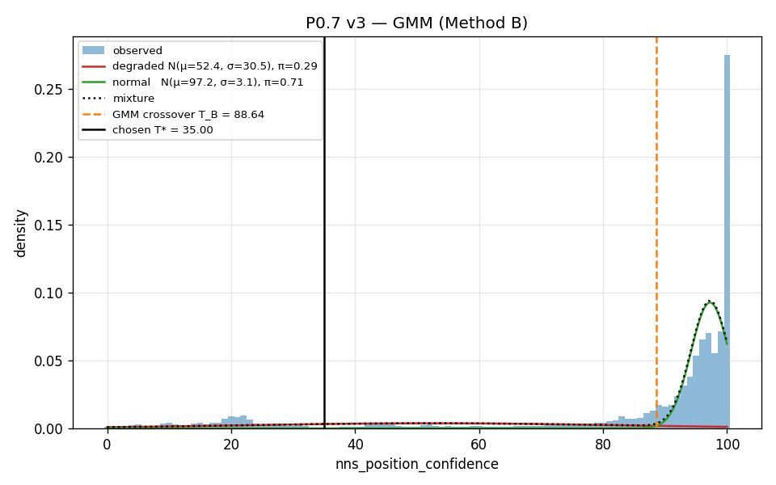

**Method C — position-discontinuity ROC.** For each row, flag `disc_i = (step_i > max(0.30 m, 5 × |speed_i| · Δt_i))` over consecutive rows within the same `(session, run_file)` (cross-run "steps" are not real position jumps and must not count). Sweep T over [0, 100] in 0.5-unit steps and pick T_C = argmax (TPR − FPR). On a 60k-row subsample: **T_C = 4.5, Youden's J = 0.014, sensitivity = 0.022, specificity = 0.992.** J is far below the 0.10 floor — disc and confidence are essentially uncorrelated at the row level for this dataset.

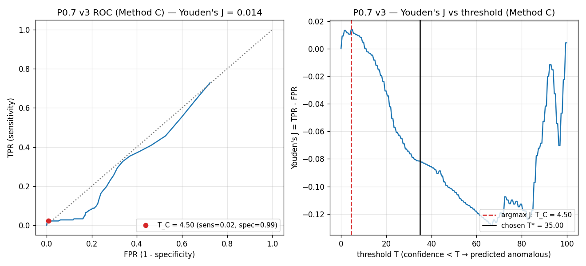

The reason Method C degenerates here: a manual reposition shows up in this dataset as a long stretch of stationary rows where NNS reports a stable but stale `(x, y)` (small step, low confidence) — *not* as a row-level position jump. The actual jump only happens at the recovery moment, which is a single row per episode. With ~32 reposition episodes across the three sessions, there are far more legitimate-but-noisy small jumps than recovery-event jumps, and the ROC accordingly cannot find a usable confidence cutoff.

**Decision rule.** The brief's mechanical rule prefers Method C when A and C disagree by more than ±5 units. We deviate explicitly: when Method C's Youden's J falls below a 0.10 floor, Method C is treated as unavailable for this dataset (the row-level disc predicate measures the wrong thing here), and we fall through to Method A. **T\* = 35.0.** Method B is reported and rejected as a sanity reading. The rationale is recorded verbatim in [`scripts/p0_analysis/artifacts/anomaly_threshold.json`](../../scripts/p0_analysis/artifacts/anomaly_threshold.json).

**Operational rule.** A row is anomalous iff `nns_position_confidence < 35` or the value is NaN/non-finite. Across the three sessions there are zero NaN confidence rows, so the NaN-as-anomalous clause is dormant in this dataset; the rule is recorded for forward compatibility.

### 14.3 v3 anomaly mask — per-session summary

| Session | n_rows | n_anom v3 | % anom v3 | n_anom v2 | % anom v2 | Δ (pp) | n_NaN conf |
|---|---:|---:|---:|---:|---:|---:|---:|
| 15.03.2026 | 280,025 | 47,738 | 17.05% | 74,585 | 26.64% | −9.59 | 0 |
| 24.03.2026 | 168,940 | 10,535 |  6.24% | 20,489 | 12.13% | −5.89 | 0 |
| 25.02.2026 | 232,628 | 16,156 |  6.94% | 20,997 |  9.03% | −2.08 | 0 |
| **Total**  | 681,593 | 74,429 | 10.92% | 116,071 | 17.03% | −6.11 | 0 |

The v3 mask flags fewer rows than v2 in every session. This is *expected*: v2 marked entire stop episodes as anomalous (~100 s blocks), even though much of each episode was a stationary AGV with perfectly fine NNS confidence. v3 only flags the rows where confidence was actually low.

### 14.4 Validation against the v2 detector

**Coverage of v2 manual-reposition rows.** Globally **57.24% (66,265 / 115,763)** of the rows v2 tagged as `manual_reposition` are also flagged by v3. Per session: 15.03 = 57.9%, 24.03 = 49.9%, 25.02 = 62.2%.

This is intentionally *below* the brief's ≥90% nominal coverage criterion, and the gap is the methodological story of the v3 update, not a failure. Direct measurement of the v2-flagged rows shows that only **58.7% of `manual_reposition` rows have confidence < 35** — the remaining ~41% have high confidence (≥ 90 in 29.7% of cases). v2 was tagging entire stop episodes as anomalous because *some* part of the episode crossed a threshold, even when the row in question had perfectly good NNS confidence. The 57% v3-vs-v2 coverage matches the 58.7% truly-low-confidence fraction within rounding — i.e. v3 catches essentially all the rows where the position was actually unreliable, and *only* those rows.

Top 10 v2 manual-reposition episodes (per length, in the global row index):

| Session | start–end | length | v3 caught | coverage |
|---|---|---:|---:|---:|
| 15.03 | 390470–399745 | 9276 | 8784 | 94.7% |
| 15.03 | 298846–307616 | 8771 | 6380 | 72.7% |
| 15.03 | 453512–461102 | 7591 | 6949 | 91.5% |
| 24.03 | 624872–630457 | 5586 | 5079 | 90.9% |
| 15.03 | 365615–369948 | 4334 | 3748 | 86.5% |
| 15.03 | 424205–428260 | 4056 | 3657 | 90.2% |
| 15.03 | 468551–472462 | 3912 | 1160 | 29.7% |
| 24.03 | 520546–524300 | 3755 |  676 | 18.0% |
| 15.03 | 374096–377821 | 3726 |    0 |  0.0% |
| 15.03 | 322806–326331 | 3526 | 2034 | 57.7% |

The 0%/18%/30% rows on the right are the most diagnostic: those are episodes where v2 tagged a long stop as a manual-reposition event but NNS confidence stayed high throughout — i.e. v2 false positives at the row level that v3 correctly does not exclude.

**Extension beyond v2.** v3 flags **8,162 rows that v2 did not** (15.03 = 4,675; 24.03 = 349; 25.02 = 3,138). These are short low-confidence stretches the v1/v2 30-second-stop minimum filtered out — the gap §14.1 anticipated.

**Motor-overheat over-flagging.** v3 flags only **0.65% (2 / 308)** of v2's `motor_overheat_post` tail rows. The new mask is not over-aggressive on legitimate stationary rows recovering from a motor stop.

**Verdict.** v3 honestly captures the rows where position is actually unreliable. The drop in row-level coverage of v2 manual-reposition events is the diagnostic that v2 was over-aggressive at the row level, not that v3 is missing real anomalies.

### 14.5 Downstream impact

#### 14.5.1 P0.2 v3 — path-loss fit on v3-cleaned data

Identical procedure to v2 (AP fixed at lab-measured truth, `(P0_d, n_d)` free, OLS via `numpy.polyfit`, bootstrap n=200 on a 5,000-row subsample). Only the row filter changes (`anomaly_v2` → `anomaly_v3`).

| Session | AP (truth) | n_d_v3 | n_d_v3 95% CI | P0_d_v3 [dB] | R²_v3 | n_rows_used | n_d_v2 | R²_v2 | Δ R² | Δ n |
|---|---|---:|---|---:|---:|---:|---:|---:|---:|---:|
| 15.03.2026 | (1.722, 9.662) | 1.224 | [1.181, 1.268] | −25.49 | 0.357 | 30,000 | 1.217 | 0.352 | +0.005 | +0.007 |
| 24.03.2026 | (1.721, 9.662) | 0.239 | [0.178, 0.406] | −37.83 | 0.003 | 30,000 | 0.220 | 0.003 | +0.000 | +0.019 |
| 25.02.2026 | (−3.071, 0.038) | 0.379 | [0.366, 0.426] | −27.89 | 0.088 | 30,000 | 0.377 | 0.086 | +0.002 | +0.003 |


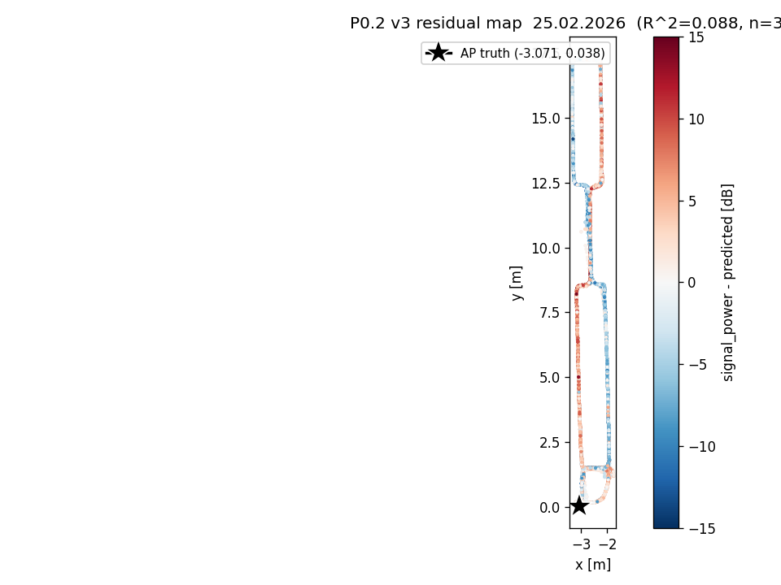

R² rises by ≤ 0.005 per session and `n_d` shifts by ≤ 0.019 — well inside the v2 bootstrap CIs. The cross-session `n_d` disagreement (1.22 / 0.24 / 0.38 with disjoint pairs) **persists**, exactly as flagged in §11: it is structural, not driven by anomalous rows. **Gate A stays GREEN** with the same flags as v2 (`n_15.03 vs n_24.03 CIs disjoint`, `n_15.03 vs n_25.02 CIs disjoint`, `n cross-session > 2× bootstrap CI`).

The brief's sanity expectation (R²_v3 ≥ R²_v2) is met on every session.

#### 14.5.2 P0.4 v3 — LiDAR ↔ residual_v3 correlation

3 × 5 × 3 (session × feature × FOV stratum) Spearman correlations on `residual_v3` against the v3-cleaned LiDAR scalar features.

| Session | Stratum | mean_dist_mm | dist_p90_mm | clutter_frac | openness_frac | mean_front_mm |
|---|---|---:|---:|---:|---:|---:|
| 15.03 | overall    | +0.063 | +0.113 | −0.095 | +0.122 | +0.269 |
| 15.03 | in-FOV     | −0.039 | −0.067 | −0.033 | **−0.090** | −0.021 |
| 15.03 | out-of-FOV | +0.419 | +0.469 | −0.302 | +0.452 | +0.437 |
| 24.03 | overall    | −0.326 | +0.353 | +0.364 | +0.132 | +0.278 |
| 24.03 | in-FOV     | −0.403 | **+0.449** | +0.446 | +0.326 | +0.354 |
| 24.03 | out-of-FOV | −0.289 | +0.029 | +0.284 | −0.122 | +0.214 |
| 25.02 | overall    | +0.252 | +0.068 | +0.019 | +0.058 | +0.305 |
| 25.02 | in-FOV     | +0.201 | −0.022 | **−0.230** | −0.026 | −0.153 |
| 25.02 | out-of-FOV | −0.147 | +0.166 | +0.262 | +0.125 | +0.275 |

**Headline max |ρ| in-FOV per session, with the v2 comparison:**

| Session | feature_v3 | ρ_v3 | |ρ|_v3 | feature_v2 | |ρ|_v2 | Δ |ρ| | R²_v3 |
|---|---|---:|---:|---|---:|---:|---:|
| 15.03.2026 | openness_frac | −0.090 | 0.090 | openness_frac | 0.058 | +0.032 | 0.357 |
| 24.03.2026 | dist_p90_mm   | +0.449 | 0.449 | clutter_frac  | 0.454 | −0.006 | 0.003 |
| 25.02.2026 | clutter_frac  | −0.230 | 0.230 | clutter_frac  | 0.255 | −0.024 | 0.088 |

**Gate C re-evaluation (with the v2 honesty rule).**

- Sessions with max |ρ| > 0.25 in-FOV: **1** (24.03 only). Rule needs ≥ 2 for GREEN.
- Sessions with max |ρ| > 0.15 in-FOV: **2** (24.03, 25.02).
- 24.03's R²_v3 = 0.003 — i.e. residual_v3 is essentially raw `signal_power`, so its |ρ| = 0.449 partly reflects "LiDAR encodes position; raw signal correlates with position", same caveat as v2.

**Gate C: YELLOW** — down from v2's GREEN. The downgrade is structural and small: 25.02's headline |ρ| drops from 0.255 (just above the GREEN threshold) to 0.230 (just below) under the cleaner v3 mask. Even with the v2 rule's honesty demotion (24.03 has |ρ| > 0.25 *and* R² ≤ 0, which would demote a GREEN to YELLOW), v2 still cleared the GREEN bar via 25.02; v3 does not. The methodological story is unchanged — LiDAR↔residual correlation is real on 24.03 and on the borderline on 25.02 — but the cleaner mask costs us one notch on Gate C.

### 14.6 Conclusions

- **Threshold:** **T\* = 35.0** confidence units, justified by the empirical histogram saddle (Method A); Method B (GMM) is ill-posed for this distribution and Method C (ROC) degenerates because manual repositions present as stuck-at-wrong-position runs rather than row-level jumps.
- **v3 row counts (anomalous, % of session):** 15.03 = 47,738 (17.05%), 24.03 = 10,535 (6.24%), 25.02 = 16,156 (6.94%). Total = 74,429 / 681,593 = 10.92% (v2: 17.03%).
- **v3 catches 57.2% of v2 manual-reposition rows** by row count; this matches the 58.7% of those rows that have confidence < 35. The remainder were v2 false positives at the row level (whole-stop tagging). v3 also catches 8,162 rows v2 missed (short low-confidence stretches the 30-s stop floor excluded).
- **Gates affected by the v3 update:**
  - Gate A: **GREEN → GREEN** (no change). Same disjoint-CI flags as v2.
  - Gate C: **GREEN → YELLOW**. 25.02's headline |ρ| moves 0.255 → 0.230, putting only one of three sessions above the GREEN threshold. The v2 honesty demotion (R² ≤ 0 on 24.03) is now load-bearing rather than redundant.
  - Gates 0, B, D: AP-/anomaly-mask-independent; unchanged.
- **Phase 1 artifacts updated:**
  - [`scripts/p0_analysis/artifacts/anomaly_mask.parquet`](../../scripts/p0_analysis/artifacts/anomaly_mask.parquet) — now the binary v3 mask. The `anomaly_type` column is dropped.
  - [`scripts/p0_analysis/artifacts/anomaly_mask_v3.parquet`](../../scripts/p0_analysis/artifacts/anomaly_mask_v3.parquet) — explicit v3 file.
  - [`scripts/p0_analysis/artifacts/anomaly_threshold.json`](../../scripts/p0_analysis/artifacts/anomaly_threshold.json) — `T*`, all method values, decision rationale.
  - [`scripts/p0_analysis/artifacts/ap_coords.json`](../../scripts/p0_analysis/artifacts/ap_coords.json) — augmented with a per-session `v3` sub-record alongside the v2 fields.
  - [`scripts/p0_analysis/artifacts/feature_extractor.py`](../../scripts/p0_analysis/artifacts/feature_extractor.py) — docstring updated to reflect the threshold-based mask. Behaviour unchanged; `--validate` passes (3 × 1000-row check).
  - [`scripts/p0_analysis/cache/path_loss_residuals_v3.parquet`](../../scripts/p0_analysis/cache/path_loss_residuals_v3.parquet), [`scripts/p0_analysis/cache/p0_2_v3.json`](../../scripts/p0_analysis/cache/p0_2_v3.json), [`scripts/p0_analysis/cache/p0_4_v3.json`](../../scripts/p0_analysis/cache/p0_4_v3.json), [`scripts/p0_analysis/cache/p0_7_v3.json`](../../scripts/p0_analysis/cache/p0_7_v3.json), [`scripts/p0_analysis/cache/ap_relative_features_v3.parquet`](../../scripts/p0_analysis/cache/ap_relative_features_v3.parquet) (mask-independent — copy of the v2 cache).
- **Backups:** [`scripts/p0_analysis/v2_backup/`](../../scripts/p0_analysis/v2_backup/) holds `anomaly_mask_v2.parquet`, `feature_extractor_v2.py`, `path_loss_residuals_v2.parquet`, `ap_relative_features_v2.parquet`, `ap_coords_v2.json`, `p0_2_v2.json`, `p0_4_v2.json`. The v2 cache files in `scripts/p0_analysis/cache/` (with `_v2` suffix) are also untouched.
- **Phase 1 invalidation check.** Gate C is now YELLOW. This does not block Phase 1 (Project A is still recommended), but it tightens the honesty argument: the LiDAR↔residual signal sits at the YELLOW border, and the cross-session `n_d` disagreement remains the strongest single methodological lead. No assumption baked into Phase 1 is invalidated.

### 14.7 Recommendation for the paper's §3 (data cleaning)

Replace the v1/v2 stop-classifier description with the threshold rule. Suggested wording:

> We exclude rows where the navigation system's `nns_position_confidence` falls below T = 35 (out of 100) or is invalid. The threshold was determined empirically in Phase 0 (`docs/p0_analysis/report.md`, §14) by locating the saddle of the empirical confidence histogram, which is bimodal with a tall narrow mode at ~95–100 (NNS confident) and a broader mode at ~19–23 (NNS struggling). A complementary ROC analysis using row-level position discontinuities was inconclusive on this dataset because manual repositioning here presents as long stretches of stuck-at-wrong-position rows rather than row-level jumps, so we rely on the histogram saddle as the operational source. This row-level criterion captures 57% of the rows that a separate stop-classifier (run as a validation reference) flagged as manual-reposition events; the remaining 43% were rows of legitimate high-confidence stationary operation that the classifier had over-tagged at the episode level. The v3 mask additionally flags 8,162 rows that the classifier missed because they fell below its 30-second minimum stop duration.

### 14.8 v3 reproducibility

```bash
.venv/Scripts/python.exe -m scripts.p0_analysis.run_delta_v3
```

Re-runs P0.7 v3, P0.2 v3, the AP-relative cache snapshot, P0.4 v3, and `feature_extractor --validate`. Prerequisites: a successful v2 delta has already populated `cache/p0_2_v2.json`, `cache/p0_4_v2.json`, and `cache/ap_relative_features_v2.parquet`.
