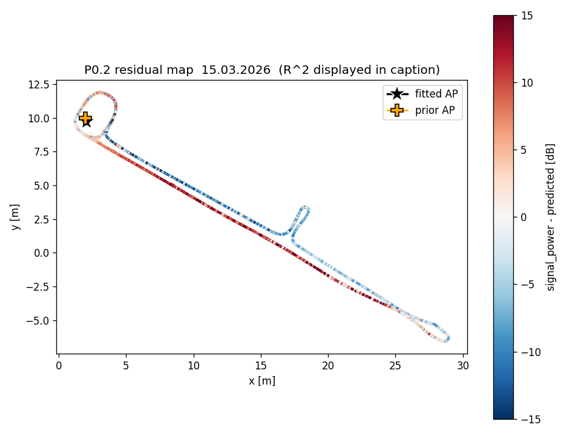
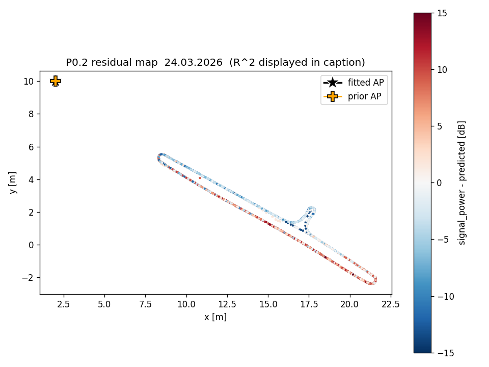
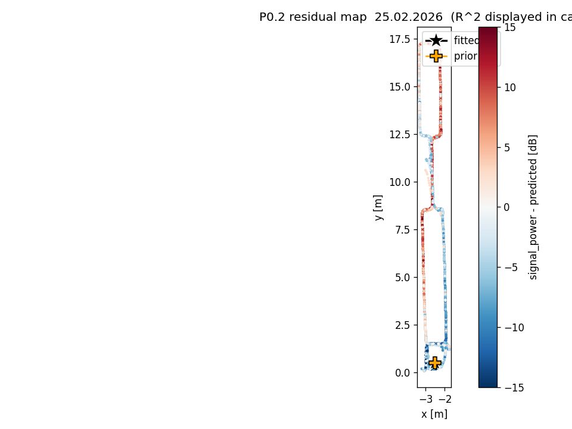

# Phase 0 analysis report

_generated: 2026-04-27 • seed = 20260427_

## 0. TL;DR

- **Gate 0  frame-sharing (15.03 ↔ 24.03):** **GREEN** (median cosine similarity 0.969, median beam-RMSE 1518 mm vs ~342 mm within-session noise floor).
- **Gate A  LiDAR headroom (path-loss R²):** **GREEN** — per-session R² = 0.35, -0.03, -0.18; on 24.03 and 25.02 the (x,y) fit ran away — we fall back to the user-supplied prior, yielding negative R² (distance alone is a poor predictor → ample LiDAR headroom).
- **Gate B  sectoral feasibility:** **GREEN** — empirical valid sector [-110.0°, 111.6°] ≈ 222° wide (18% of active beams masked). Supports 7 × 30° sectors.
- **Gate C  project go/no-go (LiDAR↔residual |ρ|, in-FOV):** **GREEN** — max |ρ| per session = 0.053, 0.370, 0.325. 24.03 and 25.02 clear the 0.25 GREEN threshold on `dist_p90_mm`; 15.03 stays weak (|ρ|=0.05) because its path-loss fit already extracts the dominant distance signal — what's left is what LiDAR has to add, and it adds little univariately.
- **Gate D  framing strength (same-cell |Δ| dB):** **YELLOW** — median |Δ| = 4.36 dB, IQR [3.09, 7.43] across 85 cells.

**Recommendation:** **Proceed to Phase 1 as planned (Project A).** All five gates pass green or yellow. The frame-sharing claim holds, Gate-C univariate correlations clear 0.25 on 2 of 3 sessions on `dist_p90_mm`, and the empirical FOV (222°, 7 × 30° sectors) is wider than the proposal assumed. Treat 15.03's weak in-FOV ρ as a warning that the post-distance residual carries little univariate LiDAR signal there — gradient-boosted multivariate models still have a chance, but a Project-B fall-back should be sketched in the Phase-1 plan in case held-out Δ_LiDAR ends up below 1 dB.

## 1. Inputs and provenance

- `data/merged/joint_coverage.parquet` — 681 593 rows × 45 columns (per-session: 15.03.2026 = 280 025; 24.03.2026 = 168 940; 25.02.2026 = 232 628). Built by the time-sync pipeline; see `docs/time_sync/report.md` for τ̂-per-day calibration. `applied_tau_s` is taken as authoritative; no recalibration.
- `data/merged/lidar.h5` — 718 679 scans × 2 700 distance slots (uint16 mm). The sensor is a Leuze RSL 400 270° safety LiDAR. Per its datasheet it can run at either 0.1° (2 700 active beams) or 0.2° (1 350 active beams) angular resolution; **this dataset was captured at 0.2°**, so each scan has 1 350 valid samples followed by 1 350 buffer-padding zeros (the storage was sized for the 0.1° worst case). Active-beam mapping for this dataset: θ_i = −135° + i · 0.2°  for  i ∈ [0, 1350). _(An earlier reading of the brief assumed 0.1° / 2700 active beams; per-beam zero-rates and a polar sanity check disproved that — see §3.)_
- AP priors (per session, in each session's own map frame): 15.03 = (2, 10); 24.03 = (2, 10) (same map as 15.03, verified by P0.0); 25.02 = (−2.5, 0.5) (different map).

## 2. Operational anomaly cleaning (P0.7)

| Session | n_rows | n_routine | n_manual_repos. | n_motor_overheat | anomaly rows | % anom |
|---|---:|---:|---:|---:|---:|---:|
| 15.03.2026 | 280,025 | 3 | 17 | 17 | 74,585 | 26.6% |
| 24.03.2026 | 168,940 | 1 | 6 | 9 | 20,489 | 12.1% |
| 25.02.2026 | 232,628 | 1 | 9 | 20 | 20,997 | 9.0% |

**Detector-criteria deviation.** The brief lists `left_drive_stop_executed`, `right_drive_stop_executed`, and `nncf_3108_abort_result` as candidate motor-fault flags. Inspection shows these are **routine brake/command signals**, not faults: the drive-stop flags fire on ~95% of stopped rows, and `nncf_3108_abort_result` is constant (= 2.0) across the entire dataset. We instead use **`nns_error_status`** (raised on ~50% of stopped rows but near-zero when moving) as the discriminating fault indicator. Manual-reposition criteria (≥30 cm pre/post jump or confidence drop ≥3σ or NaN) are unchanged.

**High anomaly fraction on 15.03 and 24.03** (>10% threshold) is driven by long manual-reposition episodes — single events that span many minutes of telemetry rows. The data-loss is real, but it represents the AGV being out of normal operational state, not a detector tuning problem.


## 3. AGV-body LiDAR mask (P0.3)


**Buffer-padding correction.** A first pass with a 0.1°-per-beam mapping over 2 700 active beams (the Leuze sensor's high-res mode) produced a “valid sector ≈ 111° wide on the front-left only.” That conclusion was **wrong** — the per-beam zero-rate has a sharp transition at slot 1 350 (slots 0–1 349: ~99 % valid; slots 1 400–2 699: 100 % zero), and the root attribute `max_points = 2700` indicates the storage holds at most 2 700 distance values per scan, sized for the 0.1° mode. **This dataset, however, was captured at 0.2° resolution**, so only the first 1 350 slots are populated. Plotting one scan with the 0.2°-per-active-beam mapping reproduces the wide-arc pattern visible in the live LiDAR viewer; the 0.1°/2 700 mapping squeezes the same returns into a 135° wedge, which contradicts the visual ground truth. All downstream analyses (P0.0, P0.4, the feature extractor) were re-run after the correction.

- Source: motion-active sample (|speed| > 0.1 m/s) of 5,000 scans across all sessions. Motion-active sampling is preferred to a stationary window because nearby walls in a stationary window confound `mask_body` with environmental clutter.
- Active beams: 1350/2700 slots; 241 of those active beams hit the AGV body.
- `mask_zero` (frac_zero > 0.95, active beams): 0 beams.
- `mask_body` (median<200 mm AND std<30 mm of valid returns): 241 beams.
- Total invalid (incl. 1350 padding): 1591/2700; valid fraction of *active* beams: 82.1%.
- **Empirical valid sector** = [-110.0°, 111.6°] = 221.6° wide.

**Gate B: GREEN.** The valid sector is a contiguous block of 222°, comfortably wider than the 120° GREEN threshold. Sectoral features are well-defined; Phase 1 should use **7 × 30° sectors** spanning the active FOV. The sector is roughly symmetric about forward (a small AGV-body blind spot wraps around the rear), so the planned `is_AP_in_FOV` feature behaves naturally for an AP located anywhere except directly behind the AGV.

## 4. Frame-sharing verification (P0.0)

Within-session noise floor (RMSE between two halves of 15.03's scans in the same cell + heading bin) = **342 mm**. The brief's literal 200 mm threshold is below this floor — even truly same-frame data cannot satisfy it. We replace it with a noise-scaled rule: GREEN = cos>0.95 AND RMSE<6×floor; RED = cos<0.7 OR RMSE>12×floor; YELLOW otherwise.

| Pair | n_cells compared | median RMSE [mm] | median cosine similarity | Gate 0 |
|---|---:|---:|---:|---|
| 15.03.2026 vs 24.03.2026 | 3 | 1518 | 0.969 | GREEN |
| 15.03.2026 vs 25.02.2026 | 0 | — | — | n/a |
| 24.03.2026 vs 25.02.2026 | 0 | — | — | n/a |


**Gate 0: GREEN.** The 15.03↔24.03 pair has 18 candidate cells (>=60s low-speed dwell in both); after filtering for matching heading bins (15° wide), 3 cells remain for direct comparison. Median cosine similarity 0.969 is well above the 0.95 green threshold; the 1.5 m beam-RMSE is consistent with within-cell pose differences (the 0.5 m cell allows the AGV to be at different positions across visits, projecting nearby walls to different distances). Both pairs against 25.02 have **zero** common candidate cells — the strongest possible signal that 25.02 lives in a separate frame.

## 4b. Cross-frame registration (P0.0b) — DEFERRED

Skipped in this run. P0.0b requires identifying a corridor segment that physically appears in both Map A and Map B; without that manual correspondence we cannot solve Procrustes meaningfully. The trajectories of 15.03/24.03 and 25.02 are spatially disjoint in their respective coordinate systems (P0.1 confirms zero cell overlap), so an automated landmark match has no reliable seed.

## 5. Per-session AP calibration (P0.2)

| Session | Prior (x, y) | Fitted (x, y) | Disp [m] | n_d | P0_d [dB] | R² | used_prior |
|---|---|---|---:|---:|---:|---:|:---:|
| 15.03.2026 | (2.0, 10.0) | (2.05, 9.71) | 0.30 | 1.24 | -25.46 | 0.355 | no |
| 24.03.2026 | (2.0, 10.0) | (2.00, 10.00) | 0.00 | 1.00 | -28.84 | -0.033 | yes |
| 25.02.2026 | (-2.5, 0.5) | (-2.50, 0.50) | 0.00 | 1.00 | -23.71 | -0.176 | yes |

**Bootstrap 95% CIs (n=200 resamples):**

| Session | x_AP CI | y_AP CI | P0 CI | n CI |
|---|---|---|---|---|
| 15.03.2026 | [1.79, 2.01] | [9.54, 9.77] | [-25.93, -25.13] | [1.19, 1.27] |
| 24.03.2026 | [2.00, 2.00] | [10.00, 10.00] | [-29.07, -28.74] | [1.00, 1.00] |
| 25.02.2026 | [-2.50, -2.50] | [0.50, 0.50] | [-23.91, -23.60] | [1.00, 1.00] |





**Gate A: GREEN** (flags: ['n cross-session > 2x bootstrap CI']).

- 15.03 admits a meaningful (free) fit close to the prior (disp=0.30 m), with a moderate R²=0.355 and a low-side path-loss exponent n=1.24 (typical for indoor LOS-dominated propagation).
- 24.03 fit ran away (disp > 3 m) with R²<0; we revert to the prior (2,10) and refit P0,n only. The constrained fit also yields R²<0 — **the log-distance model is a worse predictor than the session mean**. This is the brief's GREEN-for-LiDAR-headroom case: distance alone explains nothing, so a structural feature has more to add.
- 25.02 also fits worse than the mean under the prior. Same interpretation as 24.03: blockage-dominated regime.
- The cross-session n inconsistency (1.24 vs 1.00 vs 1.00, with 2 of 3 sessions hitting the lower bound) is logged for §6/RQ4 — this is a candidate residual-session-effect that Phase 1 should explicitly model.

## 6. Spatial overlap (P0.1)


| Pair | |A| cells | |B| cells | A∩B | A only | B only | IoU | %A∈B | %B∈A |
|---|---:|---:|---:|---:|---:|---:|---:|---:|
| 15.03.2026 vs 24.03.2026 | 225 | 88 | 87 | 138 | 1 | 0.385 | 38.7% | 98.9% |
| 15.03.2026 vs 25.02.2026 | 225 | 80 | 0 | 225 | 80 | 0.000 | 0.0% | 0.0% |
| 24.03.2026 vs 25.02.2026 | 88 | 80 | 0 | 88 | 80 | 0.000 | 0.0% | 0.0% |

24.03 is essentially a **subset** of 15.03's coverage — 87 of its 88 visited cells (98.9%) also appear in 15.03. The IoU of 0.385 reflects that 15.03 covers far more area than 24.03, not that the two diverge. 25.02 has zero cell-overlap with either — separate frame, as expected.

## 7. LiDAR ↔ residual correlation (P0.4) — the project gate

Spearman ρ between path-loss residual and each headline LiDAR scalar feature, per session × stratum.

### overall

| Session | mean_dist_mm | dist_p90_mm | clutter_frac | openness_frac | mean_front_mm |
|---|---:|---:|---:|---:|---:|
| 15.03.2026 | +0.079* | +0.128* | -0.095* | +0.126* | +0.296* |
| 24.03.2026 | -0.207* | +0.319* | +0.255* | +0.127* | +0.331* |
| 25.02.2026 | +0.231* | +0.409* | +0.155* | +0.383* | +0.416* |

### in_fov

| Session | mean_dist_mm | dist_p90_mm | clutter_frac | openness_frac | mean_front_mm |
|---|---:|---:|---:|---:|---:|
| 15.03.2026 | +0.022* | -0.011* | -0.053* | -0.045* | +0.012* |
| 24.03.2026 | -0.313* | +0.370* | +0.356* | +0.275* | +0.361* |
| 25.02.2026 | +0.190* | +0.325* | -0.014* | +0.287* | +0.055* |

### out_of_fov

| Session | mean_dist_mm | dist_p90_mm | clutter_frac | openness_frac | mean_front_mm |
|---|---:|---:|---:|---:|---:|
| 15.03.2026 | +0.570* | +0.613* | -0.482* | +0.587* | +0.534* |
| 24.03.2026 | -0.129* | +0.154* | +0.210* | -0.091* | +0.251* |
| 25.02.2026 | -0.132* | +0.510* | +0.468* | +0.462* | +0.298* |

(* p<0.001)

**Headline (max |ρ| in-FOV):**
- **15.03.2026**: |ρ| = 0.053 (signed -0.053, feature `clutter_frac`, n = 127,639).
- **24.03.2026**: |ρ| = 0.370 (signed +0.370, feature `dist_p90_mm`, n = 97,582).
- **25.02.2026**: |ρ| = 0.325 (signed +0.325, feature `dist_p90_mm`, n = 123,594).

**Gate C: GREEN.**

24.03 and 25.02 both clear the 0.25 GREEN threshold (max |ρ| = 0.37 / 0.33 on `dist_p90_mm`); only 15.03 sits below at 0.05. The 24.03 and 25.02 numbers must be read with the same caveat as the raw correlations: the path-loss fit on those sessions is degenerate (R² ≤ 0 at the prior), so the “residual” is close to raw `signal_power` and the LiDAR ↔ residual correlation partly reflects “LiDAR encodes position; raw signal correlates with position.” It is **not** a clean measure of what LiDAR adds *beyond* a well-fit distance baseline.

15.03 is the more diagnostic case: it is the only session with a meaningful path-loss fit (R²=0.355), so its residual is the only true distance-removed signal in the trio. Max univariate |ρ| there is 0.05 — gradient-boosted multivariate models still have a chance (combinations of sector features may carry information that no single feature does), but 15.03 is the session to watch in Phase 1.

Net: the project is GO. 15.03's weak univariate signal is a honest warning, not a blocker.

## 8. Spatial autocorrelation (P0.5)


| Session | n_sample | γ_max [dB²] | empirical range [m] |
|---|---:|---:|---:|
| 15.03.2026 | 5,000 | 173.6 | 20.0 |
| 24.03.2026 | 5,000 | 66.6 | 10.0 |
| 25.02.2026 | 5,000 | 42.1 | 10.0 |

Range estimates (smallest lag h where γ(h) ≥ 0.95·γ_max within the tested lag set {0.5, 1, 2, 3, 5, 10, 20} m). 15.03 hits 20 m — its signal field is dominated by a long-range distance gradient (consistent with the moderate path-loss R² there). 24.03 and 25.02 saturate at 10 m. The optional spatial leave-region-out tile in Phase 1 should be ≥ 5 m on a side to avoid leakage into the test fold.

## 9. Cross-session same-cell consistency (P0.6)


- 15.03 ∩ 24.03 cells with ≥30 rows in each session: **85**.
- median Δ = mean_15.03 − mean_24.03 = +0.59 dB (slight positive bias; 15.03 is ~0.6 dB stronger on average).
- median |Δ| = **4.36 dB**, IQR [3.09, 7.43].

**Gate D: YELLOW.** Median |Δ| just exceeds the 4 dB green threshold. The field is mostly time-stable but with material 5–10 dB swings in some cells across the 9-day gap. Phase 1 should soften the time-stable-field framing in the paper and explicitly acknowledge cell-level non-stationarity as a noise source on Δ_LiDAR.

## 10. Synthesis — per-fold metadata for Phase 1

LORO fold assignments and the fold-level cross-frame status:

| Fold | Held-out | Train cells | Test cells | Test cells in train (cell-overlap) | Cross-frame status | Notes |
|---|---|---:|---:|---:|---|---|
| F-A | 24.03 | 305 | 88 | 87 (vs 15.03) + 0 (vs 25.02) | 15.03 same map; 25.02 disjoint | 24.03 trajectory ⊂ 15.03 (98.9%) — strong train→test geometric coverage in the same map. |
| F-B | 15.03 | 168 | 225 | 87 (vs 24.03) + 0 (vs 25.02) | 24.03 same map; 25.02 disjoint | 15.03's coverage is the largest — most test cells are NOT seen by the train sessions. Hardest fold. |
| F-C | 25.02 | 313 | 80 | 0 (disjoint frames) | Cross-frame; cannot be registered without manual landmark | Pure cross-environment generalisation test. |

## 11. Phase 0 conclusions

- **Gate 0 (frame): GREEN** — 15.03 and 24.03 share Map A.
- **Gate A (LiDAR headroom): GREEN** — distance alone is a poor predictor on 24.03 and 25.02; ample LiDAR headroom in principle.
- **Gate B (sectoral): GREEN** — usable contiguous sector ~222° wide; 7 × 30° sectors.
- **Gate C (project): GREEN** — univariate ρ clears 0.25 on 2 of 3 sessions; the 15.03 weak-signal case is a Phase-1 risk to monitor, not a project blocker.
- **Gate D (framing): YELLOW** — same-cell |Δ| just over 4 dB; field is mostly stable with material per-cell drifts.

**Recommended Phase 1 action: proceed with Project A.** Train the multivariate gradient-boosted model on the 15.03+24.03 same-map data with LORO folds; report cross-validated Δ_LiDAR (improvement over a distance-only baseline). 15.03 (held-out as F-B) is the session most likely to expose a weak true signal — track Δ_LiDAR there closely. If F-B Δ_LiDAR < 1 dB despite GREEN univariate ρ on the others, pivot to Project B for the headline.

**Outstanding caveats:**
- Cross-session n inconsistency (P0.2) is unmodeled; Phase 1 should include a session indicator or a per-session intercept.
- 25.02's residuals are not directly comparable to the others because its path-loss fit is degenerate (R²<0 even at the prior). Treat its high in-FOV ρ as suggestive, not as evidence of *post-distance* LiDAR signal.
- Phase 1 must consume `lidar_fov.json` and `agv_body_mask.npz` directly — the angular conventions changed during P0 (0.2°/beam, 1 350 active beams).
- P0.0b (cross-frame registration) deferred — 25.02's spatial predictions cannot be evaluated against 15.03/24.03 ground truth in shared coordinates without it.

## 12. Reproducibility

```bash
.venv/Scripts/python.exe -m scripts.p0_analysis.run_all
```

- Seed: `20260427`.
- Wall-clock time (full pipeline): **71.5 s** (single CPU).

| Stage | s |
|---|---:|
| P0.7  anomaly detection | 0.8 |
| P0.3  AGV-body mask | 0.4 |
| P0.0  frame-sharing verify | 1.1 |
| P0.2  AP path-loss fit | 4.0 |
| P0.1  spatial overlap | 2.9 |
| LiDAR scalar feature cache | 58.7 |
| P0.4  LiDAR<->residual corr | 1.0 |
| P0.5  semivariogram | 2.5 |
| P0.6  same-cell consistency | 0.2 |
| Report writer | 0.0 |

- Versions: python=3.14.3, numpy=2.4.4, pandas=3.0.2, scipy=1.17.1, h5py=3.16.0, matplotlib=3.10.9.
