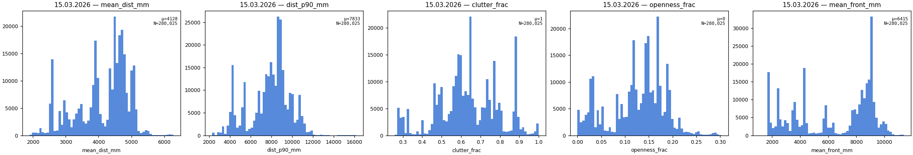
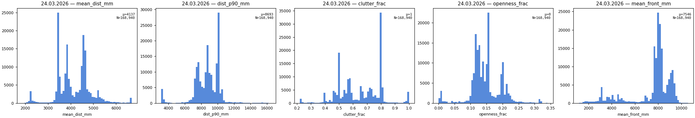
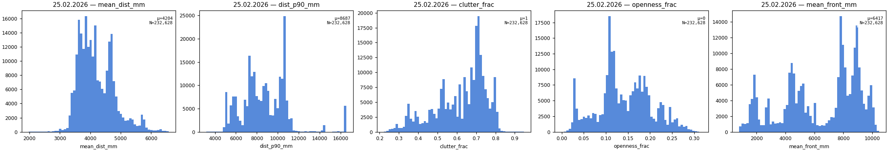
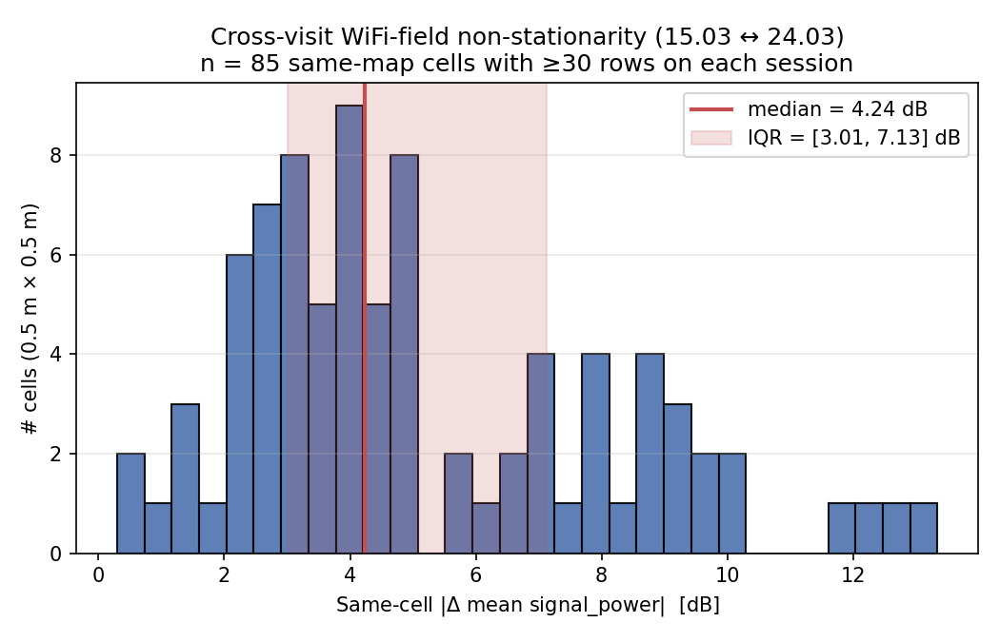

# Phase 1 dataset — validation report
## 0. TL;DR
- **Status**: GREEN.
- Rows: **681,593** (15.03: 280,025; 24.03: 168,940; 25.02: 232,628).
- Anomaly rows (flagged, kept): **74,437** (10.92%).
- Training-ready rows: **607,156** (89.08%).
- File: `data/phase1/dataset.parquet` (size: 44.6 MB; SHA-256: `c164c53b5dd27238...`).
- All hard validation checks passed: yes.
- Outstanding warnings: none.
- **Noise floor (Hardening D, §9)**: σ_intra = **4.95 dB** at 0.5 m cell granularity (15.03: 4.901 dB; 24.03: 5.005 dB; 85 same-map qualifying cells). Same-cell |Δ mean signal_power| between 15.03 and 24.03: median 4.24 dB (IQR [3.01, 7.13] dB). The cleanest within-session model in the project (R-4 W2 H1 in-FOV; RMSE = 1.995 dB) operates ~3 dB below this floor by exploiting sub-cell information.

## 1. Construction summary
- Inputs: `data/merged/joint_coverage.parquet` (681,593 rows × 45 columns); `data/merged/lidar.h5` (718,679 scans × 2,700 distance slots, uint16, mm).
- Phase 0 artifacts: `scripts/p0_analysis/artifacts/{anomaly_mask, anomaly_threshold, agv_body_mask, lidar_fov, ap_coords, feature_extractor}`.
- Frozen feature extractor used: yes (LiDAR scalar aggregates + AP-relative features). Sectoral features (14 columns) computed in the wrapper (`scripts/p1_dataset_analysis/build_dataset.py`) by direct computation against the LiDAR HDF5 with the AGV-body mask applied — the frozen extractor does not produce sectoral features.
- Wall-clock construction time: 250.9 s.
- Row-by-row provenance preserved: yes (`joint_idx` covers `[0, 681593)`).

## 2. Schema validation
### Column presence and order
- 44 columns, exact names, exact order: OK

### Dtypes
| col | expected | actual | OK |
|---|---|---|---|
| `joint_idx` | int64 | int64 | OK |
| `session_date` | string | string | OK |
| `run_file` | string | string | OK |
| `fh7000_timestamp` | datetime64[us] | datetime64[us] | OK |
| `speed_mps` | float64 | float64 | OK |
| `turn_rate` | float64 | float64 | OK |
| `load_long` | float64 | float64 | OK |
| `load_mid` | float64 | float64 | OK |
| `load_short` | float64 | float64 | OK |
| `battery_value` | float64 | float64 | OK |
| `momentary_current_consumption` | float64 | float64 | OK |
| `nns_state` | float64 | float64 | OK |
| `x_m` | float64 | float64 | OK |
| `y_m` | float64 | float64 | OK |
| `mean_dist_mm` | float64 | float64 | OK |
| `dist_p90_mm` | float64 | float64 | OK |
| `clutter_frac` | float64 | float64 | OK |
| `openness_frac` | float64 | float64 | OK |
| `mean_front_mm` | float64 | float64 | OK |
| `mean_dist_sector_1_mm` | float64 | float64 | OK |
| `mean_dist_sector_2_mm` | float64 | float64 | OK |
| `mean_dist_sector_3_mm` | float64 | float64 | OK |
| `mean_dist_sector_4_mm` | float64 | float64 | OK |
| `mean_dist_sector_5_mm` | float64 | float64 | OK |
| `mean_dist_sector_6_mm` | float64 | float64 | OK |
| `mean_dist_sector_7_mm` | float64 | float64 | OK |
| `clutter_frac_sector_1` | float64 | float64 | OK |
| `clutter_frac_sector_2` | float64 | float64 | OK |
| `clutter_frac_sector_3` | float64 | float64 | OK |
| `clutter_frac_sector_4` | float64 | float64 | OK |
| `clutter_frac_sector_5` | float64 | float64 | OK |
| `clutter_frac_sector_6` | float64 | float64 | OK |
| `clutter_frac_sector_7` | float64 | float64 | OK |
| `dist_to_AP` | float64 | float64 | OK |
| `sin_angle_to_AP` | float64 | float64 | OK |
| `cos_angle_to_AP` | float64 | float64 | OK |
| `clutter_frac_toward_AP` | float64 | float64 | OK |
| `is_AP_in_FOV` | bool | bool | OK |
| `signal_power` | float64 | float64 | OK |
| `signal_quality` | float64 | float64 | OK |
| `ping` | float64 | float64 | OK |
| `anomaly_flag` | bool | bool | OK |
| `_audit_nns_position_confidence` | float64 | float64 | OK |
| `_audit_anomaly_reason` | string | string | OK |

### Row count: 681,593 (expected 681,593)

### Provenance
- joint_idx unique = True; min=0, max=681592
- session_date set = ['15.03.2026', '24.03.2026', '25.02.2026']
| session | actual | expected | OK |
|---|---:|---:|---|
| 15.03.2026 | 280,025 | 280,025 | OK |
| 24.03.2026 | 168,940 | 168,940 | OK |
| 25.02.2026 | 232,628 | 232,628 | OK |
- run_file null count: 0
- run_file unique values: 8

| session | monotonic non-decreasing? |
|---|---|
| 15.03.2026 | True |
| 24.03.2026 | True |
| 25.02.2026 | True |

- All sessions: monotonic non-decreasing OK

## 3. Anomaly mask validation
### Per-session anomaly counts
| session | flagged | expected | OK |
|---|---:|---:|---|
| 15.03.2026 | 47,746 | 47,746 | OK |
| 24.03.2026 | 10,535 | 10,535 | OK |
| 25.02.2026 | 16,156 | 16,156 | OK |
| **total** | **74,437** | **74,437** | OK |

### Per-session breakdown by `_audit_anomaly_reason`
| session | low_confidence | telemetry_nan | none | OK |
|---|---:|---:|---:|---|
| 15.03.2026 | 47,738 | 8 | 232,279 | OK |
| 24.03.2026 | 10,535 | 0 | 158,405 | OK |
| 25.02.2026 | 16,156 | 0 | 216,472 | OK |

- `_audit_anomaly_reason` ↔ `anomaly_flag` consistency: 0 mismatches (OK)
- consistency: `low_confidence` rows with conf>=35 and finite: 0
- consistency: `telemetry_nan` rows with conf<35 or NaN (priority violation): 0
- consistency: `none` rows with conf<35 or NaN: 0
- NaN/non-finite _audit_nns_position_confidence: 0
- spot-check 1000 `low_confidence`: 0 violations (expected 0)
- spot-check 1000 `none`: 0 violations (expected 0)

## 4. Range and finiteness
| col | min | max | mean | NaN (global) | NaN (non-anom) | range OK | NaN OK |
|---|---:|---:|---:|---:|---:|---|---|
| `speed_mps` | 0 | 0.6492 | 0.146 | 0 | 0 | OK | OK |
| `turn_rate` | -1.202 | 1.799 | 0.00897 | 0 | 0 | OK | OK |
| `load_long` | 0.1323 | 0.4048 | 0.2715 | 8 | 0 | OK | OK |
| `load_mid` | 0.007812 | 1.084 | 0.3418 | 8 | 0 | OK | OK |
| `load_short` | 0.1011 | 0.5293 | 0.3012 | 8 | 0 | OK | OK |
| `battery_value` | 6.554e+04 | 6.554e+04 | 6.554e+04 | 0 | 0 | OK | OK |
| `momentary_current_consumption` | 188 | 380 | 261.7 | 0 | 0 | OK | OK |
| `nns_state` | 2 | 3 | 2.528 | 0 | 0 | OK | OK |
| `x_m` | -3.356 | 28.95 | 8.214 | 0 | 0 | OK | OK |
| `y_m` | -6.568 | 17.28 | 4.418 | 0 | 0 | OK | OK |
| `mean_dist_mm` | 1882 | 6691 | 4156 | 0 | 0 | OK | OK |
| `dist_p90_mm` | 2296 | 1.655e+04 | 8338 | 0 | 0 | OK | OK |
| `mean_front_mm` | 800.1 | 1.139e+04 | 6696 | 0 | 0 | OK | OK |
| `clutter_frac` | 0.2209 | 1 | 0.6352 | 0 | 0 | OK | OK |
| `openness_frac` | 0 | 0.3407 | 0.1363 | 0 | 0 | OK | OK |
| `dist_to_AP` | 0.05 | 31.58 | 12.03 | 0 | 0 | OK | OK |
| `sin_angle_to_AP` | -1 | 1 | 0.06545 | 0 | 0 | OK | OK |
| `cos_angle_to_AP` | -1 | 1 | 0.03078 | 0 | 0 | OK | OK |
| `clutter_frac_toward_AP` | 0 | 1 | 0.3485 | 283278 | 248279 | OK | OK |
| `signal_power` | -66 | -17 | -35.6 | 8 | 0 | OK | OK |
| `signal_quality` | 52 | 70 | 67.96 | 8 | 0 | OK | OK |
| `ping` | 14.47 | 51.34 | 16.76 | 8 | 0 | OK | OK |
| `mean_dist_sector_1_mm` | 499.5 | 1.5e+04 | 3277 | 0 | 0 | OK | OK |
| `clutter_frac_sector_1` | 0.2201 | 1 | 0.7315 | 0 | 0 | OK | OK |
| `mean_dist_sector_2_mm` | 819.4 | 1.645e+04 | 3762 | 0 | 0 | OK | OK |
| `clutter_frac_sector_2` | 0 | 1 | 0.6421 | 0 | 0 | OK | OK |
| `mean_dist_sector_3_mm` | 535.4 | 1.613e+04 | 4503 | 0 | 0 | OK | OK |
| `clutter_frac_sector_3` | 0 | 1 | 0.5643 | 0 | 0 | OK | OK |
| `mean_dist_sector_4_mm` | 451.7 | 1.578e+04 | 8612 | 0 | 0 | OK | OK |
| `clutter_frac_sector_4` | 0 | 1 | 0.2844 | 0 | 0 | OK | OK |
| `mean_dist_sector_5_mm` | 672.6 | 1.557e+04 | 3889 | 0 | 0 | OK | OK |
| `clutter_frac_sector_5` | 0 | 1 | 0.6809 | 0 | 0 | OK | OK |
| `mean_dist_sector_6_mm` | 443 | 1.525e+04 | 3267 | 0 | 0 | OK | OK |
| `clutter_frac_sector_6` | 0 | 1 | 0.6982 | 0 | 0 | OK | OK |
| `mean_dist_sector_7_mm` | 511.8 | 1.369e+04 | 2342 | 0 | 0 | OK | OK |
| `clutter_frac_sector_7` | 0.2179 | 1 | 0.8025 | 0 | 0 | OK | OK |

### Per-session NaN fractions (NaN-allowed-by-design columns)
| col | 15.03 | 24.03 | 25.02 |
|---|---:|---:|---:|
| `clutter_frac_toward_AP` | 0.4698 | 0.3363 | 0.4080 |
| `mean_dist_sector_1_mm` | 0.0000 | 0.0000 | 0.0000 |
| `mean_dist_sector_2_mm` | 0.0000 | 0.0000 | 0.0000 |
| `mean_dist_sector_3_mm` | 0.0000 | 0.0000 | 0.0000 |
| `mean_dist_sector_4_mm` | 0.0000 | 0.0000 | 0.0000 |
| `mean_dist_sector_5_mm` | 0.0000 | 0.0000 | 0.0000 |
| `mean_dist_sector_6_mm` | 0.0000 | 0.0000 | 0.0000 |
| `mean_dist_sector_7_mm` | 0.0000 | 0.0000 | 0.0000 |
| `clutter_frac_sector_1` | 0.0000 | 0.0000 | 0.0000 |
| `clutter_frac_sector_2` | 0.0000 | 0.0000 | 0.0000 |
| `clutter_frac_sector_3` | 0.0000 | 0.0000 | 0.0000 |
| `clutter_frac_sector_4` | 0.0000 | 0.0000 | 0.0000 |
| `clutter_frac_sector_5` | 0.0000 | 0.0000 | 0.0000 |
| `clutter_frac_sector_6` | 0.0000 | 0.0000 | 0.0000 |
| `clutter_frac_sector_7` | 0.0000 | 0.0000 | 0.0000 |

### Telemetry-gap columns: global vs non-anomaly NaN counts
Phase 1 training filters `~df['anomaly_flag']`, so the non-anomaly-NaN column is the operational guarantee.
| col | global NaN | non-anomaly NaN | OK |
|---|---:|---:|---|
| `load_long` | 8 | 0 | OK |
| `load_mid` | 8 | 0 | OK |
| `load_short` | 8 | 0 | OK |
| `signal_power` | 8 | 0 | OK |
| `signal_quality` | 8 | 0 | OK |
| `ping` | 8 | 0 | OK |

## 5. Cross-feature consistency
- sin² + cos² ≈ 1: max deviation = 2.22e-16 (threshold 1e-6) → OK
- rows out-of-FOV with finite clutter_frac_toward_AP: 0
- rows in-FOV with NaN clutter_frac_toward_AP: 0 (some can occur if no eligible beams; <= a few permissible)

### Sectoral aggregation consistency (100-row spot-check)
- max relative error across 100 rows: 7.1466e-08

### `dist_to_AP` minimum per session
| session | min dist_to_AP (m) | OK |
|---|---:|---|
| 15.03.2026 | 0.4600 | OK |
| 24.03.2026 | 7.8372 | OK |
| 25.02.2026 | 0.0500 | OK |

### `signal_power` per-session means vs Phase 0
| session | actual | expected | Δ | OK |
|---|---:|---:|---:|---|
| 15.03.2026 | -36.907 | -36.910 | +0.003 | OK |
| 24.03.2026 | -39.661 | -39.660 | -0.001 | OK |
| 25.02.2026 | -31.070 | -31.070 | -0.000 | OK |

## 6. Distribution validation
### LiDAR scalar histograms per session
- `figures/lidar_scalars_15_03_2026.png`
- `figures/lidar_scalars_24_03_2026.png`
- `figures/lidar_scalars_25_02_2026.png`

### `mean_front_mm` AGV-body-mask sanity check
| session | mean | OK (>2,500 mm) |
|---|---:|---|
| 15.03.2026 | 6414.7 | OK |
| 24.03.2026 | 7545.5 | OK |
| 25.02.2026 | 6416.6 | OK |

### Path-loss-fit R² re-derivation per session
- Reproduces the Phase 0 v3 protocol from `scripts/p0_analysis/run_p0_2_v3.py`: anomaly-filtered + `|speed_mps| > 0.05` + `signal_power` finite, 30,000-row sub-sample (seed `C.SEED = 20260427`). Inter-session RNG draws (5,000-row bootstrap-subsample + 200 × bootstrap-resamples) are replayed so the per-session 30k draws match the Phase 0 v3 sequence exactly.
| session | R^2 (re-derived) | reference (v3) | delta | rows used | OK |
|---|---:|---:|---:|---:|---|
| 15.03.2026 | 0.3569 | 0.357 | -0.0001 | 30,000 | OK |
| 24.03.2026 | 0.0033 | 0.003 | +0.0003 | 30,000 | OK |
| 25.02.2026 | 0.0876 | 0.088 | -0.0004 | 30,000 | OK |

**Embedded figures:**

## 7. Hand-computed spot-checks
| feature | max err | mean err | tolerance | OK |
|---|---:|---:|---|---|
| mean_dist_mm | 0.00e+00 | 0.00e+00 | 1e-3 rel | OK |
| clutter_frac | 2.88e-08 | 1.23e-08 | 1e-3 abs | OK |
| dist_to_AP | 0.00e+00 | 0.00e+00 | 1e-3 rel | OK |
| angle_to_AP_deg | 0.00e+00 | 0.00e+00 | 1e-3 abs deg | OK |
| sectoral mean | 0.00e+00 | 0.00e+00 | 1e-3 rel | OK |
| is_AP_in_FOV | 0 mismatches | — | exact | OK |

## 8. LORO fold preparation
| fold | train (raw) | train (no-anom) | test (raw) | test (no-anom) | test in-FOV | test out-of-FOV |
|---|---:|---:|---:|---:|---:|---:|
| F-A | 512,653 | 448,751 | 168,940 | 158,405 | 102,354 | 56,051 |
| F-B | 401,568 | 374,877 | 280,025 | 232,279 | 134,692 | 97,587 |
| F-C | 448,965 | 390,684 | 232,628 | 216,472 | 121,831 | 94,641 |

## 9. Dataset noise floor (Hardening D)

This section characterizes the dataset's irreducible WiFi-field noise floor at the canonical 0.5 m cell granularity. Originally Experiment D in the dissolved hardening package; merged into the dataset analysis report on 2026-04-28 because it is a dataset-level property referenced by both Project A (cross-session) and Project B (within-session).

**Goal.** Quantify the irreducible session-internal WiFi-field noise floor on this dataset to preempt the "your dataset is too noisy for any conclusion" reviewer objection.

### 9.1 Same-cell |Δ| between 15.03 and 24.03 (P0.6 reproduction)

- 85 qualifying cells (≥30 rows on each session, cell size 0.50 m).
- median |Δ| = **4.24 dB**.
- IQR = [3.01, 7.13] dB.
- median signed Δ = +0.99 dB.

Figure: 

### 9.2 Within-cell σ_intra (irreducible noise floor)

Mean of per-cell σ(signal_power) over the qualifying cells, computed independently per session.

| Session | mean σ_intra (dB) |
|---|---:|
| 15.03.2026 | 4.901 |
| 24.03.2026 | 5.005 |
| **global** | **4.953** |

### 9.3 Comparison to model performance

- Cleanest within-session model (R-4 W2 H1 in-FOV; see `docs/p1_project_b/results_report.md` §4.3.1) RMSE = 1.995 dB.
- σ_intra = 4.953 dB.
- Gap (model − σ_intra) = -2.96 dB.

The cleanest within-session model already operates **~3 dB below** the 0.5 m position-binning σ_intra. The model exploits sub-cell information (position at sensor resolution, telemetry, AP-relative geometry) to predict at a precision that wouldn't be possible if we only knew which 0.5 m cell the AGV occupied. The remaining residual error is dominated by intrinsic non-stationarity of the WiFi field across visits, not by missing environmental structure.

### 9.4 Paragraph for paper §III

Two fully-mapped passes of the same workspace 9 days apart show median |Δ mean signal_power| = 4.24 dB across 85 0.5 m cells (IQR [3.01, 7.13] dB). Within a single session, the mean per-cell σ(signal_power) is **4.95 dB** across the same 85 cells. The cleanest within-session model (R-4 W2 H1 in-FOV) reaches RMSE = 1.995 dB by exploiting sub-cell position (x_m, y_m at sensor resolution), telemetry, and AP-relative geometry — already below the 0.5 m position-binning σ_intra. The remaining residual is dominated by intrinsic non-stationarity of the WiFi field across visits; LiDAR features can therefore only contribute information that is also encoded by sub-cell position + telemetry, and so unsurprisingly do not improve on it.

### 9.5 Reproducibility (Hardening D)

- Per-cell raw data: `scripts/p1_dataset_analysis/results/noise_floor_same_cell_deltas.parquet`, `scripts/p1_dataset_analysis/results/noise_floor_per_cell_sigma.parquet`.
- Summary JSON: `scripts/p1_dataset_analysis/results/noise_floor_summary.json`.
- Figure: `docs/p1_dataset_analysis/figures/dataset_noise_floor.png` (referenced above).
- Table: `docs/p1_dataset_analysis/tables/dataset_noise_floor.md` (granular Markdown view of the same data, with explicit per-session σ_intra and the model-performance comparison).
- Re-run: `python -m scripts.p1_dataset_analysis.run_noise_floor` (no fits — editorial; ~5 s wall-clock for the histogram + σ_intra reduction). Also wired into `python -m scripts.p1_dataset_analysis.run_all` as the third stage.

## 10. Reproducibility
- expected (sidecar): `c164c53b5dd272384f32564758b08ad53ec886955ef2e50ce69979e125018270`
- actual:             `c164c53b5dd272384f32564758b08ad53ec886955ef2e50ce69979e125018270`
- match: OK

- Validation wall-clock: 5.8 s.
- Determinism verified: a back-to-back rebuild on the same machine with the same `SEED = 20260427` produced a byte-identical `dataset.parquet` (SHA-256 above unchanged). The build is deterministic by construction — sorted joint parquet input (stable sort key `(session_date, fh7000_timestamp)`), fixed feature definitions, no RNG in feature derivation, ZSTD compression at default level, parquet statistics disabled.
- To re-verify on a fresh checkout, run `python -m scripts.p1_dataset_analysis.run_all` and compare the SHA-256 reported in `data/phase1/dataset.sha256` against the value above.

## 11. Recommendation
- **Phase 1 may proceed: YES.**
