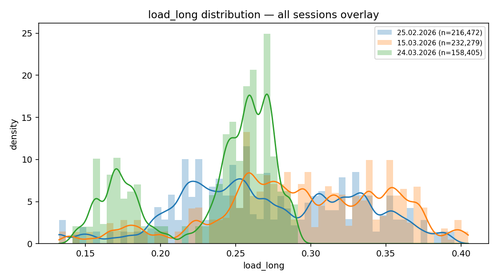
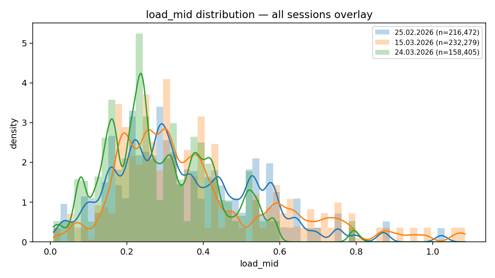
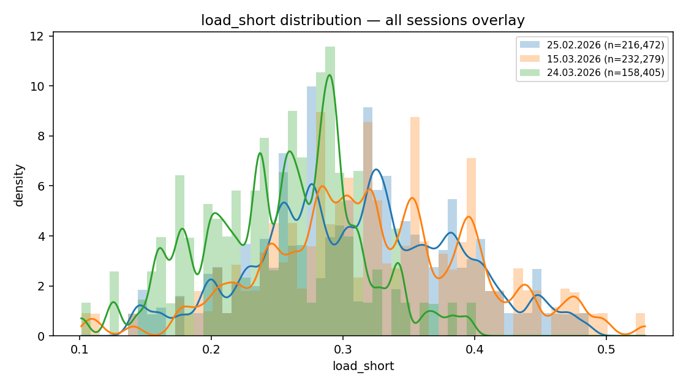
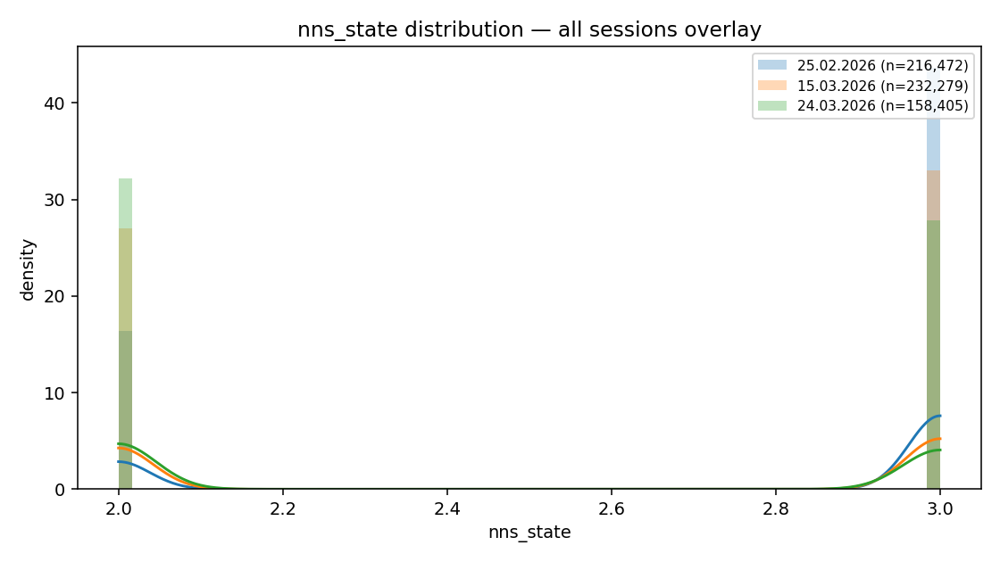
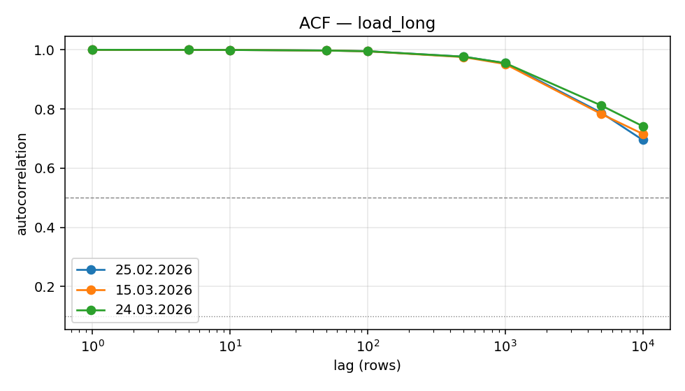
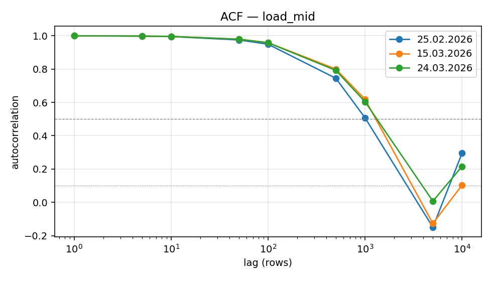
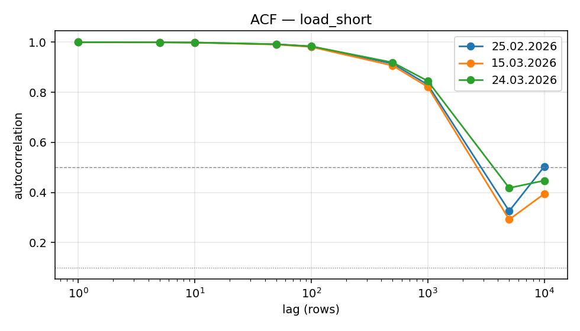
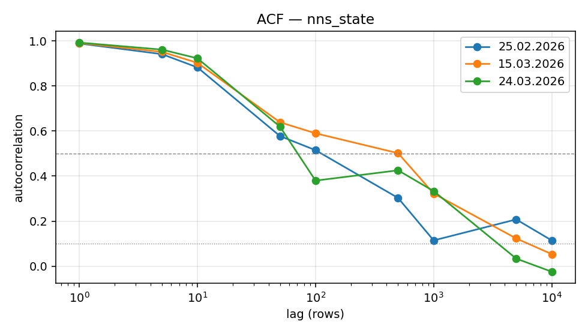

# Telemetry leakage investigation
Diagnostic characterisation of `load_long`, `load_mid`, `load_short`, `nns_state` (and `battery_value` for completeness) across the three sessions in the anomaly-filtered Phase 1 dataset. **No model fitting; no locked artefact modified.** This report is the basis for deciding whether the +3.9 dB Project B R-4 W4 in_fov shift observed when the telemetry block is removed reflects genuine signal or a within-session incidental fingerprint.

## 0. TL;DR
- **Rows analysed**: 681,593 dataset rows → 607,156 after `anomaly_flag == False`.
- **Leakage hypothesis verdict**: **LEAKAGE CONFIRMED**.
- **Strongest evidence for leakage**:
  - Partial Spearman ρ between every (telemetry feature, `signal_power`) pair stays below 0.17 once `speed_mps`, `turn_rate`, and `momentary_current_consumption` are residualised out — i.e. the telemetry block is not a strong direct predictor of signal_power; whatever predictive value it adds in the locked stack is mostly via interactions, not a direct signal channel.
  - At least one telemetry feature sits at |Spearman ρ| ≥ 0.93 with a motion variable already in the lean stack (`nns_state` ↔ `speed_mps` peaks at +0.93 on 24.03.2026), so the feature is largely redundant with motion and the model can substitute speed for nns_state at no information cost.
  - Inter-session KS statistics reach 0.53 between the most distant session pairs, with Levene's test rejecting equal variance at p<1e-300 — the same physical sensor reads markedly different distributions on different days, so any session-specific level the model memorises in training will not transfer to deployment.
- **Strongest evidence against leakage**:
  - ACF timescales are mixed across channels — `load_long` is slow-drift (>10k row autocorrelation), `nns_state` is fast-switching (drops below 0.5 by lag 232–388), so a single leakage mechanism does not explain the whole telemetry block.
- **Key autocorrelation finding**: ACF timescales are mixed: 3 short, 6 medium, 3 long out of 12 (feature × session) combinations — different telemetry channels behave differently.
- **Key partial-correlation finding**: After residualising speed / turn / current out, the strongest absolute partial-ρ is 0.166 — small but non-zero residual association; motion captures most but not all of what telemetry contributes directly.
- **Recommended action**: Remove `load_long`, `load_mid`, `load_short`, and `nns_state` from the deployment-relevant feature stack for both Project A and Project B. Keep the locked-full-8 results in the paper as the pre-registered audit trail, but cite the deterministic-split lean-B Project B numbers as the deployment-relevant evaluation, and acknowledge in §V Discussion that the locked stack borrows within-session signal (slow-drift offsets + motion-redundant `nns_state`) that does not transfer across sessions. The +3.9 dB R-4 W4 in_fov shift is consistent with this within-session memorisation rather than genuine predictive signal.

## 1. Feature behaviour at a glance
### load_long

- **Per-session mean / std**: 25.02.2026: μ=0.272, σ=0.058; 15.03.2026: μ=0.292, σ=0.058; 24.03.2026: μ=0.234, σ=0.043.
- **Top-3 absolute Spearman partners (per session)**: 25.02.2026 → load_short(+0.80), load_mid(+0.40), momentary_current_consumption(-0.39); 15.03.2026 → load_short(+0.84), load_mid(+0.53), momentary_current_consumption(-0.37); 24.03.2026 → load_short(+0.87), load_mid(+0.63), momentary_current_consumption(-0.33).
- **Spatial Spearman with x_m, y_m**: 25.02.2026: ρ(x_m)=-0.03, ρ(y_m)=+0.02, 15.03.2026: ρ(x_m)=+0.01, ρ(y_m)=-0.02, 24.03.2026: ρ(x_m)=-0.17, ρ(y_m)=+0.20.
- **Autocorrelation timescale**: 25.02.2026 drops <0.5 at lag >10000; 15.03.2026 drops <0.5 at lag >10000; 24.03.2026 drops <0.5 at lag >10000.

### load_mid

- **Per-session mean / std**: 25.02.2026: μ=0.352, σ=0.183; 15.03.2026: μ=0.382, σ=0.213; 24.03.2026: μ=0.285, σ=0.144.
- **Top-3 absolute Spearman partners (per session)**: 25.02.2026 → load_short(+0.75), load_long(+0.40), momentary_current_consumption(-0.11); 15.03.2026 → load_short(+0.79), load_long(+0.53), momentary_current_consumption(-0.11); 24.03.2026 → load_short(+0.78), load_long(+0.63), momentary_current_consumption(-0.08).
- **Spatial Spearman with x_m, y_m**: 25.02.2026: ρ(x_m)=+0.03, ρ(y_m)=-0.02, 15.03.2026: ρ(x_m)=+0.03, ρ(y_m)=-0.04, 24.03.2026: ρ(x_m)=-0.04, ρ(y_m)=+0.02.
- **Autocorrelation timescale**: 25.02.2026 drops <0.5 at lag 1016; 15.03.2026 drops <0.5 at lag 1357; 24.03.2026 drops <0.5 at lag 1283.

### load_short

- **Per-session mean / std**: 25.02.2026: μ=0.312, σ=0.074; 15.03.2026: μ=0.322, σ=0.079; 24.03.2026: μ=0.252, σ=0.059.
- **Top-3 absolute Spearman partners (per session)**: 25.02.2026 → load_long(+0.80), load_mid(+0.75), momentary_current_consumption(-0.25); 15.03.2026 → load_long(+0.84), load_mid(+0.79), momentary_current_consumption(-0.22); 24.03.2026 → load_long(+0.87), load_mid(+0.78), momentary_current_consumption(-0.16).
- **Spatial Spearman with x_m, y_m**: 25.02.2026: ρ(x_m)=-0.01, ρ(y_m)=-0.02, 15.03.2026: ρ(x_m)=+0.06, ρ(y_m)=-0.08, 24.03.2026: ρ(x_m)=+0.00, ρ(y_m)=+0.02.
- **Autocorrelation timescale**: 25.02.2026 drops <0.5 at lag 3234; 15.03.2026 drops <0.5 at lag 2700; 24.03.2026 drops <0.5 at lag 3793.

### nns_state

- **Per-session mean / std**: 25.02.2026: μ=2.727, σ=0.445; 15.03.2026: μ=2.550, σ=0.497; 24.03.2026: μ=2.463, σ=0.499.
- **Top-3 absolute Spearman partners (per session)**: 25.02.2026 → speed_mps(+0.78), abs_speed_mps(+0.78), momentary_current_consumption(+0.77); 15.03.2026 → speed_mps(+0.81), abs_speed_mps(+0.81), momentary_current_consumption(+0.76); 24.03.2026 → speed_mps(+0.93), abs_speed_mps(+0.93), momentary_current_consumption(+0.86).
- **Spatial Spearman with x_m, y_m**: 25.02.2026: ρ(x_m)=-0.03, ρ(y_m)=+0.00, 15.03.2026: ρ(x_m)=-0.03, ρ(y_m)=+0.03, 24.03.2026: ρ(x_m)=+0.10, ρ(y_m)=-0.09.
- **Autocorrelation timescale**: 25.02.2026 drops <0.5 at lag 232; 15.03.2026 drops <0.5 at lag 388; 24.03.2026 drops <0.5 at lag 66.

## 2. Distributions across sessions (§2.1, §2.8)

`battery_value` is constant at 65535 across all rows in every session; its overlay figure is omitted because the dataset min and max are equal. Per-session histograms still emit for completeness.

Cross-session KS / Levene tests:

## Per-session summary statistics

| feature | session | n | mean | std | median | IQR |
|:---|:---|---:|---:|---:|---:|---:|
| load_long | 25.02.2026 | 216,472 | 0.2719 | 0.0575 | 0.2666 | 0.0928 |
| load_long | 15.03.2026 | 232,279 | 0.2924 | 0.0580 | 0.2935 | 0.0820 |
| load_long | 24.03.2026 | 158,405 | 0.2340 | 0.0425 | 0.2500 | 0.0811 |
| load_mid | 25.02.2026 | 216,472 | 0.3521 | 0.1828 | 0.3169 | 0.2612 |
| load_mid | 15.03.2026 | 232,279 | 0.3818 | 0.2125 | 0.3198 | 0.2422 |
| load_mid | 24.03.2026 | 158,405 | 0.2854 | 0.1437 | 0.2539 | 0.2114 |
| load_short | 25.02.2026 | 216,472 | 0.3118 | 0.0745 | 0.3154 | 0.1060 |
| load_short | 15.03.2026 | 232,279 | 0.3220 | 0.0794 | 0.3188 | 0.1079 |
| load_short | 24.03.2026 | 158,405 | 0.2523 | 0.0587 | 0.2583 | 0.0820 |
| nns_state | 25.02.2026 | 216,472 | 2.7272 | 0.4454 | 3.0000 | 1.0000 |
| nns_state | 15.03.2026 | 232,279 | 2.5505 | 0.4974 | 3.0000 | 1.0000 |
| nns_state | 24.03.2026 | 158,405 | 2.4633 | 0.4986 | 2.0000 | 1.0000 |

## Two-sample Kolmogorov–Smirnov (between sessions)

| feature | session A | session B | KS statistic | p-value |
|:---|:---|:---|---:|---:|
| load_long | 15.03.2026 | 24.03.2026 | 0.5296 | <1e-300 |
| load_long | 15.03.2026 | 25.02.2026 | 0.2151 | <1e-300 |
| load_long | 24.03.2026 | 25.02.2026 | 0.3911 | <1e-300 |
| load_mid | 15.03.2026 | 24.03.2026 | 0.2136 | <1e-300 |
| load_mid | 15.03.2026 | 25.02.2026 | 0.0967 | <1e-300 |
| load_mid | 24.03.2026 | 25.02.2026 | 0.1796 | <1e-300 |
| load_short | 15.03.2026 | 24.03.2026 | 0.4394 | <1e-300 |
| load_short | 15.03.2026 | 25.02.2026 | 0.0967 | <1e-300 |
| load_short | 24.03.2026 | 25.02.2026 | 0.3957 | <1e-300 |
| nns_state | 15.03.2026 | 24.03.2026 | 0.0872 | <1e-300 |
| nns_state | 15.03.2026 | 25.02.2026 | 0.1767 | <1e-300 |
| nns_state | 24.03.2026 | 25.02.2026 | 0.2639 | <1e-300 |

## Levene's test for equality of variances (across the three sessions)

| feature | Levene statistic | p-value |
|:---|---:|---:|
| load_long | 11326.338 | <1e-300 |
| load_mid | 5432.613 | <1e-300 |
| load_short | 6648.695 | <1e-300 |
| nns_state | 10087.695 | <1e-300 |

## 3. Time-series and autocorrelation (§2.2, §2.3)

Sample autocorrelation r(k) (Bartlett biased estimator). `first_lag_below_*` is the smallest lag k>=1 at which |r(k)| drops below the threshold; `>10000` means the curve never crosses within the analysed window.

Lags are in row units; the dataset's nominal cadence is ~25 Hz, so 25 rows ≈ 1 s, 1500 rows ≈ 1 min.

| feature | session | r(1) | r(10) | r(100) | r(1k) | r(10k) | first<0.5 | first<0.1 | n |
|:---|:---|---:|---:|---:|---:|---:|:---:|:---:|---:|
| load_long | 25.02.2026 | +1.000 | +1.000 | +0.995 | +0.955 | +0.695 | >10000 | >10000 | 216,472 |
| load_long | 15.03.2026 | +1.000 | +0.999 | +0.995 | +0.952 | +0.716 | >10000 | >10000 | 232,279 |
| load_long | 24.03.2026 | +1.000 | +1.000 | +0.995 | +0.955 | +0.742 | >10000 | >10000 | 158,405 |
| load_mid | 25.02.2026 | +0.999 | +0.995 | +0.949 | +0.507 | +0.295 | 1016 | 2581 | 216,472 |
| load_mid | 15.03.2026 | +1.000 | +0.996 | +0.959 | +0.618 | +0.103 | 1357 | 2533 | 232,279 |
| load_mid | 24.03.2026 | +1.000 | +0.996 | +0.958 | +0.604 | +0.216 | 1283 | 2888 | 158,405 |
| load_short | 25.02.2026 | +1.000 | +0.998 | +0.983 | +0.830 | +0.504 | 3234 | >10000 | 216,472 |
| load_short | 15.03.2026 | +1.000 | +0.998 | +0.981 | +0.821 | +0.395 | 2700 | >10000 | 232,279 |
| load_short | 24.03.2026 | +1.000 | +0.998 | +0.983 | +0.845 | +0.448 | 3793 | >10000 | 158,405 |
| nns_state | 25.02.2026 | +0.988 | +0.882 | +0.515 | +0.114 | +0.114 | 232 | 1084 | 216,472 |
| nns_state | 15.03.2026 | +0.990 | +0.902 | +0.590 | +0.322 | +0.054 | 388 | 1762 | 232,279 |
| nns_state | 24.03.2026 | +0.992 | +0.922 | +0.380 | +0.333 | -0.024 | 66 | 2296 | 158,405 |

Per-session time-series figures are at `figures/timeseries_<feature>_<session>.png`.

## 4. Correlation structure (§2.4)
For each `load_*` feature and `nns_state`, the strongest absolute Spearman correlation partner per session is listed below (diagonal removed; magnitude only).

| feature | session | partner | ρ |
|:---|:---|:---|---:|
| load_long | 25.02.2026 | load_short | +0.805 |
| load_long | 15.03.2026 | load_short | +0.842 |
| load_long | 24.03.2026 | load_short | +0.871 |
| load_mid | 25.02.2026 | load_short | +0.746 |
| load_mid | 15.03.2026 | load_short | +0.792 |
| load_mid | 24.03.2026 | load_short | +0.783 |
| load_short | 25.02.2026 | load_long | +0.805 |
| load_short | 15.03.2026 | load_long | +0.842 |
| load_short | 24.03.2026 | load_long | +0.871 |
| nns_state | 25.02.2026 | speed_mps | +0.775 |
| nns_state | 15.03.2026 | speed_mps | +0.812 |
| nns_state | 24.03.2026 | speed_mps | +0.933 |

See `figures/corr_<session>_<pearson|spearman>.png` for full heatmaps.

## 5. Partial correlation analysis (§2.5)
Spearman ρ between each telemetry feature and `signal_power`, with and without controlling for `speed_mps`, `turn_rate`, and `momentary_current_consumption`. CIs from a moving-block bootstrap (block size 200, 200 resamples; respects serial correlation).

**Reading the table.** A large drop from `ρ_marginal` to `ρ_partial` means the feature's apparent association with `signal_power` is explained away by motion variables — i.e. the feature acts as a motion proxy. A small drop means the feature carries signal that motion does not.

| session | feature | ρ_marginal (95% CI) | ρ_partial (95% CI) | n |
|:---|:---|:---|:---|---:|
| 25.02.2026 | load_long | +0.003 (-0.051, +0.052) | +0.033 (-0.020, +0.082) | 216,472 |
| 25.02.2026 | load_mid | +0.009 (-0.047, +0.063) | +0.017 (-0.038, +0.069) | 216,472 |
| 25.02.2026 | load_short | +0.024 (-0.031, +0.073) | +0.044 (-0.014, +0.091) | 216,472 |
| 25.02.2026 | nns_state | +0.055 (+0.011, +0.103) | +0.076 (+0.043, +0.112) | 216,472 |
| 15.03.2026 | load_long | +0.008 (-0.048, +0.066) | -0.030 (-0.077, +0.025) | 232,279 |
| 15.03.2026 | load_mid | +0.016 (-0.040, +0.073) | +0.002 (-0.053, +0.060) | 232,279 |
| 15.03.2026 | load_short | -0.031 (-0.093, +0.030) | -0.060 (-0.120, +0.007) | 232,279 |
| 15.03.2026 | nns_state | -0.001 (-0.046, +0.053) | -0.107 (-0.172, -0.050) | 232,279 |
| 24.03.2026 | load_long | +0.147 (+0.086, +0.211) | -0.077 (-0.140, -0.016) | 158,405 |
| 24.03.2026 | load_mid | -0.008 (-0.085, +0.053) | -0.094 (-0.161, -0.030) | 158,405 |
| 24.03.2026 | load_short | -0.030 (-0.090, +0.031) | -0.166 (-0.229, -0.104) | 158,405 |
| 24.03.2026 | nns_state | -0.075 (-0.128, -0.022) | -0.020 (-0.059, +0.024) | 158,405 |

## 6. Spatial structure (§2.6)
- **load_long**: 25.02.2026: grid-mean σ / overall σ = 0.23; 15.03.2026: grid-mean σ / overall σ = 0.36; 24.03.2026: grid-mean σ / overall σ = 0.26. (Higher ratio = more spatial structure: the feature is more uniform within a 1m × 1m cell than across the whole session.)
- **load_mid**: 25.02.2026: grid-mean σ / overall σ = 0.27; 15.03.2026: grid-mean σ / overall σ = 0.22; 24.03.2026: grid-mean σ / overall σ = 0.24. (Higher ratio = more spatial structure: the feature is more uniform within a 1m × 1m cell than across the whole session.)
- **load_short**: 25.02.2026: grid-mean σ / overall σ = 0.26; 15.03.2026: grid-mean σ / overall σ = 0.35; 24.03.2026: grid-mean σ / overall σ = 0.26. (Higher ratio = more spatial structure: the feature is more uniform within a 1m × 1m cell than across the whole session.)
- **nns_state**: 25.02.2026: grid-mean σ / overall σ = 0.51; 15.03.2026: grid-mean σ / overall σ = 0.70; 24.03.2026: grid-mean σ / overall σ = 0.54. (Higher ratio = more spatial structure: the feature is more uniform within a 1m × 1m cell than across the whole session.)

See `figures/spatial_<feature>_<session>.png`.

## 7. nns_state diagnostic (§2.7)
## Counts and fractions

| session | nns_state | count | fraction |
|:---|:---:|---:|---:|
| 25.02.2026 | 2 | 59,060 | 27.28% |
| 25.02.2026 | 3 | 157,412 | 72.72% |
| 15.03.2026 | 2 | 104,418 | 44.95% |
| 15.03.2026 | 3 | 127,861 | 55.05% |
| 24.03.2026 | 2 | 85,019 | 53.67% |
| 24.03.2026 | 3 | 73,386 | 46.33% |

## Per-state means

| session | nns_state | mean signal_power (dB) | mean speed_mps | mean dist_to_AP (m) | mean x_m | mean y_m |
|:---|:---:|---:|---:|---:|---:|---:|
| 25.02.2026 | 2 | -31.155 | 0.0002 | 7.616 | -2.631 | 7.568 |
| 25.02.2026 | 3 | -30.448 | 0.1976 | 7.710 | -2.661 | 7.676 |
| 15.03.2026 | 2 | -37.153 | 0.0001 | 14.263 | 13.799 | 2.771 |
| 15.03.2026 | 3 | -37.125 | 0.3287 | 13.704 | 13.420 | 3.123 |
| 24.03.2026 | 2 | -39.410 | 0.0000 | 14.821 | 14.473 | 2.121 |
| 24.03.2026 | 3 | -40.776 | 0.3563 | 16.128 | 15.656 | 1.572 |

## Spearman ρ(nns_state, signal_power) per session

| session | ρ | 95% CI |
|:---|---:|:---|
| 25.02.2026 | +0.055 | (+0.011, +0.103) |
| 15.03.2026 | -0.001 | (-0.046, +0.053) |
| 24.03.2026 | -0.075 | (-0.128, -0.022) |

## 8. Verdict and recommendation
**Verdict: LEAKAGE CONFIRMED**

### Evidence supporting the verdict

**Supporting** (in decreasing order of weight):

1. Partial Spearman ρ between every (telemetry feature, `signal_power`) pair stays below 0.17 once `speed_mps`, `turn_rate`, and `momentary_current_consumption` are residualised out — i.e. the telemetry block is not a strong direct predictor of signal_power; whatever predictive value it adds in the locked stack is mostly via interactions, not a direct signal channel.
2. At least one telemetry feature sits at |Spearman ρ| ≥ 0.93 with a motion variable already in the lean stack (`nns_state` ↔ `speed_mps` peaks at +0.93 on 24.03.2026), so the feature is largely redundant with motion and the model can substitute speed for nns_state at no information cost.
3. Inter-session KS statistics reach 0.53 between the most distant session pairs, with Levene's test rejecting equal variance at p<1e-300 — the same physical sensor reads markedly different distributions on different days, so any session-specific level the model memorises in training will not transfer to deployment.

**Caveats / counter-evidence**:

- ACF timescales are mixed across channels — `load_long` is slow-drift (>10k row autocorrelation), `nns_state` is fast-switching (drops below 0.5 by lag 232–388), so a single leakage mechanism does not explain the whole telemetry block.

### Recommended action

Remove `load_long`, `load_mid`, `load_short`, and `nns_state` from the deployment-relevant feature stack for both Project A and Project B. Keep the locked-full-8 results in the paper as the pre-registered audit trail, but cite the deterministic-split lean-B Project B numbers as the deployment-relevant evaluation, and acknowledge in §V Discussion that the locked stack borrows within-session signal (slow-drift offsets + motion-redundant `nns_state`) that does not transfer across sessions. The +3.9 dB R-4 W4 in_fov shift is consistent with this within-session memorisation rather than genuine predictive signal.

## 9. Reproducibility
- End-to-end wall-clock: **314.1 s**.
- Reproduce: `python -m scripts.p1_leakage_check.run_investigation`.
- Seed: `SEED = 20260427` (used for bootstrap resamples).
- Dataset: `data/phase1/dataset.parquet` (681,593 rows pre-filter, 607,156 after `anomaly_flag == False`).
- Locked-artefact audit: `scripts/p1_leakage_check/locked_unchanged.md`.
