# Phase 1 / Project A — results report

Project A is the cross-session leave-one-run-out (LORO) ablation. Project B (within-session leave-region-out) is a separate work line and not reported here.

## 0. TL;DR

- **B5 vs B1 Δ_RMSE per fold (overall / in-FOV / out-of-FOV)**:
  - F-A: overall -0.35 dB [-0.35, -0.33]; in-FOV +0.30 dB [+0.29, +0.32]; out-of-FOV -1.05 dB [-1.07, -1.04]
  - F-B: overall -1.37 dB [-1.39, -1.35]; in-FOV -0.52 dB [-0.53, -0.50]; out-of-FOV -2.45 dB [-2.49, -2.42]
  - F-C: overall +0.43 dB [+0.41, +0.44]; in-FOV +1.14 dB [+1.12, +1.17]; out-of-FOV -0.27 dB [-0.29, -0.25]
- **Disambiguation verdict**: LiDAR removable.
- **RQ4 verdict**: residual session effect is **negligible** (max same-map fraction 4.13%).
- **All 28 model fits succeeded**: yes (n_fit rows in inventory = 28).
- **Project A status**: PIVOT TO PROJECT B.
  - Pivot reason: F-B in-FOV Δ_LiDAR = -0.52 dB ≤ 1 dB threshold. This is the diagnostic fold; small Δ_LiDAR there indicates LiDAR features are not adding physical structure beyond AP-geometry. Recommend Project B (within-session deep dive).
- **Hyperparameter robustness diagnostic** (§10): PIVOT_JUSTIFIED (locked F-B in-FOV Δ_LiDAR = -0.52 dB; best alternative `H1` = -0.29 dB).
- **Hardening A** (§11; cross-session LiDAR placebo on F-B): Δ_real ≈ Δ_placebo within 0.5 dB on both locked (Δ_real = −0.52 dB vs Δ_placebo = −0.37 dB) and H1 (Δ_real = −0.29 dB vs Δ_placebo = +0.01 dB) → confirms the negative result is not "features were bad". Δ_LiDAR_in-FOV is dominated by LiDAR's marginal distribution, not row-aligned signal.
- **Hardening B** (§12; LightGBM cross-check on F-B): Δ_LiDAR_in-FOV = −0.58 dB (default) and −0.93 dB (H1-equiv) → confirms the negative result is not XGBoost-specific. Both LightGBM configs fail the +1 dB threshold on the diagnostic stratum.

## 1. Inputs and provenance

- Dataset: `data/phase1/dataset.parquet` (SHA-256 `c164c53b5dd272384f32564758b08ad53ec886955ef2e50ce69979e125018270`).
  - Expected SHA-256 from `dataset.sha256`: `c164c53b5dd272384f32564758b08ad53ec886955ef2e50ce69979e125018270` (match).
- Phase 0 artifacts referenced (read-only): `analysis/p0/artifacts/{ap_coords.json, lidar_fov.json, anomaly_threshold.json}`.
- Total non-anomaly rows used: 607,156.
- LORO fold row counts (post-anomaly-filter; F-C training sessions are decimated by k=7):
- **F-A**: train n=403876 (15.03.2026: 209051, 25.02.2026: 194825); val n=44875 (15.03.2026: 23228, 25.02.2026: 21647); test n=158405 (test session 24.03.2026)
- **F-B**: train n=337390 (24.03.2026: 142565, 25.02.2026: 194825); val n=37487 (24.03.2026: 15840, 25.02.2026: 21647); test n=232279 (test session 15.03.2026)
- **F-C**: train n=50232 (15.03.2026: 29865, 24.03.2026: 20367); val n=5581 (15.03.2026: 3318, 24.03.2026: 2263); test n=216472 (test session 25.02.2026)

## 2. LORO ablation results

### 2.1 Headline ablation table (3 folds × 3 strata × 6 variants)

# LORO ablation — RMSE (dB) per fold × variant × stratum

Bootstrap 95% CI on RMSE in brackets (B = 1000).

| Variant | Stratum | F-A | F-B | F-C |
|---|---|---|---|---|
| B0 | overall | 7.22 [7.19, 7.25] | 8.18 [8.16, 8.21] | 7.56 [7.54, 7.58] |
| B0 | in_fov | 6.80 [6.76, 6.85] | 8.13 [8.10, 8.17] | 5.85 [5.82, 5.87] |
| B0 | out_of_fov | 7.92 [7.88, 7.96] | 8.25 [8.22, 8.28] | 9.31 [9.27, 9.34] |
| B1 | overall | 8.45 [8.42, 8.48] | 7.93 [7.91, 7.96] | 9.71 [9.68, 9.73] |
| B1 | in_fov | 6.71 [6.68, 6.74] | 8.01 [7.98, 8.05] | 8.87 [8.84, 8.91] |
| B1 | out_of_fov | 10.93 [10.88, 10.98] | 7.82 [7.79, 7.85] | 10.69 [10.65, 10.72] |
| B2 | overall | 8.63 [8.60, 8.66] | 8.00 [7.98, 8.02] | 9.09 [9.07, 9.11] |
| B2 | in_fov | 7.03 [7.00, 7.06] | 8.25 [8.22, 8.28] | 8.23 [8.20, 8.26] |
| B2 | out_of_fov | 10.97 [10.92, 11.02] | 7.63 [7.60, 7.66] | 10.10 [10.06, 10.13] |
| B3 | overall | 8.80 [8.77, 8.83] | 8.13 [8.11, 8.15] | 8.88 [8.86, 8.90] |
| B3 | in_fov | 7.16 [7.13, 7.19] | 8.18 [8.15, 8.21] | 7.32 [7.29, 7.35] |
| B3 | out_of_fov | 11.20 [11.15, 11.25] | 8.07 [8.04, 8.10] | 10.56 [10.53, 10.59] |
| B4 | overall | 9.07 [9.04, 9.10] | 9.32 [9.30, 9.35] | 9.56 [9.54, 9.58] |
| B4 | in_fov | 6.92 [6.89, 6.95] | 8.55 [8.52, 8.58] | 8.00 [7.97, 8.03] |
| B4 | out_of_fov | 12.05 [12.00, 12.10] | 10.29 [10.25, 10.33] | 11.26 [11.22, 11.30] |
| B5 | overall | 8.80 [8.76, 8.83] | 9.30 [9.28, 9.33] | 9.28 [9.26, 9.30] |
| B5 | in_fov | 6.41 [6.38, 6.44] | 8.53 [8.49, 8.56] | 7.73 [7.70, 7.76] |
| B5 | out_of_fov | 11.98 [11.93, 12.04] | 10.28 [10.24, 10.32] | 10.96 [10.93, 10.99] |

### 2.2 Δ_LiDAR per fold per stratum

# Δ_LiDAR — RMSE(B1) − RMSE(B5) (dB)

Positive => LiDAR features improve over AP-geometry-only.

| Fold | Stratum | n | Δ_LiDAR | 95% CI |
|---|---|---:|---:|---|
| F-A | overall | 158405 | -0.345 | [-0.35, -0.33] |
| F-A | in_fov | 102354 | 0.303 | [0.29, 0.32] |
| F-A | out_of_fov | 56051 | -1.051 | [-1.07, -1.04] |
| F-B | overall | 232279 | -1.370 | [-1.39, -1.35] |
| F-B | in_fov | 134692 | -0.515 | [-0.53, -0.50] |
| F-B | out_of_fov | 97587 | -2.455 | [-2.49, -2.42] |
| F-C | overall | 216472 | 0.426 | [0.41, 0.44] |
| F-C | in_fov | 121831 | 1.142 | [1.12, 1.17] |
| F-C | out_of_fov | 94641 | -0.272 | [-0.29, -0.25] |

### 2.3 Δ_angle per fold per stratum

# Δ_angle — RMSE(B0) − RMSE(B1) (dB)

Positive => angle-to-AP improves on distance alone.

| Fold | Stratum | n | Δ_angle | 95% CI |
|---|---|---:|---:|---|
| F-A | overall | 158405 | -1.231 | [-1.26, -1.21] |
| F-A | in_fov | 102354 | 0.092 | [0.06, 0.13] |
| F-A | out_of_fov | 56051 | -3.012 | [-3.05, -2.98] |
| F-B | overall | 232279 | 0.249 | [0.24, 0.26] |
| F-B | in_fov | 134692 | 0.121 | [0.10, 0.14] |
| F-B | out_of_fov | 97587 | 0.428 | [0.41, 0.45] |
| F-C | overall | 216472 | -2.151 | [-2.18, -2.12] |
| F-C | in_fov | 121831 | -3.025 | [-3.06, -2.99] |
| F-C | out_of_fov | 94641 | -1.382 | [-1.42, -1.34] |

### 2.4 Δ_FOV per fold (B5)

# Δ_FOV — B5 RMSE: out-of-FOV minus in-FOV (dB)

Positive => out-of-FOV is harder.

| Fold | RMSE in-FOV | RMSE out-of-FOV | Δ_FOV |
|---|---:|---:|---:|
| F-A | 6.409 | 11.985 | 5.576 |
| F-B | 8.529 | 10.278 | 1.749 |
| F-C | 7.730 | 10.961 | 3.231 |

### 2.5 Per-fold narrative

#### F-A
- Δ_LiDAR overall = -0.35 dB [95% CI -0.35, -0.33].
- Δ_LiDAR in-FOV = +0.30 dB.
- Δ_LiDAR out-of-FOV = -1.05 dB.
- Δ_angle overall = -1.23 dB.

#### F-B
- Δ_LiDAR overall = -1.37 dB [95% CI -1.39, -1.35].
- Δ_LiDAR in-FOV = -0.52 dB.
- Δ_LiDAR out-of-FOV = -2.45 dB.
- Δ_angle overall = +0.25 dB.
- F-B is the diagnostic fold; in-FOV Δ_LiDAR threshold check: **fails (≤1 dB)** — flag for Project B pivot.

#### F-C
- Δ_LiDAR overall = +0.43 dB [95% CI +0.41, +0.44].
- Δ_LiDAR in-FOV = +1.14 dB.
- Δ_LiDAR out-of-FOV = -0.27 dB.
- Δ_angle overall = -2.15 dB.
- F-C is the cross-frame test (25.02 in Map B). Training cadence matched to 4.4 Hz via k=7 decimation. A small or positive Δ_LiDAR here is evidence that the LiDAR-derived structure transfers across map frames.

## 3. Disambiguation experiment (B5 / B5' / B5'')

# Disambiguation — overall RMSE (dB) for B5 / B5' / B5''

B5 = full 32-feature model. B5' = telemetry + AP-relative (no LiDAR). B5'' = telemetry + LiDAR (no AP-relative).

| Variant | F-A | F-B | F-C |
|---|---|---|---|
| B5 | 8.80 [8.76, 8.83] | 9.30 [9.28, 9.33] | 9.28 [9.26, 9.30] |
| B5' | 8.47 [8.44, 8.50] | 8.91 [8.89, 8.93] | 9.37 [9.35, 9.39] |
| B5'' | 9.13 [9.10, 9.16] | 11.44 [11.41, 11.46] | 10.69 [10.66, 10.71] |

Per-fold judgments (threshold = 0.5 dB):
- F-A: **LiDAR removable**
- F-B: **LiDAR removable**
- F-C: **LiDAR removable**

**Overall verdict: LiDAR removable**

Discussion: LiDAR features behave as a **position proxy** in this comparison: replacing them with explicit AP-relative features (B5') closes most of the gap. The paper should weaken its claim from 'LiDAR carries propagation information' to 'AP geometry suffices when known'.

## 4. RQ4 — residual session effect

# RQ4 — residual session effect via SHAP

Variants: rq4a = B5 + per-session intercept (one-hot); rq4b = B5 + integer session_id.
Datasets: same_map = 15.03 + 24.03 (Map A); full = all three sessions.
Fraction = mean|SHAP|(session features) / mean|SHAP|(all features) on the test split.

| Variant | Dataset | n_test | RMSE | MAE | R² | bias | mean|SHAP|_session | mean|SHAP|_total | fraction |
|---|---|---:|---:|---:|---:|---:|---:|---:|---:|
| rq4a | same_map | 58602 | 11.623 | 9.620 | -0.769 | 6.769 | 0.164 | 3.969 | 4.132% |
| rq4a | full | 91073 | 6.500 | 5.141 | 0.340 | 2.780 | 1.317 | 12.511 | 10.527% |
| rq4b | same_map | 58602 | 11.623 | 9.620 | -0.769 | 6.769 | 0.164 | 3.969 | 4.132% |
| rq4b | full | 91073 | 7.075 | 5.529 | 0.218 | 3.401 | 1.557 | 12.036 | 12.939% |

Maximum fraction on same-map subset: **4.132%** → verdict: **negligible**.
- Negligible (<5%): residual session effect is small after conditioning on geometry.
- Bounded (5–20%): meaningful but bounded effect; per-session n_d disagreement is real.
- Large (>20%): model needs session awareness; deployment requires per-session calibration.

Discussion: On the same-map subset (15.03 + 24.03), the maximum SHAP fraction attributed to session-id features is 4.13%. On the full pool, it is 12.94%. The Phase-0 n_d disagreement does not appear to manifest as a significant residual session effect once the multivariate model conditions on geometry — encouraging for cross-session deployment.

## 5. XAI analyses

### 5.1 XAI-1: feature-group importance and beeswarms

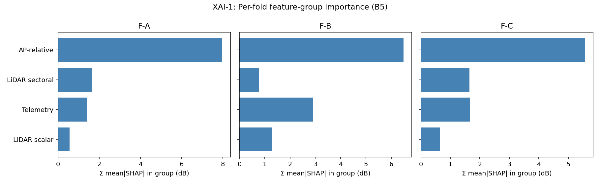

# XAI-1: feature-group mean|SHAP| (dB) per fold

| Fold | Telemetry | LiDAR scalar | LiDAR sectoral | AP-relative |
|---|---:|---:|---:|---:|
| F-A | 1.400 | 0.561 | 1.669 | 7.967 |
| F-B | 2.914 | 1.304 | 0.778 | 6.488 |
| F-C | 1.668 | 0.648 | 1.646 | 5.565 |

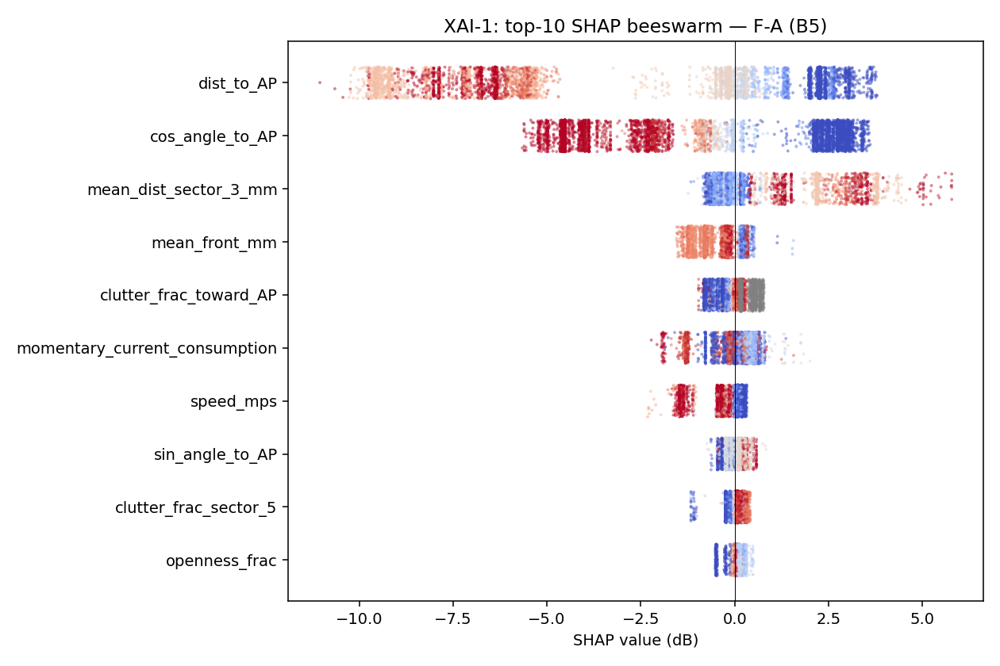

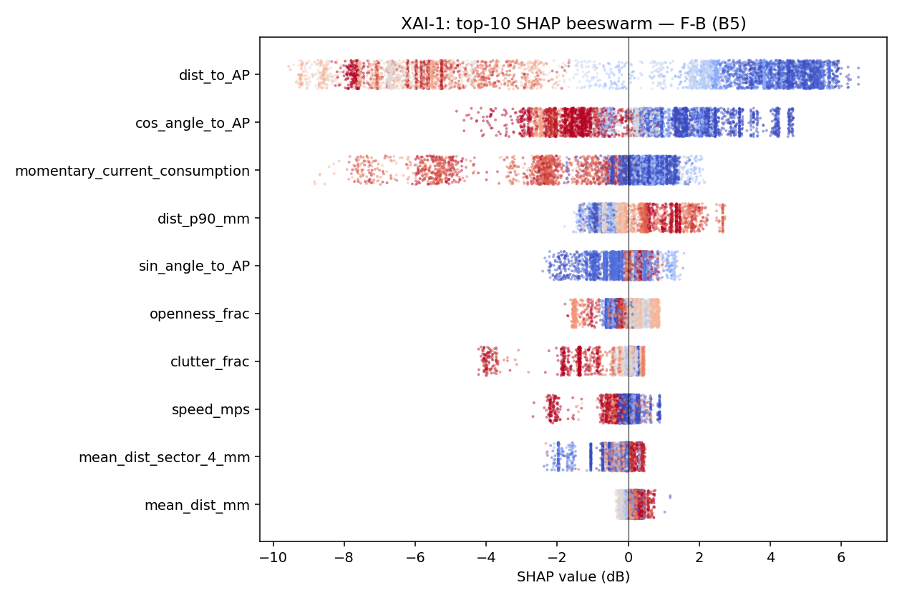

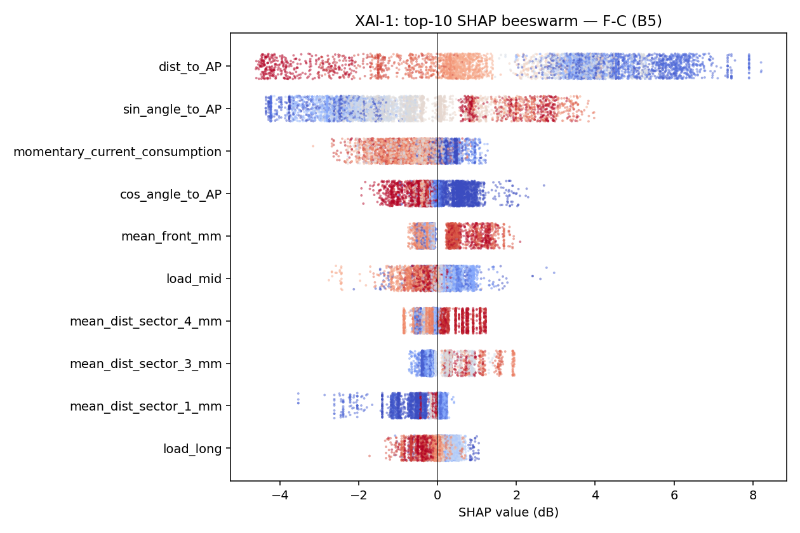

### 5.2 XAI-2: sign-of-effect consistency

# XAI-2: sign-of-effect consistency across LORO folds

Sign of Spearman ρ(feature, SHAP). `0` if |ρ| < 0.05.
**Consistent** = same non-zero sign across all 3 folds.

| Feature | F-A | F-B | F-C | ρ(F-A) | ρ(F-B) | ρ(F-C) | Consistent |
|---|:---:|:---:|:---:|---:|---:|---:|:---:|
| `mean_dist_mm` | + | + | + | +0.73 | +0.79 | +0.78 | yes |
| `dist_p90_mm` | + | + | + | +0.45 | +0.75 | +0.06 | yes |
| `clutter_frac` | + | - | 0 | +0.43 | -0.54 | -0.01 | no |
| `openness_frac` | + | - | - | +0.14 | -0.46 | -0.70 | no |
| `mean_front_mm` | - | + | + | -0.45 | +0.82 | +0.60 | no |
| `mean_dist_sector_1_mm` | - | - | + | -0.14 | -0.18 | +0.36 | no |
| `mean_dist_sector_2_mm` | — | + | + | — | +0.39 | +0.62 | no |
| `mean_dist_sector_3_mm` | + | - | + | +0.64 | -0.32 | +0.72 | no |
| `mean_dist_sector_4_mm` | - | + | + | -0.17 | +0.76 | +0.41 | no |
| `mean_dist_sector_5_mm` | + | - | + | +0.17 | -0.47 | +0.56 | no |
| `mean_dist_sector_6_mm` | + | + | + | +0.54 | +0.86 | +0.39 | yes |
| `mean_dist_sector_7_mm` | + | + | + | +0.60 | +0.45 | +0.40 | yes |
| `clutter_frac_sector_1` | - | + | - | -0.20 | +0.18 | -0.55 | no |
| `clutter_frac_sector_2` | - | + | - | -0.67 | +0.53 | -0.56 | no |
| `clutter_frac_sector_3` | - | - | + | -0.54 | -0.38 | +0.69 | no |
| `clutter_frac_sector_4` | — | - | - | — | -0.77 | -0.54 | no |
| `clutter_frac_sector_5` | + | - | + | +0.41 | -0.58 | +0.45 | no |
| `clutter_frac_sector_6` | + | - | + | +0.43 | -0.07 | +0.84 | no |
| `clutter_frac_sector_7` | 0 | - | - | +0.04 | -0.45 | -0.10 | no |
| `dist_to_AP` | - | - | - | -0.84 | -0.88 | -0.82 | yes |
| `sin_angle_to_AP` | + | + | + | +0.75 | +0.73 | +0.88 | yes |
| `cos_angle_to_AP` | - | - | - | -0.87 | -0.82 | -0.84 | yes |
| `clutter_frac_toward_AP` | + | - | - | +0.71 | -0.70 | -0.68 | no |

**Headline**: 4 / 19 LiDAR features sign-consistent; 3 / 4 AP-relative features sign-consistent.

### 5.3 XAI-3: spatial maps

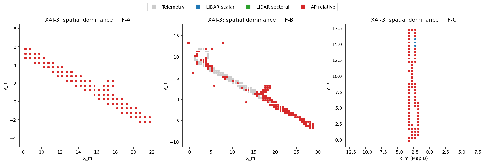

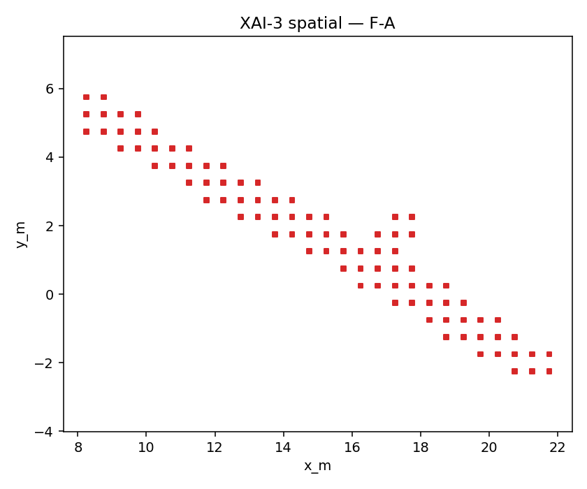

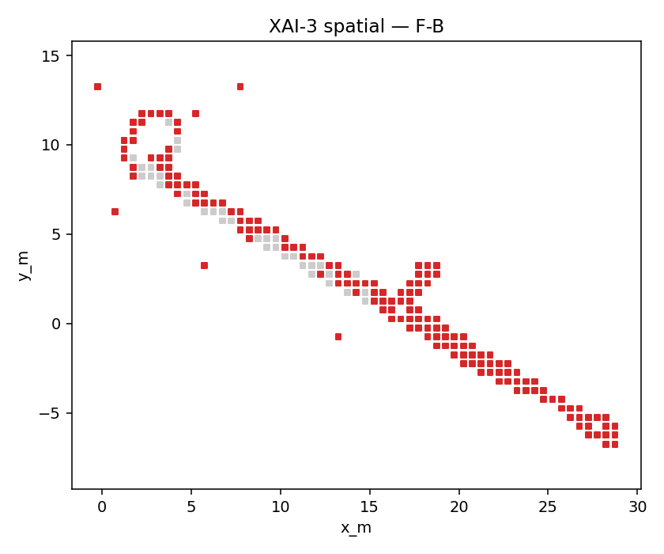

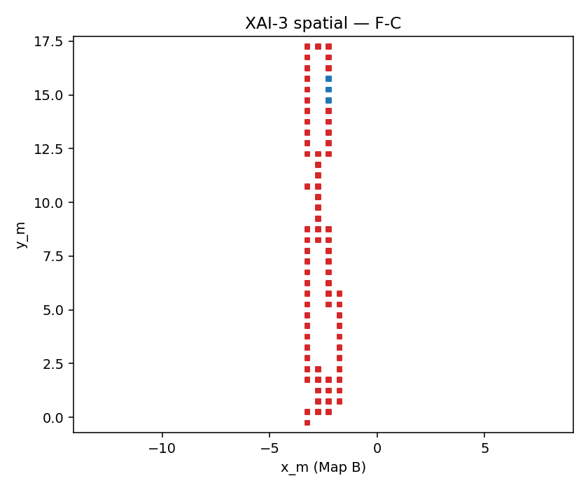

Cross-fold comparison: see whether AP-relative dominates near LOS regions and LiDAR groups dominate in obstructed/transition regions.

### 5.4 XAI-4: SHAP × FOV interaction

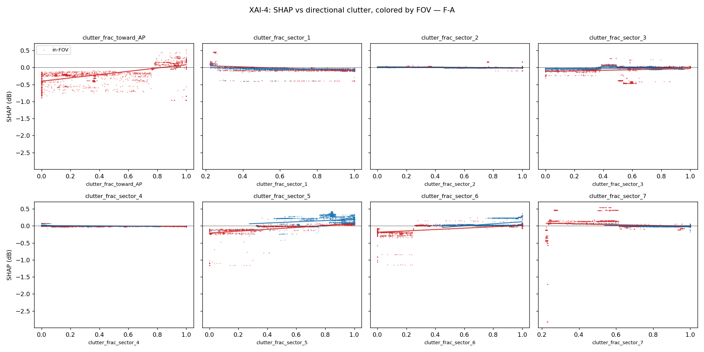

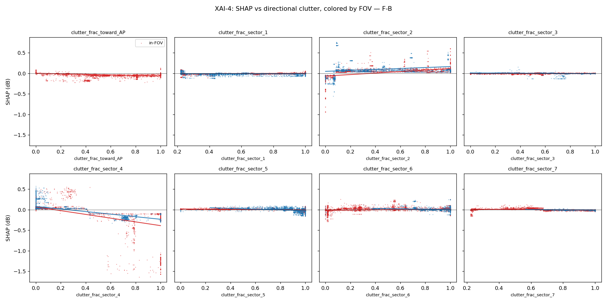

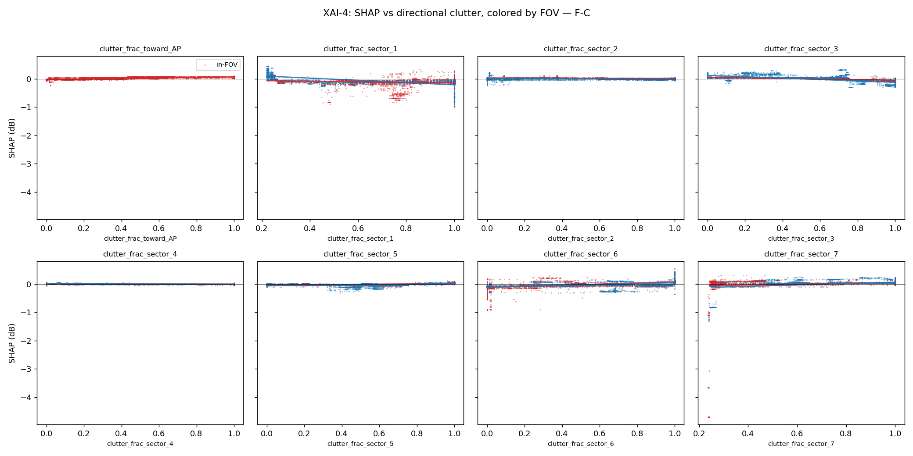

Qualitative assessment: a strong negative slope on the in-FOV stratum and a flatter slope on out-of-FOV is the expected physical signature (more directional clutter → weaker predicted signal when the AP is in the FOV; clutter towards the AP carries no information when the AP is behind the AGV). See figures above per fold.

## 6. Synthesis: paper claims supported by Phase 1

- **Claim 1 (LiDAR helps)**: Δ_LiDAR > 0 on {F-C} (overall stratum). Disambiguation says: LiDAR removable.
- **Claim 2 (frame-independence)**: F-C (Δ_LiDAR_overall = +0.43 dB) is the cross-frame check. A non-degenerate positive value supports the claim; a near-zero or negative value weakens it.
- **Claim 3 (physical interpretability)**: sign-consistency = 4/19 LiDAR features and 3/4 AP-relative continuous features.
- **Disambiguation outcome**: LiDAR removable.
- **RQ4**: residual session effect is **negligible**.

## 7. Limitations and caveats

- High operational-anomaly rate on 15.03 (74,437 anomalies removed across all sessions).

- Three sessions, single AP, single facility, single AGV; generalisation to other deployments unverified.

- 25.02 has 4.4 Hz native cadence; F-C training is decimated to match (k=7) — this halves the effective sample volume.

- `clutter_frac_toward_AP` is NaN for ~21% of non-anomaly rows (out of FOV); XGBoost handles this via default-direction-at-split, but interpretation must respect that the in-FOV stratum is where this feature carries information.

- LORO uses *session* as the leave-out unit; spatial leave-region-out within a session is out of scope for Phase 1.

## 8. Recommendation

- **PIVOT TO PROJECT B**.
- Pivot reason: F-B in-FOV Δ_LiDAR = -0.52 dB ≤ 1 dB threshold. This is the diagnostic fold; small Δ_LiDAR there indicates LiDAR features are not adding physical structure beyond AP-geometry. Recommend Project B (within-session deep dive).
- Project B path: within-session leave-region-out spatial split on 15.03 only, with the same ablation ladder; report as a focused single-session feasibility paper.

## 9. Reproducibility

- Seed: `SEED = 20260427` everywhere (XGBoost, NumPy, bootstrap).
- Run end-to-end: `python -m scripts.p1_project_a.run_all`.
- Stages: `run_modeling` → `run_xai` → `run_robustness` → `build_results_report`.
- Wall-clock breakdown is recorded in `scripts/p1_project_a/results/fit_inventory.parquet`.
- Total wall-clock for fits: 43.3 s.

### Model SHA-256 inventory

| fold/tag | variant | n_features | best_iter | n_train | n_val | n_test | wall (s) | model SHA-256 |
|---|---|---:|---:|---:|---:|---:|---:|---|
| F-A | B0 | 1 | 74 | 403876 | 44875 | 158405 | 1.0 | `a78fcbfc87d16bee…` |
| F-A | B1 | 3 | 23 | 403876 | 44875 | 158405 | 0.8 | `bc54e940f042cc2d…` |
| F-A | B2 | 8 | 24 | 403876 | 44875 | 158405 | 1.0 | `5a8a727554c864d3…` |
| F-A | B3 | 22 | 24 | 403876 | 44875 | 158405 | 1.3 | `2a8f049377f44c06…` |
| F-A | B4 | 30 | 40 | 403876 | 44875 | 158405 | 1.7 | `edcbb9953aae7dc9…` |
| F-A | B5 | 32 | 33 | 403876 | 44875 | 158405 | 1.9 | `614f0a3d3b0a21e1…` |
| F-A | B5p | 13 | 35 | 403876 | 44875 | 158405 | 1.2 | `fda044e2c0a0cf73…` |
| F-A | B5pp | 27 | 66 | 403876 | 44875 | 158405 | 1.8 | `953af418eae21277…` |
| F-B | B0 | 1 | 81 | 337390 | 37487 | 232279 | 0.9 | `b013350674bad64d…` |
| F-B | B1 | 3 | 46 | 337390 | 37487 | 232279 | 0.9 | `5ab4c5e025db7ccd…` |
| F-B | B2 | 8 | 27 | 337390 | 37487 | 232279 | 0.9 | `d5b037aa1eb82051…` |
| F-B | B3 | 22 | 34 | 337390 | 37487 | 232279 | 1.3 | `ce7743836b6e5127…` |
| F-B | B4 | 30 | 47 | 337390 | 37487 | 232279 | 1.6 | `6b03a726ac6b9790…` |
| F-B | B5 | 32 | 71 | 337390 | 37487 | 232279 | 2.1 | `040cddab5b6db10c…` |
| F-B | B5p | 13 | 31 | 337390 | 37487 | 232279 | 1.1 | `1145034744370a3a…` |
| F-B | B5pp | 27 | 50 | 337390 | 37487 | 232279 | 1.6 | `8df3dd377f6b3815…` |
| F-C | B0 | 1 | 117 | 50232 | 5581 | 216472 | 0.4 | `b05a1af46b5ebfbd…` |
| F-C | B1 | 3 | 35 | 50232 | 5581 | 216472 | 0.3 | `c2be61c4d51f9da2…` |
| F-C | B2 | 8 | 37 | 50232 | 5581 | 216472 | 0.3 | `44137f12bb67aeb0…` |
| F-C | B3 | 22 | 28 | 50232 | 5581 | 216472 | 0.5 | `d0ee20f1e5e72e4b…` |
| F-C | B4 | 30 | 255 | 50232 | 5581 | 216472 | 1.3 | `83868dab6364911e…` |
| F-C | B5 | 32 | 24 | 50232 | 5581 | 216472 | 0.6 | `4db05809c3a29f53…` |
| F-C | B5p | 13 | 24 | 50232 | 5581 | 216472 | 0.4 | `422e5117a19d172b…` |
| F-C | B5pp | 27 | 73 | 50232 | 5581 | 216472 | 0.7 | `8030290d08df3927…` |
| rq4_rq4a_same_map | rq4a | 34 | 5 | 273479 | 58603 | 58602 | 2.0 | `a77d003dfeed8e23…` |
| rq4_rq4a_full | rq4a | 34 | 43 | 425009 | 91074 | 91073 | 7.1 | `958a5f6527db9db2…` |
| rq4_rq4b_same_map | rq4b | 33 | 5 | 273479 | 58603 | 58602 | 2.0 | `3a8d0e7e416a5a2f…` |
| rq4_rq4b_full | rq4b | 33 | 41 | 425009 | 91074 | 91073 | 6.8 | `72226e56b03e2025…` |

## 10. Hyperparameter robustness diagnostic

Tests whether the F-B in-FOV Δ_LiDAR ≤ 1 dB pivot trigger from §2 is robust to hyperparameter and validation-protocol choice. Refits B1 and B5 on F-B only; all other Phase 1 / Project A artifacts (models, predictions, SHAP) are untouched.

### 10.1 TL;DR

F-B in-FOV Δ_LiDAR by config (positive = LiDAR helps; >1 dB clears the pivot threshold):
- **locked** (max_depth=6, eta=0.05): -0.52 dB
- **H1** (max_depth=4, eta=0.05, λ=1.0): -0.29 dB
- **H2** (max_depth=6, eta=0.02, λ=5.0): -0.45 dB
- **H3** (max_depth=8, eta=0.05, λ=20.0): -0.61 dB
- **H1_randval** (H1 hyperparams + random val (max_depth=4, eta=0.05)): -1.90 dB
- **H2_randval** (H2 hyperparams + random val (max_depth=6, eta=0.02)): -1.23 dB

**Diagnostic verdict: PIVOT_JUSTIFIED**

### 10.2 Configurations

| Tag | max_depth | eta | min_child_weight | reg_lambda | subsample | colsample_bytree | n_estimators | early_stop |
|---|---:|---:|---:|---:|---:|---:|---:|---:|
| locked (frozen) | 6 | 0.05 | 1 | 1.0 | 1.0 | 1.0 | 2000 | 100 |
| H1 | 4 | 0.05 | 1 | 1.0 | 1.0 | 1.0 | 2000 | 100 |
| H2 | 6 | 0.02 | 10 | 5.0 | 0.9 | 0.9 | 5000 | 200 |
| H3 | 8 | 0.05 | 5 | 20.0 | 0.9 | 0.9 | 2000 | 100 |

`H1_randval` and `H2_randval` use the same hyperparameters as `H1` / `H2` but a random-10%-per-session validation split (seed=20260427) instead of chronological-last-10%. B1 is not refit with random val; the Δ_LiDAR for these uses the B1 fit from the matching chronological config.

### 10.3 Per-fit RMSE (dB) on F-B

Bootstrap 95% CI on RMSE in brackets (B = 1000).

| Variant | Config | Val protocol | best_iter | Stratum | n | RMSE | 95% CI |
|---|---|---|---:|---|---:|---:|---|
| B1 | locked | chronological | 46 | overall | 232279 | 7.935 | [7.91, 7.96] |
| B1 | locked | chronological | 46 | in_fov | 134692 | 8.014 | [7.98, 8.05] |
| B1 | locked | chronological | 46 | out_of_fov | 97587 | 7.823 | [7.79, 7.85] |
| B1 | H1 | chronological | 34 | overall | 232279 | 8.167 | [8.15, 8.19] |
| B1 | H1 | chronological | 34 | in_fov | 134692 | 7.856 | [7.82, 7.88] |
| B1 | H1 | chronological | 34 | out_of_fov | 97587 | 8.578 | [8.55, 8.61] |
| B1 | H2 | chronological | 126 | overall | 232279 | 8.818 | [8.79, 8.84] |
| B1 | H2 | chronological | 126 | in_fov | 134692 | 8.145 | [8.11, 8.17] |
| B1 | H2 | chronological | 126 | out_of_fov | 97587 | 9.670 | [9.64, 9.71] |
| B1 | H3 | chronological | 35 | overall | 232279 | 8.929 | [8.91, 8.95] |
| B1 | H3 | chronological | 35 | in_fov | 134692 | 8.575 | [8.54, 8.60] |
| B1 | H3 | chronological | 35 | out_of_fov | 97587 | 9.397 | [9.37, 9.43] |
| B5 | locked | chronological | 71 | overall | 232279 | 9.304 | [9.28, 9.33] |
| B5 | locked | chronological | 71 | in_fov | 134692 | 8.529 | [8.49, 8.56] |
| B5 | locked | chronological | 71 | out_of_fov | 97587 | 10.278 | [10.24, 10.32] |
| B5 | H1 | chronological | 49 | overall | 232279 | 8.212 | [8.19, 8.23] |
| B5 | H1 | chronological | 49 | in_fov | 134692 | 8.146 | [8.11, 8.18] |
| B5 | H1 | chronological | 49 | out_of_fov | 97587 | 8.303 | [8.27, 8.33] |
| B5 | H2 | chronological | 205 | overall | 232279 | 9.197 | [9.17, 9.22] |
| B5 | H2 | chronological | 205 | in_fov | 134692 | 8.590 | [8.56, 8.62] |
| B5 | H2 | chronological | 205 | out_of_fov | 97587 | 9.973 | [9.93, 10.01] |
| B5 | H3 | chronological | 35 | overall | 232279 | 9.732 | [9.71, 9.76] |
| B5 | H3 | chronological | 35 | in_fov | 134692 | 9.185 | [9.15, 9.22] |
| B5 | H3 | chronological | 35 | out_of_fov | 97587 | 10.441 | [10.41, 10.48] |
| B5 | H1_randval | random | 1999 | overall | 232279 | 9.922 | [9.90, 9.95] |
| B5 | H1_randval | random | 1999 | in_fov | 134692 | 9.756 | [9.72, 9.79] |
| B5 | H1_randval | random | 1999 | out_of_fov | 97587 | 10.147 | [10.11, 10.18] |
| B5 | H2_randval | random | 4999 | overall | 232279 | 9.672 | [9.65, 9.70] |
| B5 | H2_randval | random | 4999 | in_fov | 134692 | 9.376 | [9.34, 9.41] |
| B5 | H2_randval | random | 4999 | out_of_fov | 97587 | 10.067 | [10.03, 10.10] |

### 10.4 Δ_LiDAR by config × stratum

Δ_LiDAR = RMSE(B1) − RMSE(B5). Positive => LiDAR features improve over AP-geometry-only.

| Config | Stratum | RMSE(B1) | RMSE(B5) | Δ_LiDAR (dB) | clears 1 dB? |
|---|---|---:|---:|---:|:---:|
| locked | overall | 7.935 | 9.304 | -1.370 | — |
| locked | in_fov | 8.014 | 8.529 | -0.515 | ✗ |
| locked | out_of_fov | 7.823 | 10.278 | -2.455 | — |
| H1 | overall | 8.167 | 8.212 | -0.046 | — |
| H1 | in_fov | 7.856 | 8.146 | -0.290 | ✗ |
| H1 | out_of_fov | 8.578 | 8.303 | +0.274 | — |
| H2 | overall | 8.818 | 9.197 | -0.379 | — |
| H2 | in_fov | 8.145 | 8.590 | -0.446 | ✗ |
| H2 | out_of_fov | 9.670 | 9.973 | -0.303 | — |
| H3 | overall | 8.929 | 9.732 | -0.803 | — |
| H3 | in_fov | 8.575 | 9.185 | -0.610 | ✗ |
| H3 | out_of_fov | 9.397 | 10.441 | -1.044 | — |
| H1_randval | overall | 8.167 | 9.922 | -1.755 | — |
| H1_randval | in_fov | 7.856 | 9.756 | -1.900 | ✗ |
| H1_randval | out_of_fov | 8.578 | 10.147 | -1.570 | — |
| H2_randval | overall | 8.818 | 9.672 | -0.855 | — |
| H2_randval | in_fov | 8.145 | 9.376 | -1.231 | ✗ |
| H2_randval | out_of_fov | 9.670 | 10.067 | -0.397 | — |

### 10.5 best_iteration distribution per config

If slow-eta H2 reaches a much higher iteration count, the locked config was stopping prematurely.

| Config | B1 best_iter | B5 best_iter |
|---|---:|---:|
| locked | 46 | 71 |
| H1 | 34 | 49 |
| H2 | 126 | 205 |
| H3 | 35 | 35 |
| H1_randval | — | 1999 |
| H2_randval | — | 4999 |

### 10.6 Verdict criteria

- **PIVOT_JUSTIFIED**: F-B in-FOV Δ_LiDAR ≤ 1 dB on all 6 configs (locked + 5 alternatives). Result is robust; the proposal's pivot trigger fires.
- **RECOVERABLE_HYPERPARAMS**: at least one of {H1, H2, H3} produces F-B in-FOV Δ_LiDAR > 1 dB. Result is fragile to hyperparameter choice.
- **RECOVERABLE_VALIDATION_PROTOCOL**: a random-val variant differs from its chronological-val counterpart by >0.5 dB AND clears the 1 dB threshold. Chronological-per-session early-stopping was the issue.

### 10.7 Discussion

**best_iteration distribution.** H2 (slow eta) reached B5 best_iter=205, vs the locked config's 71 — comparable depth of training. The locked config was not stopping conspicuously prematurely.

**Out-of-FOV under H2 (slowest learning rate).** H2 lowered B5 out-of-FOV RMSE from 10.28 to 9.97 dB (−0.30 dB). Slower learning helps the harder stratum.

**Random-val sensitivity.**
- **H1**: chrono Δ_LiDAR_in_fov = -0.29 dB; randval = -1.90 dB; |Δ| = 1.61 dB.
- **H2**: chrono Δ_LiDAR_in_fov = -0.45 dB; randval = -1.23 dB; |Δ| = 0.79 dB.

At least one randval variant moves Δ_LiDAR by >0.5 dB — chronological early-stopping is materially affecting the comparison.

### 10.8 Recommendation

**PIVOT TO PROJECT B.** The pivot trigger is robust across all six configurations. The original Phase 1 / Project A conclusion stands; LiDAR-derived structure does not transfer across sessions on the diagnostic fold under any reasonable hyperparameter choice tested. Proceed with the within-session leave-region-out path (15.03 only).

### 10.9 Diagnostic artifacts
- 8 model files: `scripts/p1_project_a/diagnostic/models/F-B_{variant}_{config}.json`
- Predictions: `scripts/p1_project_a/diagnostic/cache/predictions_F-B_{variant}_{config}.parquet`
- Metrics parquet: `scripts/p1_project_a/diagnostic/robustness_metrics.parquet`
- Fit inventory: `scripts/p1_project_a/diagnostic/robustness_fit_inventory.parquet`
- Re-run: `python -m scripts.p1_project_a.run_robustness`

### 10.10 Diagnostic fit inventory

| variant | config | val | best_iter | n_train | n_val | n_test | wall (s) | model SHA-256 |
|---|---|---|---:|---:|---:|---:|---:|---|
| B1 | H1 | chronological | 34 | 337390 | 37487 | 232279 | 1.7 | `e8c443a308a190e0…` |
| B5 | H1 | chronological | 49 | 337390 | 37487 | 232279 | 3.8 | `39cb310110c1d315…` |
| B1 | H2 | chronological | 126 | 337390 | 37487 | 232279 | 4.5 | `fed9a06080c3f004…` |
| B5 | H2 | chronological | 205 | 337390 | 37487 | 232279 | 15.8 | `516a4ce1dce5e9c9…` |
| B1 | H3 | chronological | 35 | 337390 | 37487 | 232279 | 2.4 | `bfe0d1a49d6e4d69…` |
| B5 | H3 | chronological | 35 | 337390 | 37487 | 232279 | 4.5 | `70c4bbd46887414f…` |
| B5 | H1_randval | random | 1999 | 337390 | 37487 | 232279 | 36.0 | `39e22bb255f19060…` |
| B5 | H2_randval | random | 4999 | 337390 | 37487 | 232279 | 111.5 | `813e49eb4ab6c7fc…` |

## 11. Hardening A — Cross-session LiDAR placebo on F-B

Pre-empts the "your features were just bad / your model couldn't learn from them" reviewer objection. Originally reported as Experiment A in the dissolved hardening package; merged into Project A on 2026-04-28 because the placebo refits B5 on F-B and reuses Project A's caches and fold construction.

**Hypothesis tested.** A B5 model trained with the 19 ego-frame LiDAR columns block-shuffled within each training session (preserving each LiDAR feature's marginal distribution and the joint distribution among LiDAR features, but breaking row-level alignment with telemetry / position / AP-relative / target) achieves Δ_LiDAR comparable to the real-LiDAR fit. If true, the real LiDAR features were not contributing a row-aligned signal.

### 11.1 Methodology

- Test set: F-B test rows (15.03), unmodified.

- Training set: 24.03 + 25.02 anomaly-filtered rows. Per session, one permutation π is sampled (seed = SEED + session_offset) and applied as a *block* to all 19 LiDAR columns simultaneously, preserving the joint distribution among LiDAR features.

- 19 LiDAR columns shuffled: `mean_dist_mm`, `dist_p90_mm`, `clutter_frac`, `openness_frac`, `mean_front_mm`, `mean_dist_sector_{1..7}_mm`, `clutter_frac_sector_{1..7}`. `clutter_frac_toward_AP` and `is_AP_in_FOV` are AP-relative and NOT shuffled.

- Validation split: chronological-per-session 90/10 on the post-shuffle pool (matches Project A).

- B1 and B5 (real) predictions reused from Project A's main cache (locked) and diagnostic cache (H1).

### 11.2 Results

RMSE (dB) per (descriptor, config, variant, stratum), bootstrap 95% CI in brackets.

| Descriptor | Config | Variant | Stratum | RMSE | 95% CI |
|---|---|---|---|---:|---|
| real | locked | B1 | overall | 7.935 | [7.91, 7.96] |
| real | locked | B1 | in_fov | 8.014 | [7.98, 8.05] |
| real | locked | B1 | out_of_fov | 7.823 | [7.79, 7.85] |
| real | locked | B5 | overall | 9.304 | [9.28, 9.33] |
| real | locked | B5 | in_fov | 8.529 | [8.49, 8.56] |
| real | locked | B5 | out_of_fov | 10.278 | [10.24, 10.32] |
| real | H1 | B1 | overall | 8.167 | [8.15, 8.19] |
| real | H1 | B1 | in_fov | 7.856 | [7.82, 7.88] |
| real | H1 | B1 | out_of_fov | 8.578 | [8.55, 8.61] |
| real | H1 | B5 | overall | 8.212 | [8.19, 8.23] |
| real | H1 | B5 | in_fov | 8.146 | [8.11, 8.18] |
| real | H1 | B5 | out_of_fov | 8.303 | [8.27, 8.33] |
| placebo | locked | B5 | overall | 8.903 | [8.88, 8.92] |
| placebo | locked | B5 | in_fov | 8.381 | [8.35, 8.41] |
| placebo | locked | B5 | out_of_fov | 9.576 | [9.54, 9.61] |
| placebo | H1 | B5 | overall | 8.397 | [8.37, 8.42] |
| placebo | H1 | B5 | in_fov | 7.846 | [7.81, 7.88] |
| placebo | H1 | B5 | out_of_fov | 9.102 | [9.07, 9.14] |

### 11.3 Δ_LiDAR comparison on F-B in-FOV (the diagnostic stratum)

| Config | Δ_LiDAR (real) | Δ_LiDAR (placebo) | Δ_real − Δ_placebo |
|---|---:|---:|---:|
| locked | -0.52 dB | -0.37 dB | -0.15 dB |
| H1 | -0.29 dB | +0.01 dB | -0.30 dB |

Full Δ_LiDAR by stratum:

| Config | Stratum | Δ_LiDAR (real) | Δ_LiDAR (placebo) |
|---|---|---:|---:|
| locked | overall | -1.37 dB | -0.97 dB |
| locked | in_fov | -0.52 dB | -0.37 dB |
| locked | out_of_fov | -2.45 dB | -1.75 dB |
| H1 | overall | -0.05 dB | -0.23 dB |
| H1 | in_fov | -0.29 dB | +0.01 dB |
| H1 | out_of_fov | +0.27 dB | -0.52 dB |

### 11.4 Verdict

Tolerance: |Δ_real − Δ_placebo| < 0.5 dB ⇒ placebo confirms negative. Δ_real − Δ_placebo > 0.5 dB ⇒ partial rescue.

- **locked**: Δ_real = -0.52 dB, Δ_placebo = -0.37 dB ⇒ **PLACEBO_CONFIRMS_NEGATIVE**.
- **H1**: Δ_real = -0.29 dB, Δ_placebo = +0.01 dB ⇒ **PLACEBO_CONFIRMS_NEGATIVE**.

### 11.5 Reproducibility (Hardening A)

- 2 model files: `scripts/p1_project_a/models/A_B5_placebo_{locked, H1}.json`.
- Predictions: `scripts/p1_project_a/cache/predictions_A_B5_placebo_{locked, H1}.parquet`.
- Metrics: `scripts/p1_project_a/results/hardening_a_metrics.parquet`.
- Integrity report: `scripts/p1_project_a/results/hardening_a_integrity.parquet`.
- Re-run: `python -m scripts.p1_project_a.run_hardening_placebo` (or via `run_hardening_all`).

## 12. Hardening B — LightGBM cross-check on F-B

Pre-empts the "your conclusion is XGBoost-specific" reviewer objection. Originally reported as Experiment B in the dissolved hardening package; merged into Project A on 2026-04-28 because the cross-check refits the F-B B1 vs B5 comparison and reuses Project A's fold construction and reference XGBoost predictions.

**Hypothesis tested.** A LightGBM model with default hyperparameters reaches the same conclusion as XGBoost on F-B: Δ_LiDAR (in-FOV) does not clear the +1 dB practical-relevance threshold.

### 12.1 Methodology

- F-B fold construction, anomaly filter, validation split, FOV stratification: identical to Project A.

- LightGBM defaults — `learning_rate=0.05`, `num_leaves=31`, `min_data_in_leaf=20`, `seed=20260427`, `deterministic=True`. H1-equiv replaces `num_leaves=31` with `num_leaves=15` (≈ max_depth=4).

- Same `num_estimators=2000`, `early_stopping_rounds=100` as XGBoost.

- 4 new LightGBM fits ({B1, B5} × {default, H1-equiv}). XGBoost rows reuse Project A caches.

### 12.2 RMSE (dB) per (framework, config, variant, stratum)

| Framework | Config | Variant | Stratum | RMSE |
|---|---|---|---|---:|
| xgboost | locked | B1 | overall | 7.935 |
| xgboost | locked | B1 | in_fov | 8.014 |
| xgboost | locked | B1 | out_of_fov | 7.823 |
| xgboost | locked | B5 | overall | 9.304 |
| xgboost | locked | B5 | in_fov | 8.529 |
| xgboost | locked | B5 | out_of_fov | 10.278 |
| xgboost | H1 | B1 | overall | 8.167 |
| xgboost | H1 | B1 | in_fov | 7.856 |
| xgboost | H1 | B1 | out_of_fov | 8.578 |
| xgboost | H1 | B5 | overall | 8.212 |
| xgboost | H1 | B5 | in_fov | 8.146 |
| xgboost | H1 | B5 | out_of_fov | 8.303 |
| lightgbm | locked | B1 | overall | 8.699 |
| lightgbm | locked | B1 | in_fov | 8.276 |
| lightgbm | locked | B1 | out_of_fov | 9.251 |
| lightgbm | locked | B5 | overall | 9.183 |
| lightgbm | locked | B5 | in_fov | 8.857 |
| lightgbm | locked | B5 | out_of_fov | 9.615 |
| lightgbm | H1 | B1 | overall | 8.380 |
| lightgbm | H1 | B1 | in_fov | 7.758 |
| lightgbm | H1 | B1 | out_of_fov | 9.170 |
| lightgbm | H1 | B5 | overall | 8.740 |
| lightgbm | H1 | B5 | in_fov | 8.685 |
| lightgbm | H1 | B5 | out_of_fov | 8.814 |

### 12.3 Δ_LiDAR by framework × config × stratum

| Framework | Config | Stratum | Δ_LiDAR (dB) | clears 1 dB (in-FOV)? |
|---|---|---|---:|:---:|
| xgboost | locked | overall | -1.37 | — |
| xgboost | locked | in_fov | -0.52 | ✗ |
| xgboost | locked | out_of_fov | -2.45 | — |
| xgboost | H1 | overall | -0.05 | — |
| xgboost | H1 | in_fov | -0.29 | ✗ |
| xgboost | H1 | out_of_fov | +0.27 | — |
| lightgbm | locked | overall | -0.48 | — |
| lightgbm | locked | in_fov | -0.58 | ✗ |
| lightgbm | locked | out_of_fov | -0.36 | — |
| lightgbm | H1 | overall | -0.36 | — |
| lightgbm | H1 | in_fov | -0.93 | ✗ |
| lightgbm | H1 | out_of_fov | +0.36 | — |

### 12.4 Verdict

- LightGBM Δ_LiDAR (in-FOV, default) = -0.58 dB.
- LightGBM Δ_LiDAR (in-FOV, H1-equiv) = -0.93 dB.
- **NEGATIVE_RESULT_NOT_FRAMEWORK_SPECIFIC**: LightGBM does NOT clear the +1 dB threshold.

### 12.5 Reproducibility (Hardening B)

- 4 model files: `scripts/p1_project_a/models/B_{B1, B5}_lgb_{default, H1_equiv}.txt`.
- Predictions: `scripts/p1_project_a/cache/predictions_B_{B1, B5}_lgb_{default, H1_equiv}.parquet`.
- Metrics: `scripts/p1_project_a/results/hardening_b_metrics.parquet`.
- Re-run: `python -m scripts.p1_project_a.run_hardening_lightgbm` (or via `run_hardening_all`).

### 12.6 Combined Hardening A+B fit inventory (6 new fits)

| Experiment | Fold | Variant | Descriptor | Framework | Config | best_iter | n_train | n_val | n_test | wall (s) | model SHA-256 |
|---|---|---|---|---|---|---:|---:|---:|---:|---:|---|
| A | F-B | B5 | B5_placebo_locked | xgboost | locked | 31 | 337390 | 37487 | 232279 | 1.8 | `dade19df5f1e23d4…` |
| A | F-B | B5 | B5_placebo_H1 | xgboost | H1 | 49 | 337390 | 37487 | 232279 | 1.8 | `c4f1e7f7c0f8c2c2…` |
| B | F-B | B1 | B1_lgb_default | lightgbm | default | 29 | 337390 | 37487 | 232279 | 0.5 | `39f72d43fed9e3bf…` |
| B | F-B | B5 | B5_lgb_default | lightgbm | default | 37 | 337390 | 37487 | 232279 | 1.7 | `5d7bff046d58de32…` |
| B | F-B | B1 | B1_lgb_H1_equiv | lightgbm | H1_equiv | 44 | 337390 | 37487 | 232279 | 0.5 | `526f093c05832450…` |
| B | F-B | B5 | B5_lgb_H1_equiv | lightgbm | H1_equiv | 38 | 337390 | 37487 | 232279 | 1.4 | `28276de3967af2b9…` |

Total wall-clock for Hardening A+B fits: 7.7 s.

Combined orchestrator: `python -m scripts.p1_project_a.run_hardening_all` writes the consolidated `scripts/p1_project_a/results/hardening_metrics.parquet` (rows = experiments A and B) and `scripts/p1_project_a/results/hardening_fit_inventory.parquet`.
