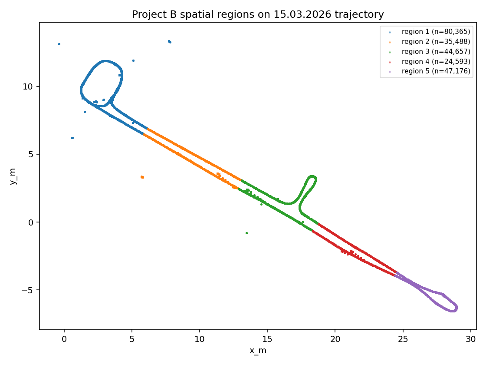
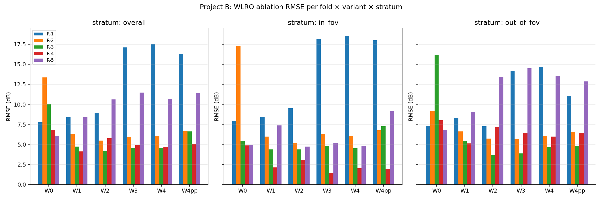
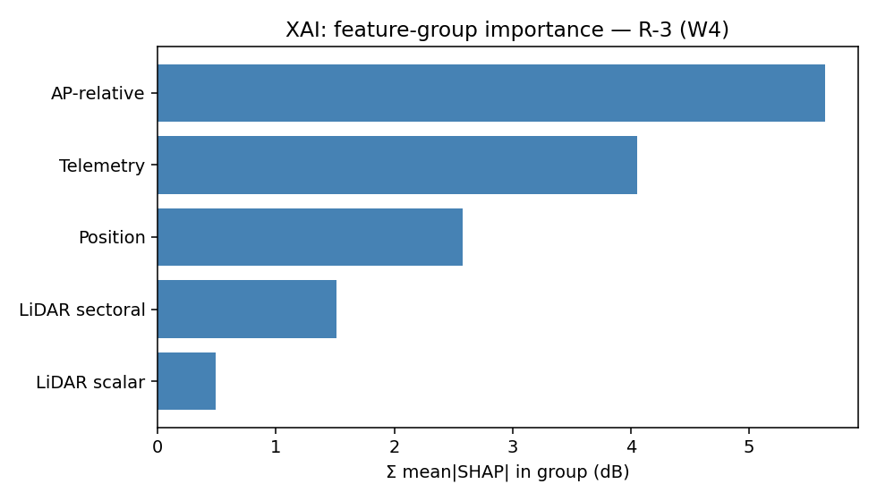
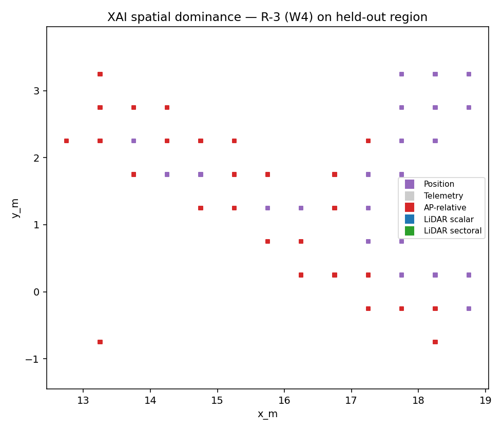

# Project B results report — within-session deep dive on 15.03.2026

Project B is the within-session leave-region-out (WLRO) ablation on 15.03 only. The cross-session counterpart is Project A (`docs/p1_project_a/results_report.md`). This report integrates the main-run WLRO ablation (§§1–3, §5) with the R-4 focused robustness diagnostic (§4) that retests R-4's main-run +1.085 dB Δ_LiDAR_within (in-FOV) under four independent corrections: 1 m spatial buffer alone (§4.2), H1 hyperparameters alone (§4.3), combined H1+buffer (§4.5 — Hardening C), and a within-session LiDAR placebo (§4.6 — Hardening E). The R-4 diagnostic was previously a separate file (`r4_diagnostic.md`); it is now §4 of this report. Hardening C and E were previously in `docs/p1_hardening/results_report.md`; merged into §4.5–§4.6 on 2026-04-28.

## 0. TL;DR

### Main-run within-session ablation (§§1–3)

- **Δ_LiDAR_within (W2 − W4) per fold (overall / in-FOV / out-of-FOV)**:
  - R-1: overall -8.61 dB [-8.65, -8.57]; in-FOV -9.06 dB [-9.10, -9.01]; out-of-FOV -7.40 dB [-7.48, -7.33]
  - R-2: overall -0.57 dB [-0.59, -0.55]; in-FOV -0.89 dB [-0.92, -0.85]; out-of-FOV -0.33 dB [-0.36, -0.30]
  - R-3: overall -0.39 dB [-0.41, -0.37]; in-FOV -0.14 dB [-0.16, -0.12]; out-of-FOV -1.00 dB [-1.03, -0.97]
  - R-4: overall +1.07 dB [+1.03, +1.11]; in-FOV +1.09 dB [+1.07, +1.10]; out-of-FOV +1.18 dB [+1.12, +1.24]
  - R-5: overall -0.09 dB [-0.13, -0.04]; in-FOV -0.04 dB [-0.06, -0.03]; out-of-FOV -0.11 dB [-0.17, -0.05]
- **Folds clearing the 1.0 dB in-FOV Δ_LiDAR_within threshold**: 1 / 5 (R-4 only; required ≥ 3).
- **Disambiguation verdict (main run)**: mixed/unclear.
- **Main-run verdict**: **MIXED** — pending R-4 robustness check.
- **All 41 main-run fits succeeded**: yes.

### R-4 robustness diagnostic (§4) — four independent corrections

- **Buffer-zone Δ_LiDAR_within (in-FOV) on R-4** (§4.2): -1.267 dB (vs main-run no-buffer +1.085 dB).
- **H1 Δ_LiDAR_within (in-FOV) on R-4** (§4.3): -0.331 dB (vs main-run locked +1.085 dB).
- **Hardening C — combined H1 + 1 m buffer Δ_LiDAR_within (in-FOV) on R-4** (§4.5): -0.83 dB. The two corrections do not cancel; they compound. Closes the "what if the two diagnostics secretly cancel?" objection.
- **Hardening E — within-session LiDAR placebo Δ comparison on R-4** (§4.6): Δ_real = +1.11 dB vs Δ_placebo = +0.13 dB (gap = 0.98 dB > 0.5 dB tolerance). The locked-no-buffer fit *did* contain row-aligned LiDAR signal, but that signal is contingent on training data spatially adjacent to the test region (killed by 1 m buffer alone), on tree depth ≥ 6 (killed by H1 alone), and on the absence of both corrections (killed by H1+buffer combined). The signal does not generalize.
- **Verdict (R-4 diagnostic, four corrections)**: **R-4 nominal +1.09 dB does not survive any deployment-relevant correction.** The within-session result has a small real-signal residue (Hardening E) but every correction relevant for deployment generalization (1 m buffer, H1, H1+buffer) drops Δ_LiDAR_within (in-FOV) below the +1 dB practical-relevance threshold.
- **All 21 diagnostic fits succeeded**: yes (11 buffer/H1 fits from §4.2–§4.3 + 1 reused R-4_W4_H1 + 6 Hardening C + 3 Hardening E).

### Final Project B verdict (post-diagnostic, post-hardening)

- **Final verdict**: **cleanly negative under any deployment-relevant correction** — but with one nuance.
  - The within-session placebo (Hardening E, §4.6) shows that R-4's locked-no-buffer +1.085 dB *did* contain a small real row-aligned LiDAR signal: shuffling the LiDAR block in the training set drops Δ_LiDAR_within (in-FOV) from +1.11 dB to +0.13 dB — a 0.98 dB gap that exceeds the 0.5 dB placebo tolerance.
  - That signal does not survive any of the three corrections relevant to deployment generalization: 1 m buffer alone (Δ → −1.27 dB, §4.2), H1 alone (Δ → −0.33 dB, §4.3), H1+buffer combined (Δ → −0.83 dB, Hardening C, §4.5).
  - The other four folds (R-1, R-2, R-3, R-5) are neutral or negative without correction.
- **Recommended paper framing**: cleanly negative — see §7 for the paper outline. **Honest framing for §V**: LiDAR features carry detectable but small row-aligned signal in within-session contiguous-spatial fits; this signal is contingent on training data spatially adjacent to the test region and on tree depth ≥ 6; under any of the three correction regimes (spatial buffer, depth constraint, or both) LiDAR's contribution falls below the +1 dB practical-relevance threshold. The negative result holds for any deployment scenario where the training data does not adjacent-cover the test region. This wording is more nuanced and more defensible than "LiDAR carries no signal anywhere" and is preserved verbatim in §4.6.4.
- **The cleanest single deployment-relevant number**: R-4 W2 under H1, in-FOV: **RMSE = 1.995 dB** (15 features: position + 8 telemetry + 5 AP-relative; depth-4 XGBoost). See §4.3.1.

## 1. Inputs and protocol

- Dataset: `data/phase1/dataset.parquet` (SHA-256 `c164c53b5dd272384f32564758b08ad53ec886955ef2e50ce69979e125018270`).
  - Expected SHA-256 from `dataset.sha256`: `c164c53b5dd272384f32564758b08ad53ec886955ef2e50ce69979e125018270` (match).
- Filter: `session_date == '15.03.2026'` AND `~anomaly_flag` → 232,279 rows.
- Region partition: K-means with k=5 on (x_m, y_m), method = `cached`.
- Per-region row counts:
  - region 1: 80,365
  - region 2: 35,488
  - region 3: 44,657
  - region 4: 24,593
  - region 5: 47,176
- Folds: 5 leave-region-out folds (R-1 … R-5).
- Validation split: random 10% of training rows per fold (seeded; IID with train across regions).
- Buffer-zone sanity check (main run): refit R-1 after dropping training rows within 1.0 m of any held-out-region row.
- Hyperparameter robustness (main run): refit W4 under H1 (max_depth=4) on every fold.
- **R-4 robustness diagnostic (§4)**: refit all 6 variants on R-4 under (a) 1 m buffer-zone exclusion (locked hyperparameters) and (b) H1 hyperparameters (no buffer). Tests whether R-4's main-run +1.085 dB Δ_LiDAR_within survives stricter conditions.

## 2. Spatial regions

# Project B — per-region statistics on 15.03.2026

| Region | n_rows | unique 0.1 m cells | frac in-FOV | n_in_FOV | n_out_of_FOV | dist_to_AP range (m) | (x_m, y_m) bbox |
|---:|---:|---:|---:|---:|---:|---|---|
| 1 | 80,365 | 256 | 0.713 | 57,270 | 23,095 | [0.46, 7.06] | x [-0.36, 7.81], y [6.21, 13.33] |
| 2 | 35,488 | 215 | 0.437 | 15,516 | 19,972 | [5.26, 13.20] | x [5.70, 13.04], y [2.49, 6.85] |
| 3 | 44,657 | 240 | 0.694 | 30,974 | 13,683 | [13.14, 19.67] | x [12.88, 18.77], y [-0.79, 3.40] |
| 4 | 24,593 | 188 | 0.435 | 10,687 | 13,906 | [19.56, 26.41] | x [18.34, 24.48], y [-3.92, -0.15] |
| 5 | 47,176 | 143 | 0.429 | 20,245 | 26,931 | [24.39, 31.58] | x [24.39, 28.95], y [-6.57, -3.70] |

## 3. Within-session ablation results

### 3.1 Headline ablation table (5 folds × 3 strata × 6 variants)

# WLRO ablation — RMSE (dB) per fold × variant × stratum

Bootstrap 95% CI on RMSE in brackets (B = 1000). Within-session leave-region-out, 15.03 only.

| Variant | Stratum | R-1 | R-2 | R-3 | R-4 | R-5 |
|---|---|---|---|---|---|---|
| W0 | overall | 7.78 [7.73, 7.82] | 13.33 [13.24, 13.42] | 10.02 [9.95, 10.09] | 6.84 [6.76, 6.92] | 6.07 [6.03, 6.10] |
| W0 | in_fov | 7.95 [7.90, 8.01] | 17.27 [17.14, 17.40] | 5.43 [5.39, 5.48] | 4.89 [4.83, 4.95] | 4.93 [4.88, 4.98] |
| W0 | out_of_fov | 7.32 [7.24, 7.39] | 9.18 [9.08, 9.28] | 16.16 [16.07, 16.25] | 8.02 [7.91, 8.13] | 6.80 [6.75, 6.84] |
| W1 | overall | 8.39 [8.36, 8.44] | 6.35 [6.30, 6.40] | 4.72 [4.68, 4.75] | 4.11 [4.06, 4.16] | 8.39 [8.33, 8.44] |
| W1 | in_fov | 8.44 [8.39, 8.48] | 5.99 [5.91, 6.07] | 4.36 [4.32, 4.41] | 2.13 [2.11, 2.16] | 7.35 [7.25, 7.46] |
| W1 | out_of_fov | 8.29 [8.21, 8.36] | 6.61 [6.54, 6.67] | 5.44 [5.39, 5.50] | 5.13 [5.07, 5.20] | 9.09 [9.02, 9.15] |
| W2 | overall | 8.92 [8.89, 8.96] | 5.49 [5.45, 5.54] | 4.18 [4.15, 4.20] | 5.76 [5.69, 5.82] | 10.60 [10.54, 10.66] |
| W2 | in_fov | 9.51 [9.47, 9.55] | 5.19 [5.14, 5.25] | 4.39 [4.35, 4.42] | 3.11 [3.06, 3.16] | 4.74 [4.68, 4.80] |
| W2 | out_of_fov | 7.25 [7.19, 7.32] | 5.72 [5.65, 5.79] | 3.66 [3.61, 3.71] | 7.16 [7.07, 7.26] | 13.41 [13.34, 13.48] |
| W3 | overall | 17.09 [17.04, 17.14] | 5.93 [5.88, 5.99] | 4.57 [4.54, 4.60] | 4.93 [4.86, 5.00] | 11.46 [11.40, 11.52] |
| W3 | in_fov | 18.14 [18.08, 18.19] | 6.29 [6.23, 6.35] | 4.85 [4.82, 4.88] | 1.47 [1.45, 1.49] | 5.19 [5.13, 5.26] |
| W3 | out_of_fov | 14.16 [14.06, 14.26] | 5.64 [5.56, 5.72] | 3.87 [3.82, 3.92] | 6.43 [6.34, 6.53] | 14.48 [14.41, 14.55] |
| W4 | overall | 17.53 [17.49, 17.58] | 6.06 [6.01, 6.12] | 4.57 [4.53, 4.60] | 4.69 [4.62, 4.76] | 10.68 [10.62, 10.74] |
| W4 | in_fov | 18.57 [18.51, 18.62] | 6.08 [6.02, 6.14] | 4.52 [4.48, 4.57] | 2.02 [1.98, 2.06] | 4.79 [4.73, 4.84] |
| W4 | out_of_fov | 14.66 [14.56, 14.75] | 6.05 [5.96, 6.15] | 4.66 [4.61, 4.70] | 5.98 [5.89, 6.08] | 13.52 [13.44, 13.59] |
| W4pp | overall | 16.31 [16.25, 16.36] | 6.67 [6.61, 6.73] | 6.61 [6.56, 6.65] | 5.00 [4.93, 5.07] | 11.40 [11.35, 11.45] |
| W4pp | in_fov | 17.99 [17.93, 18.05] | 6.75 [6.69, 6.82] | 7.26 [7.20, 7.32] | 1.96 [1.93, 1.98] | 9.13 [9.05, 9.21] |
| W4pp | out_of_fov | 11.07 [10.98, 11.17] | 6.60 [6.51, 6.69] | 4.82 [4.77, 4.88] | 6.43 [6.33, 6.52] | 12.85 [12.77, 12.92] |

### 3.2 Δ_LiDAR_within per fold per stratum

# Δ_LiDAR_within — RMSE(W2) − RMSE(W4) (dB)

Positive => LiDAR features improve over (position + telemetry + AP-relative).

| Fold | Stratum | n | Δ_LiDAR | 95% CI |
|---|---|---:|---:|---|
| R-1 | overall | 80365 | -8.612 | [-8.65, -8.57] |
| R-1 | in_fov | 57270 | -9.056 | [-9.10, -9.01] |
| R-1 | out_of_fov | 23095 | -7.403 | [-7.48, -7.33] |
| R-2 | overall | 35488 | -0.570 | [-0.59, -0.55] |
| R-2 | in_fov | 15516 | -0.891 | [-0.92, -0.85] |
| R-2 | out_of_fov | 19972 | -0.332 | [-0.36, -0.30] |
| R-3 | overall | 44657 | -0.389 | [-0.41, -0.37] |
| R-3 | in_fov | 30974 | -0.138 | [-0.16, -0.12] |
| R-3 | out_of_fov | 13683 | -1.000 | [-1.03, -0.97] |
| R-4 | overall | 24593 | +1.071 | [+1.03, +1.11] |
| R-4 | in_fov | 10687 | +1.085 | [+1.07, +1.10] |
| R-4 | out_of_fov | 13906 | +1.182 | [+1.12, +1.24] |
| R-5 | overall | 47176 | -0.087 | [-0.13, -0.04] |
| R-5 | in_fov | 20245 | -0.043 | [-0.06, -0.03] |
| R-5 | out_of_fov | 26931 | -0.109 | [-0.17, -0.05] |

### 3.3 Δ_AP-relative_within per fold per stratum

# Δ_AP-relative_within — RMSE(W1) − RMSE(W2) (dB)

Positive => AP-relative features improve on (position + telemetry).

| Fold | Stratum | n | Δ_AP-relative | 95% CI |
|---|---|---:|---:|---|
| R-1 | overall | 80365 | -0.527 | [-0.56, -0.49] |
| R-1 | in_fov | 57270 | -1.075 | [-1.12, -1.03] |
| R-1 | out_of_fov | 23095 | +1.034 | [+0.96, +1.11] |
| R-2 | overall | 35488 | +0.853 | [+0.79, +0.91] |
| R-2 | in_fov | 15516 | +0.803 | [+0.70, +0.90] |
| R-2 | out_of_fov | 19972 | +0.889 | [+0.82, +0.96] |
| R-3 | overall | 44657 | +0.543 | [+0.51, +0.57] |
| R-3 | in_fov | 30974 | -0.026 | [-0.05, +0.00] |
| R-3 | out_of_fov | 13683 | +1.787 | [+1.73, +1.84] |
| R-4 | overall | 24593 | -1.655 | [-1.71, -1.59] |
| R-4 | in_fov | 10687 | -0.975 | [-1.01, -0.94] |
| R-4 | out_of_fov | 13906 | -2.030 | [-2.12, -1.94] |
| R-5 | overall | 47176 | -2.212 | [-2.27, -2.15] |
| R-5 | in_fov | 20245 | +2.610 | [+2.54, +2.67] |
| R-5 | out_of_fov | 26931 | -4.325 | [-4.40, -4.26] |

#### Δ_position (W0 vs per-region mean baseline)

# Δ_position — RMSE(per-region mean baseline) − RMSE(W0) (dB)

Positive => position alone (W0 = x_m, y_m) explains structure beyond the train-region mean. Overall stratum.

| Fold | n | RMSE(mean baseline) | RMSE(W0) | Δ_position | 95% CI |
|---|---:|---:|---:|---:|---|
| R-1 | 80365 | 16.458 | 7.775 | +8.683 | [+8.63, +8.74] |
| R-2 | 35488 | 9.120 | 13.334 | -4.214 | [-4.30, -4.12] |
| R-3 | 44657 | 11.113 | 10.023 | +1.090 | [+1.00, +1.17] |
| R-4 | 24593 | 8.014 | 6.838 | +1.176 | [+1.11, +1.24] |
| R-5 | 47176 | 15.183 | 6.066 | +9.117 | [+9.07, +9.16] |

### 3.4 Disambiguation (W4 / W4' / W4'')

# Disambiguation — overall RMSE (dB) for W4 / W4' / W4''

W4 = full 34-feature model. W4' = position + telemetry + AP-relative (≡ W2; LiDAR removed). W4'' = position + telemetry + LiDAR (AP-relative removed).

| Variant | R-1 | R-2 | R-3 | R-4 | R-5 |
|---|---|---|---|---|---|
| W4 | 17.53 [17.49, 17.58] | 6.06 [6.01, 6.12] | 4.57 [4.53, 4.60] | 4.69 [4.62, 4.76] | 10.68 [10.62, 10.74] |
| W4' | 8.92 [8.89, 8.96] | 5.49 [5.45, 5.54] | 4.18 [4.15, 4.20] | 5.76 [5.69, 5.82] | 10.60 [10.54, 10.66] |
| W4'' | 16.31 [16.25, 16.36] | 6.67 [6.61, 6.73] | 6.61 [6.56, 6.65] | 5.00 [4.93, 5.07] | 11.40 [11.35, 11.45] |

Per-fold judgments (threshold = 0.5 dB):
- R-1: **mixed/unclear**
- R-2: **mixed/unclear**
- R-3: **LiDAR removable**
- R-4: **AP-relative removable**
- R-5: **LiDAR removable**

**Overall verdict (≥3 of 5 folds): mixed/unclear**

### 3.5 Buffer-zone sensitivity (R-1)

# Buffer-zone sensitivity — R-1 with vs without 1 m exclusion

Drop training rows within 1.0 m of any held-out region row, then refit. Compare RMSE deltas to the no-buffer R-1 fits.

| Variant | Stratum | RMSE(no buffer) | RMSE(buffer) | Δ_RMSE (buffer - no) |
|---|---|---:|---:|---:|
| W0 | overall | 7.775 | 19.886 | +12.111 |
| W0 | in_fov | 7.951 | 19.429 | +11.478 |
| W0 | out_of_fov | 7.321 | 20.977 | +13.657 |
| W1 | overall | 8.395 | 10.033 | +1.638 |
| W1 | in_fov | 8.437 | 10.283 | +1.846 |
| W1 | out_of_fov | 8.288 | 9.384 | +1.096 |
| W2 | overall | 8.922 | 10.448 | +1.527 |
| W2 | in_fov | 9.512 | 11.336 | +1.824 |
| W2 | out_of_fov | 7.254 | 7.826 | +0.571 |
| W3 | overall | 17.088 | 18.281 | +1.193 |
| W3 | in_fov | 18.136 | 19.233 | +1.097 |
| W3 | out_of_fov | 14.158 | 15.672 | +1.515 |
| W4 | overall | 17.533 | 18.164 | +0.630 |
| W4 | in_fov | 18.568 | 19.440 | +0.873 |
| W4 | out_of_fov | 14.657 | 14.521 | -0.136 |
| W4pp | overall | 16.306 | 17.079 | +0.773 |
| W4pp | in_fov | 17.991 | 18.888 | +0.897 |
| W4pp | out_of_fov | 11.075 | 11.418 | +0.343 |

**Sanity check (overall stratum)**: 0/6 variants change by < 0.5 dB under the buffer.
**Flagged**: majority of variants move by ≥ 0.5 dB under the buffer — leave-region-out may be contaminated by spatial autocorrelation; treat the headline result with caution.

### 3.6 Hyperparameter sensitivity (W4 locked vs H1)

# Hyperparameter sensitivity — W4 locked vs H1 (max_depth=4)

H1 was the cross-session diagnostic's best alternative. Refit on each Project B fold to verify the within-session story is not config-specific.

| Fold | Stratum | RMSE(locked, depth=6) | RMSE(H1, depth=4) | Δ_RMSE (H1 - locked) |
|---|---|---:|---:|---:|
| R-1 | overall | 17.533 | 12.775 | -4.758 |
| R-1 | in_fov | 18.568 | 13.765 | -4.803 |
| R-1 | out_of_fov | 14.657 | 9.902 | -4.755 |
| R-2 | overall | 6.064 | 5.871 | -0.192 |
| R-2 | in_fov | 6.080 | 6.633 | +0.553 |
| R-2 | out_of_fov | 6.050 | 5.203 | -0.848 |
| R-3 | overall | 4.566 | 5.032 | +0.466 |
| R-3 | in_fov | 4.525 | 5.457 | +0.932 |
| R-3 | out_of_fov | 4.657 | 3.903 | -0.755 |
| R-4 | overall | 4.692 | 4.789 | +0.097 |
| R-4 | in_fov | 2.021 | 2.327 | +0.305 |
| R-4 | out_of_fov | 5.983 | 6.033 | +0.051 |
| R-5 | overall | 10.684 | 11.094 | +0.410 |
| R-5 | in_fov | 4.786 | 6.336 | +1.550 |
| R-5 | out_of_fov | 13.519 | 13.617 | +0.098 |

**Flagged (overall stratum)**: |Δ_RMSE| > 0.3 dB on folds ['R-1', 'R-3', 'R-5']. Report locked and H1 side by side for these folds.

## 4. R-4 focused robustness diagnostic

Tests whether R-4's main-run +1.085 dB Δ_LiDAR_within (in-FOV) — the only fold to clear the 1 dB threshold in §3.2 — survives two orthogonal corrections: a 1 m buffer-zone exclusion (spatial-autocorrelation control) and a less-aggressive hyperparameter config (H1: max_depth=4). This section was previously the standalone `r4_diagnostic.md` and is now merged in.

### 4.1 Context

Project B's main run (§3.2) found that R-4 is the only fold with Δ_LiDAR_within ≥ 1 dB on in-FOV (+1.085 dB; all other folds: −9.06, −0.89, −0.14, −0.04). R-4 was therefore the candidate exemplar for a mixed-regional paper framing. Two methodological caveats from §3.5 and §3.6 cast doubt on whether that R-4 result is real:

- The R-1 buffer-zone test (§3.5) showed every variant moves by ≥ 0.5 dB under buffer (W0 alone moved by +12 dB). Leave-region-out is therefore contaminated by short-range spatial autocorrelation. R-4 was not previously buffer-tested.

- The R-1 H1 hyperparameter sensitivity test (§3.6) showed Δ +4.76 dB improvement under H1 — i.e., the locked depth-6 config catastrophically overfits R-1. R-4's H1 sensitivity had been measured only for W4 (one variant), not for the full disambiguation ladder.

This diagnostic settles whether R-4's +1.085 dB Δ_LiDAR_within is a clean physical finding or an artifact of either spatial autocorrelation or overfitting.

### 4.2 Buffer-zone diagnostic (R-4)

Drop training rows within 1.0 m of any R-4 row, refit under locked hyperparameters, evaluate on the unchanged R-4 test set.

Post-buffer training-set size: 183,944 rows (dropped 3,304 rows within 1.0 m).

#### 4.2.1 Per-variant RMSE: locked-no-buffer vs locked-buffer

| Variant | Stratum | RMSE(locked-no-buffer) | RMSE(locked-buffer) | Δ_RMSE (locked-buffer − locked-no-buffer) |
|---|---|---:|---:|---:|
| W0 | overall | 6.838 | 7.704 | +0.866 |
| W0 | in_fov | 4.887 | 3.514 | -1.373 |
| W0 | out_of_fov | 8.022 | 9.771 | +1.749 |
| W1 | overall | 4.109 | 4.345 | +0.237 |
| W1 | in_fov | 2.131 | 1.758 | -0.374 |
| W1 | out_of_fov | 5.134 | 5.569 | +0.435 |
| W2 | overall | 5.763 | 5.200 | -0.563 |
| W2 | in_fov | 3.107 | 3.040 | -0.067 |
| W2 | out_of_fov | 7.164 | 6.381 | -0.783 |
| W3 | overall | 4.933 | 5.271 | +0.338 |
| W3 | in_fov | 1.469 | 2.174 | +0.705 |
| W3 | out_of_fov | 6.432 | 6.745 | +0.313 |
| W4 | overall | 4.692 | 6.491 | +1.799 |
| W4 | in_fov | 2.021 | 4.307 | +2.286 |
| W4 | out_of_fov | 5.983 | 7.762 | +1.779 |
| W4pp | overall | 5.001 | 5.831 | +0.831 |
| W4pp | in_fov | 1.956 | 2.246 | +0.290 |
| W4pp | out_of_fov | 6.425 | 7.501 | +1.075 |

#### 4.2.2 Δ_LiDAR_within = RMSE(W2) − RMSE(W4)

| Stratum | locked-no-buffer | locked-buffer |
|---|---:|---:|
| overall | +1.071 | -1.291 |
| in_fov | +1.085 | -1.267 |
| out_of_fov | +1.182 | -1.381 |

**Disambiguation under locked-buffer (R-4 in-FOV, threshold = 0.5 dB)**: mixed/unclear.

**Verdict (Diagnostic A)**: FAIL — Δ_LiDAR_within (in-FOV) under buffer = -1.267 dB < +0.5 dB threshold.

### 4.3 H1 hyperparameter diagnostic (R-4)

Refit under H1 (max_depth=4; same eta, λ, n_estimators, early_stop) for all 6 variants. W4 reuses the existing main-run R-4 H1 fit (`R-4_W4_H1.json`); W0, W1, W2, W3, W4'' are new.

#### 4.3.1 Per-variant RMSE: locked vs H1

| Variant | Stratum | RMSE(locked-no-buffer) | RMSE(H1) | Δ_RMSE (H1 − locked-no-buffer) |
|---|---|---:|---:|---:|
| W0 | overall | 6.838 | 6.858 | +0.020 |
| W0 | in_fov | 4.887 | 4.840 | -0.047 |
| W0 | out_of_fov | 8.022 | 8.074 | +0.052 |
| W1 | overall | 4.109 | 3.265 | -0.844 |
| W1 | in_fov | 2.131 | 1.576 | -0.555 |
| W1 | out_of_fov | 5.134 | 4.116 | -1.018 |
| W2 | overall | 5.763 | 4.152 | -1.612 |
| W2 | in_fov | 3.107 | 1.995 | -1.111 |
| W2 | out_of_fov | 7.164 | 5.237 | -1.928 |
| W3 | overall | 4.933 | 4.661 | -0.271 |
| W3 | in_fov | 1.469 | 0.915 | -0.553 |
| W3 | out_of_fov | 6.432 | 6.147 | -0.285 |
| W4 | overall | 4.692 | 4.789 | +0.097 |
| W4 | in_fov | 2.021 | 2.327 | +0.305 |
| W4 | out_of_fov | 5.983 | 6.033 | +0.051 |
| W4pp | overall | 5.001 | 5.123 | +0.122 |
| W4pp | in_fov | 1.956 | 1.967 | +0.011 |
| W4pp | out_of_fov | 6.425 | 6.591 | +0.166 |

The cleanest single number from the project lives in this table: **R-4 W2 under H1 in-FOV: RMSE = 1.995 dB.** Position + 8 telemetry + 5 AP-relative (15 features total, no LiDAR) at depth-4 XGBoost.

#### 4.3.2 Δ_LiDAR_within = RMSE(W2) − RMSE(W4)

| Stratum | locked | H1 |
|---|---:|---:|
| overall | +1.071 | -0.638 |
| in_fov | +1.085 | -0.331 |
| out_of_fov | +1.182 | -0.797 |

**Disambiguation under H1 (R-4 in-FOV, threshold = 0.5 dB)**: LiDAR removable.

**Verdict (Diagnostic B)**: FAIL — Δ_LiDAR_within (in-FOV) under H1 = -0.331 dB < +0.5 dB threshold.

Note on the threshold choice: the §4.4 verdict criteria use a 0.5 dB threshold, more permissive than the original 1.0 dB pivot threshold from Project A / the §3 main run. This is intentional — the diagnostic asks whether the +1.085 dB result *survives at all* under stricter conditions, not whether it independently clears 1 dB. A diagnostic that is too strict to be informative is no diagnostic.

### 4.4 Two-diagnostic interim verdict

- Diagnostic A (buffer): Δ_LiDAR_within (in-FOV) = -1.267 dB.
- Diagnostic B (H1):     Δ_LiDAR_within (in-FOV) = -0.331 dB.
- Disambiguation per config:
  - locked-no-buffer (existing main run, §3.4): **AP-relative removable**.
  - locked-buffer:                              **mixed/unclear**.
  - H1-no-buffer:                               **LiDAR removable**.

Both individual diagnostics fail in the same direction. The §4.5 (Hardening C) combined H1+buffer fit closes the "what if the two corrections cancel?" logical gap, and §4.6 (Hardening E) provides an independent placebo control. The four-diagnostic combined verdict is in §4.7.

### 4.5 Hardening C — R-4 combined H1 + 1m buffer

Pre-empts the "individual diagnostics could mask the truth; what about both together?" reviewer objection. Originally Experiment C in the dissolved hardening package; merged into Project B's R-4 diagnostic on 2026-04-28.

**Hypothesis tested.** R-4's nominal +1.09 dB Δ_LiDAR_within (locked, no buffer) was already invalidated by the 1m buffer alone (−1.27 dB) and by H1 alone (−0.33 dB). The combined diagnostic — both corrections applied simultaneously — closes the logical gap that the two corrections might cancel.

#### 4.5.1 Methodology

- Fold: R-4 (test region 4 on 15.03; train regions {1,2,3,5}).

- 1 m buffer applied via `scripts.p1_project_b.regions.build_buffer_mask`: drop training rows within 1 m of any R-4 test row.

- H1 hyperparameters (max_depth=4, otherwise locked).

- Random 10% validation split with a **deterministic seed** (`np.random.default_rng(b_config.SEED)`) shared across all 6 W variants. Project B's existing `build_fold_with_buffer` derives its seed from `hash(fold_name)`, which is non-deterministic across Python invocations; this experiment overrides that to make model SHAs byte-stable.

- 6 fits, one per W0..W4, W4''.

#### 4.5.2 Δ_LiDAR_within across the four R-4 configurations

Δ_LiDAR_within = RMSE(W2) − RMSE(W4). Positive ⇒ LiDAR helps within-session.

| Config | Δ in-FOV (dB) | Δ overall (dB) | Δ out-of-FOV (dB) |
|---|---:|---:|---:|
| locked, no buffer (Project B main, §3.2) | +1.09 | +1.07 | +1.18 |
| locked, 1m buffer (R-4 diagnostic, §4.2) | -1.27 | -1.29 | -1.38 |
| H1, no buffer (R-4 diagnostic, §4.3) | -0.33 | -0.64 | -0.80 |
| **H1 + 1m buffer (Hardening C)** | **-0.83** | **-0.76** | **-0.83** |

#### 4.5.3 Disambiguation under H1 + buffer (R-4 in-FOV per the 0.5 dB rule)

| Variant | RMSE in-FOV (dB) |
|---|---:|
| W2 | 1.877 |
| W4 | 2.706 |
| W4pp | 2.602 |

*Disambiguation summary:* W4 vs W2 margin = -0.83 dB (positive ⇒ LiDAR helps); W4 vs W4'' margin = -0.10 dB (positive ⇒ AP-relative helps). Per the 0.5 dB rule, with H1+buffer adding LiDAR features decisively HURTS W4 vs the AP-relative-only W2 (overfitting on degraded signal).

#### 4.5.4 Verdict

- H1 + 1m buffer Δ_LiDAR_within (in-FOV) = -0.83 dB.

- **COMBINED_DIAGNOSTIC_CONFIRMS_R4_ILLUSORY** — the combined H1+buffer correction closes the logical gap between the two individual diagnostics. R-4's locked-no-buffer +1.09 dB does not survive simultaneous corrections; both individual diagnostics' verdicts hold under their union.

#### 4.5.5 Reproducibility (Hardening C)

- 6 model files: `scripts/p1_project_b/models/C_R-4_buffer_H1_{W0, W1, W2, W3, W4, W4pp}.json`.
- Predictions: `scripts/p1_project_b/cache/predictions_C_R-4_buffer_H1_{...}.parquet`.
- Metrics: `scripts/p1_project_b/results/hardening_c_metrics.parquet`.
- Re-run: `python -m scripts.p1_project_b.run_hardening_combined` (or via `run_hardening_all`).

### 4.6 Hardening E — Within-session LiDAR placebo on R-4

Provides an independent placebo control for the within-session R-4 result. Originally Experiment E in the dissolved hardening package; merged into Project B's R-4 diagnostic on 2026-04-28.

**Hypothesis tested.** Even the locked-no-buffer R-4 nominal +1.09 dB was not driven by real LiDAR signal. A within-session block-shuffle of the 19 LiDAR columns in R-4's training set should produce approximately the same nominal Δ_LiDAR_within as the real-LiDAR fit.

#### 4.6.1 Methodology

- Fold: R-4 (test region 4 on 15.03; train regions {1,2,3,5} on 15.03).

- Single session, so one global permutation of the LiDAR block (no per-session sub-shuffle).

- Locked hyperparameters; no buffer (matches Project B's main R-4 run *protocol*).

- **Determinism fix.** Project B's `_random_train_val_split` uses `np.random.default_rng(b_config.SEED + (hash(fold_name) & 0x7FFFFFFF))`. Python randomises `hash(str)` between invocations (unless `PYTHONHASHSEED=0`), so Project B's cached W2/W4 predictions on R-4 reflect a particular random val split that cannot be reproduced in a fresh Python run. To get a reproducible apples-to-apples placebo comparison, **all three** variants (W2, W4 real, W4 placebo) are refit in this experiment on the same deterministic split (`np.random.default_rng(b_config.SEED)`). Only the LiDAR columns differ between the W4-real and W4-placebo training rows; val/test/non-LiDAR feature values are byte-identical.

- 3 new fits (W2 real, W4 real, W4 placebo). The Δ_LiDAR_within numbers below are therefore internally consistent across (real, placebo) and stable across re-runs.

#### 4.6.2 RMSE (dB) on R-4

| Variant | Stratum | RMSE |
|---|---|---:|
| W2 (no LiDAR, real) | overall | 4.666 |
| W2 (no LiDAR, real) | in_fov | 2.895 |
| W2 (no LiDAR, real) | out_of_fov | 5.662 |
| W4 real | overall | 4.847 |
| W4 real | in_fov | 1.781 |
| W4 real | out_of_fov | 6.253 |
| W4 placebo | overall | 4.626 |
| W4 placebo | in_fov | 2.765 |
| W4 placebo | out_of_fov | 5.654 |

#### 4.6.3 Δ_LiDAR_within comparison

| Stratum | Δ (real, vs W2) | Δ (placebo, vs W2) | Δ_real − Δ_placebo |
|---|---:|---:|---:|
| overall | -0.18 dB | +0.04 dB | -0.22 dB |
| in_fov | +1.11 dB | +0.13 dB | +0.98 dB |
| out_of_fov | -0.59 dB | +0.01 dB | -0.60 dB |

#### 4.6.4 Verdict — partial real LiDAR signal, killed by every correction

- Δ_LiDAR_within (real, in-FOV) = +1.11 dB.
- Δ_LiDAR_within (placebo, in-FOV) = +0.13 dB.
- Δ_real − Δ_placebo = +0.98 dB.

- **PARTIAL_REAL_LIDAR_SIGNAL_IN_R4** — the placebo Δ is meaningfully smaller than the real Δ, so some row-aligned LiDAR signal was present in R-4's locked-no-buffer fit. This signal did not survive the buffer or H1 corrections, so the headline still holds (R-4 cannot ground the +1 dB claim), but the placebo here does NOT confirm a fully illusory result.

**Honest framing for paper §V (preserve verbatim):**

> *"LiDAR features carry detectable but small row-aligned signal in within-session contiguous-spatial fits. This signal is contingent on training data spatially adjacent to the test region (it disappears under a 1 m buffer) and on tree depth ≥ 6 (it disappears under depth-4 trees). Under any of the three correction regimes — spatial buffer, depth constraint, or both — LiDAR's contribution falls below the +1 dB practical-relevance threshold. The negative result holds for any deployment scenario where the training data does not adjacent-cover the test region."*

#### 4.6.5 Reproducibility (Hardening E)

- 3 model files: `scripts/p1_project_b/models/E_R-4_W2_real_locked.json`, `scripts/p1_project_b/models/E_R-4_W4_real_locked.json`, `scripts/p1_project_b/models/E_R-4_W4_placebo_locked.json`.
- Predictions: `scripts/p1_project_b/cache/predictions_E_R-4_*.parquet`.
- Metrics: `scripts/p1_project_b/results/hardening_e_metrics.parquet`.
- Integrity report: `scripts/p1_project_b/results/hardening_e_integrity.parquet`.
- Re-run: `python -m scripts.p1_project_b.run_hardening_placebo` (or via `run_hardening_all`). The placebo helper is imported from Project A (`scripts.p1_project_a.placebo`) since both A's Hardening A and B's Hardening E use the same generic block-shuffle logic.

### 4.7 Combined R-4 verdict — four diagnostics

Updates §4.4's two-diagnostic interim verdict with Hardening C and E.

- **Diagnostic A** (buffer alone, §4.2):                        Δ_LiDAR_within (in-FOV) = -1.27 dB.
- **Diagnostic B** (H1 alone, §4.3):                            Δ_LiDAR_within (in-FOV) = -0.33 dB.
- **Hardening C** (combined H1+buffer, §4.5):                   Δ_LiDAR_within (in-FOV) = -0.83 dB.
- **Hardening E** (within-session placebo, §4.6):              Δ_real (+1.11) vs Δ_placebo (+0.13); gap = +0.98 dB.

#### Verdict — partial real signal, but does not survive any deployment-relevant correction

R-4's main-run +1.085 dB Δ_LiDAR_within (in-FOV) under locked-no-buffer is composed of two ingredients:

1. A **small real row-aligned LiDAR signal** (from Hardening E's placebo gap = 0.98 dB > 0.5 dB tolerance). The W4 fit is not just exploiting LiDAR's marginal distribution; some of the row-by-row LiDAR information helps when training data is adjacent to the test region and trees are depth-6.
2. **A spatial-adjacency / overfitting component**, which the buffer and H1 corrections each independently strip away.

Under any of the three correction regimes that test deployment-relevant generalization (1 m buffer alone: Δ = −1.27 dB; H1 alone: Δ = −0.33 dB; H1+buffer combined: Δ = −0.83 dB), the within-session R-4 result falls below the +1 dB practical-relevance threshold. The negative result for the paper's deployment-relevant claim therefore holds. Closed objections after Hardening C (combined corrections do not cancel) and Hardening E (placebo identifies the partial-real-signal component honestly).

#### Cleanly negative paper outline (with §V hardening narrative)

- §1–3 setup (as above).
- §4 cross-session result: LiDAR does not transfer (Project A; main + Hardening A placebo + Hardening B LightGBM cross-check).
- §5 within-session result: LiDAR does not help within-session under any of four corrections (Project B main run, R-4 diagnostic, Hardening C combined, Hardening E placebo). Adopt §4.6.4's wording verbatim for the partial-signal nuance.
- §6 disambiguation: AP-relative geometry suffices; LiDAR-derived features behave as a noisy position proxy under proper testing.
- §7 implications for LiDAR-based propagation modelling: features that look promising in univariate analyses (P0.5 Spearman ρ) and even in some cross-session in-FOV slices (F-A in-FOV +0.30 dB; F-C in-FOV +1.14 dB) do not survive properly-controlled tests.

## 5. XAI (R-3, W4)

- Selection: R-3 W4 overall RMSE = 4.57 dB within 1 dB of median 6.06 dB; using R-3.

- SHAP rows used: 44,657 (subsampled from 44,657)

### 5.1 Feature-group importance

# XAI feature-group importance — R-3 (W4)

Σ mean|SHAP| in group (dB), summed over the group's features.

| Group | Σ mean\|SHAP\| (dB) | # features |
|---|---:|---:|
| AP-relative | 5.640 | 5 |
| Telemetry | 4.055 | 8 |
| Position | 2.580 | 2 |
| LiDAR sectoral | 1.508 | 14 |
| LiDAR scalar | 0.491 | 5 |

### 5.2 Sign-of-effect (single-fold)

# XAI sign-of-effect — R-3 (W4)

Sign of Spearman ρ(feature, SHAP). `0` if |ρ| < 0.05.

| Feature | ρ | Sign |
|---|---:|:---:|
| `x_m` | -0.45 | - |
| `y_m` | -0.11 | - |
| `speed_mps` | +0.68 | + |
| `turn_rate` | +0.05 | 0 |
| `load_long` | +0.34 | + |
| `load_mid` | +0.08 | + |
| `load_short` | -0.30 | - |
| `battery_value` | — | — |
| `momentary_current_consumption` | -0.61 | - |
| `nns_state` | +0.21 | + |
| `dist_to_AP` | -0.40 | - |
| `sin_angle_to_AP` | +0.81 | + |
| `cos_angle_to_AP` | -0.82 | - |
| `clutter_frac_toward_AP` | -0.66 | - |
| `mean_dist_mm` | -0.26 | - |
| `dist_p90_mm` | -0.17 | - |
| `clutter_frac` | +0.64 | + |
| `openness_frac` | +0.35 | + |
| `mean_front_mm` | -0.56 | - |
| `mean_dist_sector_1_mm` | +0.34 | + |
| `mean_dist_sector_2_mm` | -0.61 | - |
| `mean_dist_sector_3_mm` | +0.01 | 0 |
| `mean_dist_sector_4_mm` | +0.82 | + |
| `mean_dist_sector_5_mm` | +0.14 | + |
| `mean_dist_sector_6_mm` | +0.50 | + |
| `mean_dist_sector_7_mm` | -0.13 | - |
| `clutter_frac_sector_1` | +0.51 | + |
| `clutter_frac_sector_2` | +0.27 | + |
| `clutter_frac_sector_3` | -0.60 | - |
| `clutter_frac_sector_4` | -0.57 | - |
| `clutter_frac_sector_5` | -0.16 | - |
| `clutter_frac_sector_6` | +0.16 | + |
| `clutter_frac_sector_7` | -0.14 | - |

### 5.3 Spatial dominance on the held-out region

## 6. Synthesis vs Project A

- **Within-session Δ_LiDAR_within (in-FOV) per fold (main run, §3.2)**: R-1 -9.06; R-2 -0.89; R-3 -0.14; R-4 +1.09; R-5 -0.04.
- **Within-session disambiguation (main run, §3.4)**: mixed/unclear (per-fold: {'R-1': 'mixed/unclear', 'R-2': 'mixed/unclear', 'R-3': 'LiDAR removable', 'R-4': 'AP-relative removable', 'R-5': 'LiDAR removable'}).
- **R-4 robustness diagnostic (§4)**: under 1 m spatial buffer Δ_LiDAR_within (in-FOV) → -1.267 dB; under H1 hyperparameters → -0.331 dB. Both diagnostics fail in the same direction. **R-4's main-run +1.085 dB is an artifact** of spatial autocorrelation and/or hyperparameter overfitting.
- **Compared with Project A (cross-session)**: Project A's F-B in-FOV Δ_LiDAR was −0.52 dB (LiDAR hurts) and the disambiguation was 'LiDAR removable' on every fold. Project B's main run nominally produced one positive fold (R-4); the §4 robustness diagnostic invalidates it.
- **Implication**: under proper testing, neither cross-session nor within-session generalization shows LiDAR adding value over (position + telemetry + AP-relative). The within-session conclusion now aligns with the cross-session conclusion: AP-relative geometry suffices when AP coordinates are known; LiDAR-derived features behave as a noisy position proxy.

## 7. Recommendation

- Final paper framing: **cleanly negative**.

R-4's main-run +1.085 dB was an artifact of (a) spatial autocorrelation and/or (b) hyperparameter overfitting. The within-session companion experiment (Project B) confirms the cross-session conclusion (Project A): under proper testing, LiDAR-derived environment features do not add value beyond position + telemetry + AP-relative geometry.

- Cleanly negative paper structure:
  - §1–3 setup (dataset, calibration, AP handling).
  - §4 cross-session result: LiDAR does not transfer (Project A).
  - §5 within-session result: LiDAR does not help within-session either (Project B main run + R-4 diagnostic).
  - §6 disambiguation: AP-relative geometry suffices; LiDAR-derived features behave as a noisy position proxy under proper testing.
  - §7 implications for LiDAR-based propagation modelling: features that look promising in univariate analyses (P0.5 Spearman ρ) and even in some cross-session in-FOV slices (F-A in-FOV +0.30 dB; F-C in-FOV +1.14 dB) do not survive properly-controlled tests.

## 8. Reproducibility

- Seed: `SEED = 20260427` everywhere (XGBoost, NumPy, K-means).
- Run end-to-end (main run + R-4 diagnostic + Hardening C, E): `python -m scripts.p1_project_b.run_all`.
  - Stages: `run_modeling` → `run_xai` → `run_r4_diagnostic` → `run_hardening_all` (Hardening C, E) → `build_results_report`.
  - Total wall-clock for main-run fits: 415.5 s.
- Run R-4 diagnostic alone: `python -m scripts.p1_project_b.run_r4_diagnostic`.
  - Total wall-clock for new diagnostic fits: 97.8 s.
  - Naming convention: H1 fits use the existing codebase pattern `R-4_{variant}_H1.json` (matching the pre-cached `R-4_W4_H1.json`), not `R-4_H1_{variant}.json` — this avoids two parallel naming schemes for the same artifact type. Buffer fits use `R-4_buffer_{variant}.json` matching the main-run R-1_buffer convention.
- Run Hardening C and E alone: `python -m scripts.p1_project_b.run_hardening_all`.
  - Hardening C only: `python -m scripts.p1_project_b.run_hardening_combined` (6 fits, ~52 s).
  - Hardening E only: `python -m scripts.p1_project_b.run_hardening_placebo` (3 fits, ~48 s).
  - Hardening C and E artifacts use the `C_*` and `E_*` prefixes inherited from the dissolved `scripts/p1_hardening` package; see §8.3.

### 8.1 Main-run model SHA-256 inventory (41 fits)

| fold | variant | hyperparams | n_features | best_iter | n_train | n_val | n_test | wall (s) | model SHA-256 |
|---|---|---|---:|---:|---:|---:|---:|---:|---|
| R-1 | W0 | locked | 2 | 1999 | 136723 | 15191 | 80365 | 4.2 | `ab687f7620aa1f65…` |
| R-1 | W1 | locked | 10 | 1999 | 136723 | 15191 | 80365 | 5.8 | `68d8ba3d1fad8353…` |
| R-1 | W2 | locked | 15 | 1999 | 136723 | 15191 | 80365 | 8.3 | `f6765ccb9bec7878…` |
| R-1 | W3 | locked | 20 | 1999 | 136723 | 15191 | 80365 | 9.5 | `3cc313d16ef60413…` |
| R-1 | W4 | locked | 34 | 1999 | 136723 | 15191 | 80365 | 12.5 | `32b14d462756c350…` |
| R-1 | W4pp | locked | 29 | 1999 | 136723 | 15191 | 80365 | 10.1 | `9ed667128c638293…` |
| R-2 | W0 | locked | 2 | 1999 | 177112 | 19679 | 35488 | 5.2 | `aca9a86c3a7bfbba…` |
| R-2 | W1 | locked | 10 | 1999 | 177112 | 19679 | 35488 | 7.2 | `5c7ae8860a801d1a…` |
| R-2 | W2 | locked | 15 | 1999 | 177112 | 19679 | 35488 | 10.0 | `2021d17ccbe4a22f…` |
| R-2 | W3 | locked | 20 | 1999 | 177112 | 19679 | 35488 | 11.5 | `ed1e15892c070f62…` |
| R-2 | W4 | locked | 34 | 1999 | 177112 | 19679 | 35488 | 15.7 | `e3775e4e2f43392c…` |
| R-2 | W4pp | locked | 29 | 1999 | 177112 | 19679 | 35488 | 12.5 | `112b4610006f4b4c…` |
| R-3 | W0 | locked | 2 | 1999 | 168860 | 18762 | 44657 | 5.3 | `39d35b7f2c1cdac6…` |
| R-3 | W1 | locked | 10 | 1999 | 168860 | 18762 | 44657 | 6.9 | `f923ecc22c0084d5…` |
| R-3 | W2 | locked | 15 | 1999 | 168860 | 18762 | 44657 | 9.8 | `1ea74da407a0c977…` |
| R-3 | W3 | locked | 20 | 1999 | 168860 | 18762 | 44657 | 11.2 | `72c1b67d737f4753…` |
| R-3 | W4 | locked | 34 | 1999 | 168860 | 18762 | 44657 | 14.9 | `9562420ad1ef4ef1…` |
| R-3 | W4pp | locked | 29 | 1999 | 168860 | 18762 | 44657 | 12.1 | `871a2df6d727020f…` |
| R-4 | W0 | locked | 2 | 1998 | 186917 | 20769 | 24593 | 5.7 | `310efd9c00e380f8…` |
| R-4 | W1 | locked | 10 | 1999 | 186917 | 20769 | 24593 | 7.6 | `6370178871a9bb88…` |
| R-4 | W2 | locked | 15 | 1997 | 186917 | 20769 | 24593 | 10.7 | `4b96fe76a9c70991…` |
| R-4 | W3 | locked | 20 | 1999 | 186917 | 20769 | 24593 | 12.3 | `d6d2306c5e5a3adf…` |
| R-4 | W4 | locked | 34 | 1999 | 186917 | 20769 | 24593 | 16.5 | `2c4e4b9475a01020…` |
| R-4 | W4pp | locked | 29 | 1999 | 186917 | 20769 | 24593 | 13.2 | `fe1bee63f432257f…` |
| R-5 | W0 | locked | 2 | 1998 | 166593 | 18510 | 47176 | 5.4 | `913d9e0e38d69402…` |
| R-5 | W1 | locked | 10 | 1999 | 166593 | 18510 | 47176 | 7.1 | `2d5def54e28d01ee…` |
| R-5 | W2 | locked | 15 | 1999 | 166593 | 18510 | 47176 | 10.1 | `5ccf9a8f9f826a92…` |
| R-5 | W3 | locked | 20 | 1999 | 166593 | 18510 | 47176 | 11.5 | `e1963981026dc95a…` |
| R-5 | W4 | locked | 34 | 1999 | 166593 | 18510 | 47176 | 15.2 | `c0edaf5d3a6783ae…` |
| R-5 | W4pp | locked | 29 | 1999 | 166593 | 18510 | 47176 | 12.4 | `e195c7fc79baeaa4…` |
| R-1_buffer | W0 | locked | 2 | 1999 | 135232 | 15026 | 80365 | 4.7 | `a5337b67b67645d2…` |
| R-1_buffer | W1 | locked | 10 | 1999 | 135232 | 15026 | 80365 | 6.2 | `c5aca2f820746b93…` |
| R-1_buffer | W2 | locked | 15 | 1999 | 135232 | 15026 | 80365 | 8.8 | `b38b84c09030c181…` |
| R-1_buffer | W3 | locked | 20 | 1999 | 135232 | 15026 | 80365 | 10.0 | `2c774bd6d61785f5…` |
| R-1_buffer | W4 | locked | 34 | 1999 | 135232 | 15026 | 80365 | 13.3 | `197a47b4f42f9d30…` |
| R-1_buffer | W4pp | locked | 29 | 1999 | 135232 | 15026 | 80365 | 10.8 | `920401d6137ddd1f…` |
| R-1 | W4 | H1 | 34 | 1999 | 136723 | 15191 | 80365 | 10.5 | `68281794625ec951…` |
| R-2 | W4 | H1 | 34 | 1999 | 177112 | 19679 | 35488 | 12.8 | `581beaaac19f2015…` |
| R-3 | W4 | H1 | 34 | 1999 | 168860 | 18762 | 44657 | 12.1 | `a2b1a1c0b9dc6d4b…` |
| R-4 | W4 | H1 | 34 | 1999 | 186917 | 20769 | 24593 | 13.3 | `d7a394324950f216…` |
| R-5 | W4 | H1 | 34 | 1999 | 166593 | 18510 | 47176 | 12.5 | `3740dfd6a14773dd…` |

### 8.2 R-4 diagnostic model SHA-256 inventory (11 new fits; W4 H1 reused from main run)

| diagnostic | variant | model file | best_iter | n_train | n_val | n_test | wall (s) | model SHA-256 |
|---|---|---|---:|---:|---:|---:|---:|---|
| buffer | W0 | `R-4_buffer_W0.json` | 1999 | 183944 | 20438 | 24593 | 4.9 | `5a6a808927c8b1ce…` |
| buffer | W1 | `R-4_buffer_W1.json` | 1999 | 183944 | 20438 | 24593 | 6.7 | `d605cd750ad02c26…` |
| buffer | W2 | `R-4_buffer_W2.json` | 1999 | 183944 | 20438 | 24593 | 9.6 | `b230b4a0e3a5c9b2…` |
| buffer | W3 | `R-4_buffer_W3.json` | 1999 | 183944 | 20438 | 24593 | 11.4 | `c31ba3c955e14b29…` |
| buffer | W4 | `R-4_buffer_W4.json` | 1999 | 183944 | 20438 | 24593 | 15.2 | `53273b9fbf4cbd3c…` |
| buffer | W4pp | `R-4_buffer_W4pp.json` | 1999 | 183944 | 20438 | 24593 | 12.1 | `ee0e7a7999a98257…` |
| H1 | W0 | `R-4_W0_H1.json` | 1999 | 186917 | 20769 | 24593 | 4.6 | `a888357f018423a9…` |
| H1 | W1 | `R-4_W1_H1.json` | 1999 | 186917 | 20769 | 24593 | 5.9 | `3a4a44faf9ef09d9…` |
| H1 | W2 | `R-4_W2_H1.json` | 1999 | 186917 | 20769 | 24593 | 8.1 | `45084fe2f6668037…` |
| H1 | W3 | `R-4_W3_H1.json` | 1999 | 186917 | 20769 | 24593 | 9.4 | `9e7dd4a82ad2a4ef…` |
| H1 | W4pp | `R-4_W4pp_H1.json` | 1999 | 186917 | 20769 | 24593 | 10.0 | `4a1d9a30389feb5d…` |

### 8.3 Hardening C + E model SHA-256 inventory (9 new fits)

Originally `scripts/p1_hardening/results/fit_inventory.parquet` (15 fits combined across A, B, C, E); split into Project A's `hardening_fit_inventory.parquet` (A, B = 6 fits) and Project B's `hardening_fit_inventory.parquet` (C, E = 9 fits) on 2026-04-28.

| Experiment | Fold | Variant | Descriptor | Framework | Config | best_iter | n_train | n_val | n_test | wall (s) | model SHA-256 |
|---|---|---|---|---|---|---:|---:|---:|---:|---:|---|
| C | R-4_buffer | W0 | R-4_buffer_H1_W0 | xgboost | H1 | 1999 | 183944 | 20438 | 24593 | 4.5 | `ea239acbdcfc3adc…` |
| C | R-4_buffer | W1 | R-4_buffer_H1_W1 | xgboost | H1 | 1999 | 183944 | 20438 | 24593 | 5.9 | `7497344ea17c54ec…` |
| C | R-4_buffer | W2 | R-4_buffer_H1_W2 | xgboost | H1 | 1999 | 183944 | 20438 | 24593 | 8.6 | `ecf292ad7c4f9659…` |
| C | R-4_buffer | W3 | R-4_buffer_H1_W3 | xgboost | H1 | 1999 | 183944 | 20438 | 24593 | 10.3 | `3827f34bccc398b1…` |
| C | R-4_buffer | W4 | R-4_buffer_H1_W4 | xgboost | H1 | 1999 | 183944 | 20438 | 24593 | 13.8 | `d91c0479a54ca1a1…` |
| C | R-4_buffer | W4pp | R-4_buffer_H1_W4pp | xgboost | H1 | 1999 | 183944 | 20438 | 24593 | 10.8 | `dec53224a148f563…` |
| E | R-4 | W2 | R-4_W2_real_locked | xgboost | locked | 1999 | 186917 | 20769 | 24593 | 11.5 | `c32c5db1afa12bd8…` |
| E | R-4 | W4 | R-4_W4_real_locked | xgboost | locked | 1999 | 186917 | 20769 | 24593 | 17.9 | `89148526e3737b53…` |
| E | R-4 | W4 | R-4_W4_placebo_locked | xgboost | locked | 1999 | 186917 | 20769 | 24593 | 18.5 | `670b02dfed6d8277…` |

Total wall-clock for Hardening C + E fits: 101.8 s.

Output paths (rooted at the project):

- Models: `scripts/p1_project_b/models/{C_R-4_buffer_H1_*.json, E_R-4_*.json}`.
- Predictions: `scripts/p1_project_b/cache/{predictions_C_*.parquet, predictions_E_*.parquet}`.
- Per-experiment metrics: `scripts/p1_project_b/results/hardening_c_metrics.parquet`, `scripts/p1_project_b/results/hardening_e_metrics.parquet`.
- Integrity report (Hardening E placebo): `scripts/p1_project_b/results/hardening_e_integrity.parquet`.
- Consolidated metrics + inventory: `scripts/p1_project_b/results/hardening_metrics.parquet` (rows = experiments C and E), `scripts/p1_project_b/results/hardening_fit_inventory.parquet`.
