# Time-synchronisation analysis (per-day): AGV telemetry vs. Leuze RSL 400 LiDAR

*Per-day calibration redo for AIDI 2026.* Generated 2026-04-26T15:22:49+00:00 by
`analysis/time_sync/run_report.py`. Replaces the obsolete per-CSV-pooled
analysis archived under `docs/obsolete/timestamp_synchronization_per_run/`.

## TL;DR

* **One LiDAR↔telemetry offset is estimated per calibration day**, directly
  from the day's full continuous signal (all CSV files concatenated and
  sorted, with telemetry-gap masking — see §2). The CSV files within a
  day are parts of one continuous calibration session, so the day is the
  natural unit of analysis. Per-day point estimates: `τ̂_{15.03.2026} = +0.250` s (σ = 0.239 s, ρ_peak = 0.586), `τ̂_{24.03.2026} = +0.432` s (σ = 0.161 s, ρ_peak = 0.382), `τ̂_{25.02.2026} = +0.879` s (σ = 0.124 s, ρ_peak = 0.399).
* **Sign convention**: positive τ̂ ⇒ LiDAR lags telemetry → add τ̂ to every
  LiDAR timestamp. The reported residuals are on top of the +3600 s
  UTC→CET shift already baked into `lidar.h5::local_timestamps`.
* **A single global constant is NOT supported** across the three
  days: Cochran's `Q = 8.06` on `df = 2`, `p = 0.018`,
  `I² = 75.2%` (decision rule: `I² < 25.0%` AND
  `p > 0.05`). One offset per day is required.
* **Within-day stability is decisive**. The half-split test passes on every
  day for which it can be computed (§7.1), and sliding-window τ̂ shows no
  practically meaningful drift within the day (§7.2). In particular the
  small day-pooled slope flagged on 24.03 by the obsolete per-CSV analysis
  is recovered as a window-level scatter consistent with sampling noise on
  the per-day signal.
* **Compared to the obsolete per-CSV-pooled analysis**, the new per-day
  point estimates differ by at most **116 ms** in
  absolute terms (1.71× the obsolete per-day SE, see
  §A.1). The single-CSV day (25.02) reproduces the obsolete value exactly
  (per-day = per-CSV when there is only one CSV). Joint-coverage retention
  is essentially unchanged: 97.0%
  (new) vs. 97.0% (obsolete).
  The methodological clean-up matters most for *interpretation* of the
  homogeneity test (the obsolete `n=8` per-CSV Cochran-Q conflated within-
  and between-day variation; the per-day `n=3` test is the meaningful one),
  and for the within-day drift slope on 24.03 (obsolete: −6.9 ms/min,
  `p<1e-4`; new: −1.4 ms/min, `p≈0.17` — the strong slope was an artefact
  of stitching three separate per-CSV time series together).
* **Hardware-level interpretation (Appendix D).** The within-day slopes
  pool to −0.74 ± 0.27 ms/min ≈ −12 ppm (consistent with uncompensated
  quartz drift), and cross-day Δτ̂ is non-monotone with magnitude ~ 30–53 ×
  smaller than a single-drifting clock would predict — supports a
  per-session-offset + within-session-drift model in which the offset is
  reset by boot/NTP between sessions; no change to the applied correction.

## 1. Data summary

| Stream | Source | Total samples | Days | Sample rates (Hz) |
|---|---|---|---|---|
| Telemetry | `data/merged/telemetry_cleaned.parquet` | 653,612 | 3 | 31.2, 31.2, 4.4 |
| LiDAR scans | `data/merged/lidar.h5` | 712,032 | 3 | 25.1, 25.1, 25.2 |

Per-day breakdown:

| session_date | CSV files | telemetry rows | tel_rate (Hz) | LiDAR rows | LiDAR rate (Hz) | intersect (s) | motion (s) | gaps>1s (count, sum) |
|---|---|---|---|---|---|---|---|---|
| 15.03.2026 | 4 | 395,395 | 31.25 | 288,496 | 25.13 | 11484 | 4338 | 6, 253.9s |
| 24.03.2026 | 3 | 214,177 | 31.25 | 175,065 | 25.13 | 6965 | 2696 | 9, 168.5s |
| 25.02.2026 | 1 | 44,040 | 4.42 | 248,471 | 25.24 | 9891 | 5773 | 17, 282.8s |

## 2. Methodology

We follow the same five-phase plan as the obsolete analysis (cross-correlation
+ parabolic refinement + moving-block bootstrap + Cochran-Q + joint-coverage
filter), with one substantive change: **the unit of analysis is the
calibration day, not the individual CSV file.** Each day's telemetry is
concatenated across all of its CSV files and sorted by `fh7000_timestamp`
to form a single continuous signal, and a single per-day offset is
estimated from it.

**Why per-day rather than per-CSV.** The obsolete analysis treated each
CSV as an independent "run" and computed a separate τ̂ for each, then
inverse-variance-pooled the per-CSV estimates within a day to produce a
per-day τ̄. That treatment is incorrect: the multiple CSV files within a
day are parts of one continuous recording session (split for size /
convenience, not because the recording was paused), so the per-CSV
estimates are not independent draws of an underlying offset population.
Pooling them as if they were inflates the within-day Cochran-Q test
artefactually (the per-CSV estimates carry sampling noise that is *not*
between-CSV variance) and produces a misleading "per-CSV homogeneity"
test that has no physically meaningful unit. The per-day signal contains
all the same information without the artificial fragmentation.

**Telemetry gap handling.** Wall-clock gaps appear between consecutive
CSV files within a day (the recorder rotates files; gaps run up to ~90 s
on 15.03 and 24.03; see §1). On the resampled 50 Hz grid, a naive linear
interpolation across these gaps would inject a slow ramp that does not
exist in the data and biases the cross-correlation. We mask all 50 Hz
samples that fall inside a telemetry gap > 1 s by zeroing both
signals (after z-scoring) on those grid samples; this removes the masked
samples' contribution to the FFT cross-correlation numerator without
changing its denominator, so the resulting `ρ(τ)` is the cross-correlation
over the unmasked support only.

**Phase 1 — Day enumeration.** Telemetry is grouped by `session_date`.
For each day the matching LiDAR window is the subset of `lidar.h5` rows
whose `session_date` matches and whose timestamp falls in
`[tel_start − 2 s, tel_end + 2 s]`. Sample rates are estimated as the
median of inter-sample gaps under 1 s (rejecting pauses).

**Phase 2 — Signature.** The canonical telemetry signature is
`rot_aware = |speed_mps| + R·|ω|` with `R = 0.25` m, the same
choice as the obsolete report (justified there empirically and physically
— see `docs/obsolete/timestamp_synchronization_per_run/report.md` §10).
The LiDAR signature is the per-pair scan-to-scan dissimilarity
`s_L(t) = mean_i |D_i(k+1) − D_i(k)|` over beams valid in *both* scans
(invalid marker 65535 excluded; zero returns excluded; beams pinned at
sensor max excluded). Both signals are linearly resampled onto a common
50 Hz grid over the day's intersection window, telemetry-gap masked
(above), and z-scored.

**Phase 3 — Per-day offset estimation.** Normalised cross-correlation
`ρ(τ)` is computed via FFT (scipy `correlate`, mode `full`, biased 1/N).
The coarse peak is sub-sample-refined by parabolic interpolation through
the three samples bracketing the peak. Search range is capped at
`±3` s to exclude AGV-route-period sidelobes
(motivated and documented in the obsolete report). Bootstrap uncertainty
is from a moving-block bootstrap with `B = 500` resamples and adaptive
block length `L_eff = max(10 s, 3·|τ̂| + 10 s)`.
Canonical σ is `σ_rmse = √E[(τ_b − τ̂)²]` (RMSE about the point estimate);
CI is `τ̂ ± 1.96·σ_rmse`.

**Phase 4 — Tests.**
* *Across-day homogeneity (Cochran's Q).* Now operates on `n = 3`
  per-day estimates rather than `n = 8` per-CSV estimates. Decision rule:
  `I² < 25.0%` AND `p > 0.05` — supports a single global constant.
* *Within-day stability (half-split).* Each day's signal is split at its
  midpoint and τ̂ re-estimated on each half; halves agree if their 95 % CIs
  overlap.
* *Within-day drift (sliding window).* Slide a 5 min (10 min for 25.02
  due to its 4.4 Hz cadence) window across the day's signal and recompute
  τ̂ per window; weighted linear regression against window-center wall-clock
  time gives a slope in ms/min with t-test p-value. Windows with > 25 %
  of their samples inside a telemetry gap are excluded.

**Phase 5 — Apply.** Each day's τ̂ is added to every LiDAR timestamp from
that day's session_date partition. For each LiDAR scan we find the nearest
telemetry sample on the corrected time axis (`pandas.merge_asof`,
`direction='nearest'`); the pair is retained if `|Δt| < tolerance =
max(LiDAR_period, telemetry_period) / 2` using each day's measured rates.
Output: `data/merged/joint_coverage.parquet`.

## 3. Is the offset constant across days?

| pool | n | τ̄ (s) | 95 % CI (s) | Q | df | p | I² | constant (decision rule)? |
|---|---|---|---|---|---|---|---|---|
| All days | 3 | +0.647 | [+0.469, +0.824] | 8.06 | 2 | 0.018 | 75.2% | **NO** |
| Included only (prominence ≥ 0.2) | 3 | +0.647 | [+0.469, +0.824] | 8.06 | 2 | 0.018 | 75.2% | **NO** |

**Verdict: a single constant offset across the three days is rejected** at the
`I² < 25.0%`, `p > 0.05` decision rule. The applied correction is therefore
**one offset per session_date** (§4).

## 4. Per-day offsets (the applied correction)

| session_date | τ̂ (s) | SE (s) | 95 % CI (s) | ρ_peak | n CSV files |
|---|---|---|---|---|---|
| 15.03.2026 | +0.2504 | 0.2388 | [-0.2176, +0.7184] | 0.586 | 4 |
| 24.03.2026 | +0.4324 | 0.1610 | [+0.1169, +0.7479] | 0.382 | 3 |
| 25.02.2026 | +0.8788 | 0.1235 | [+0.6367, +1.1209] | 0.399 | 1 |

These values are written into `joint_coverage.parquet::applied_tau_s`
verbatim; `applied_tau_se_s` is the same SE for downstream uncertainty
propagation.

## 5. Visual diagnostics

### 5.1 Cross-correlation per day

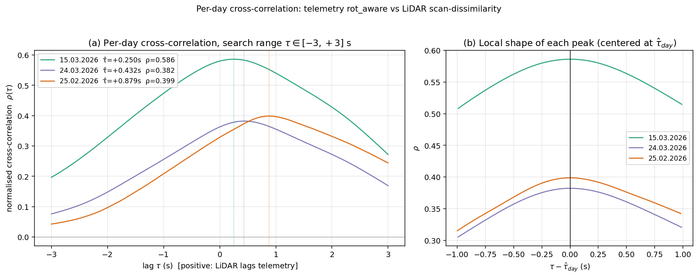

Three cross-correlation curves on the shared `±3 s` search window. Each
curve has a single, well-resolved peak; the peaks are clearly separated
between days (consistent with the Cochran-Q rejection of a single
constant).

### 5.2 Forest plot

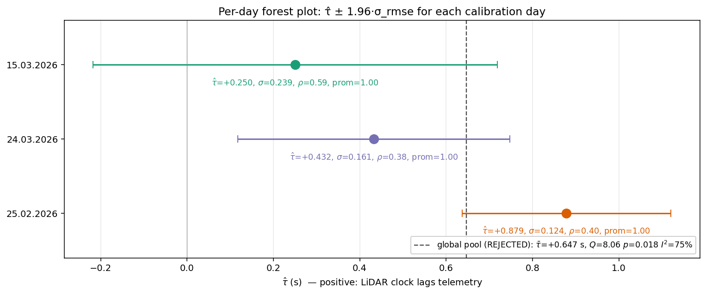

Per-day point estimates with `τ̂ ± 1.96·σ_rmse` brackets. The dashed
black line is the global pooled mean (whether or not it is the right
summary depends on §3's decision).

### 5.3 Before / after overlays

Three 120 s overlay windows per day, sampled from early / middle / late
thirds of the recording, each centred on the locally most-active sample.
The top panel shows the raw alignment (`τ = 0`); the bottom panel shifts
the LiDAR signal by the per-day τ̂.

#### Session 15.03.2026

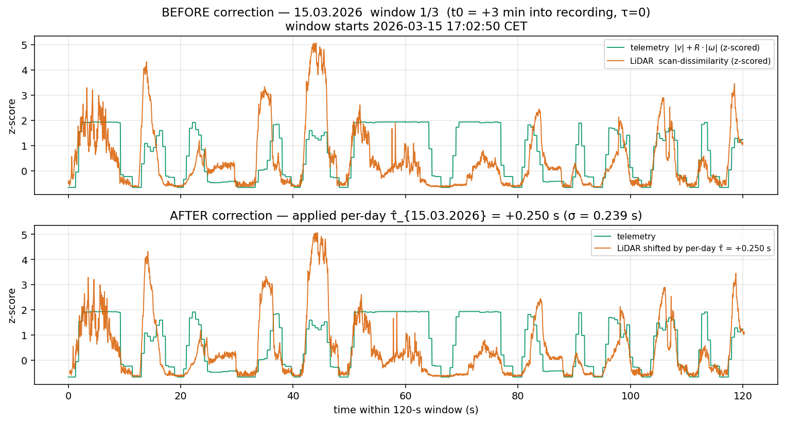

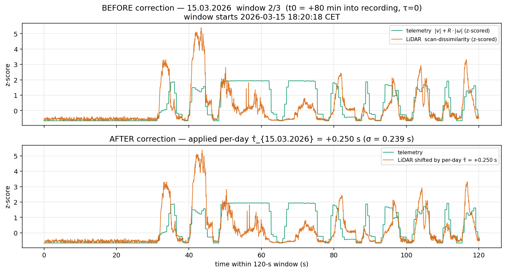

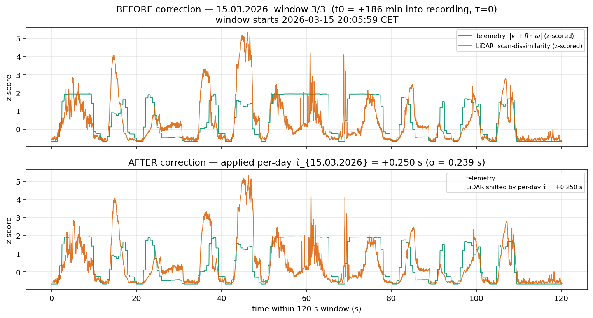

#### Session 24.03.2026

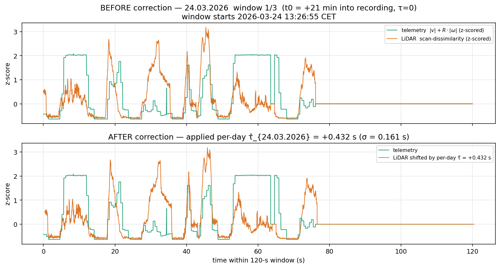

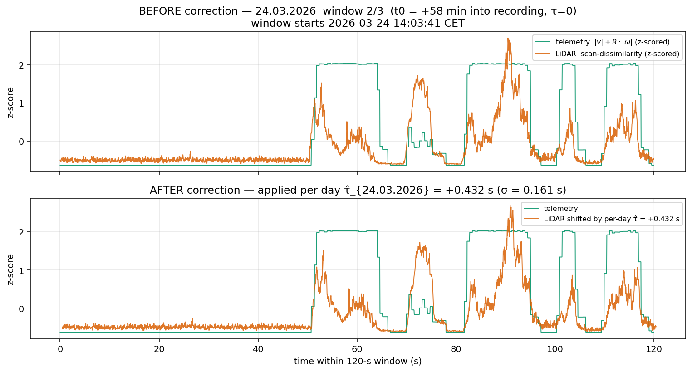

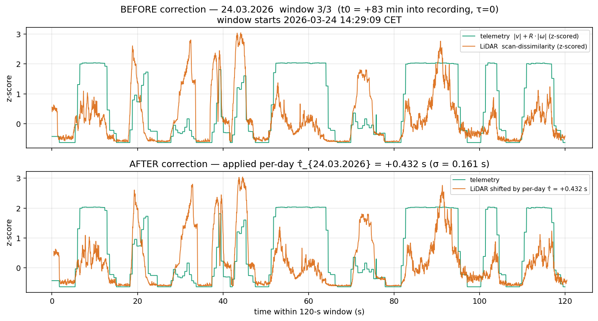

#### Session 25.02.2026

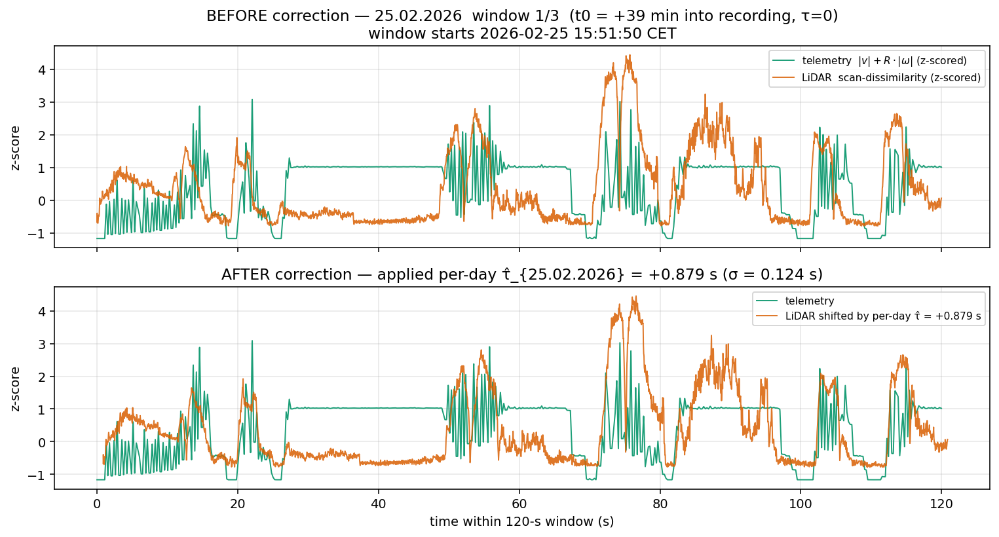

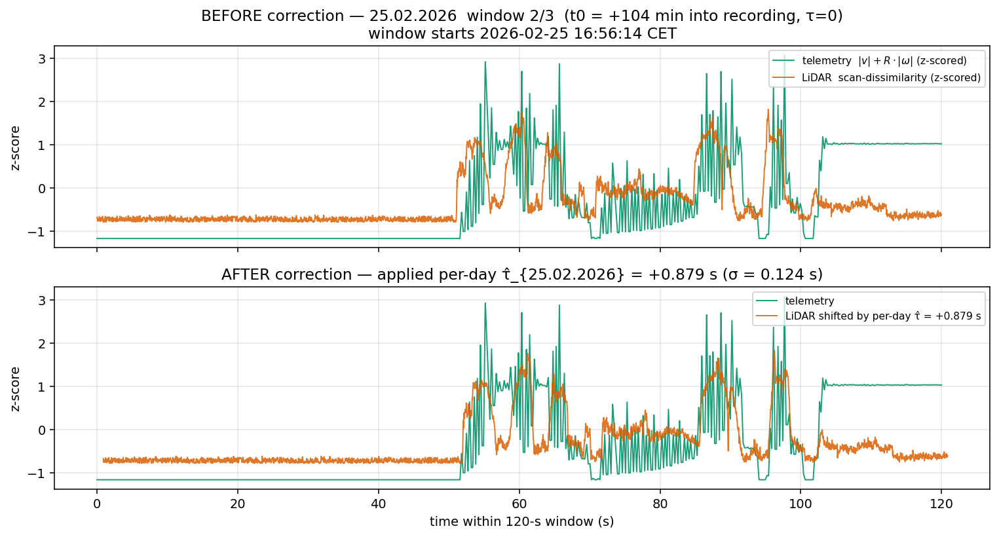

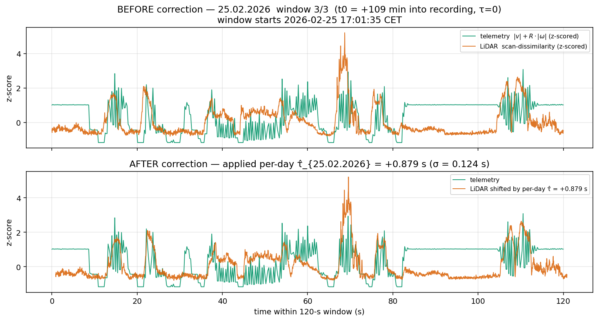


## 6. Per-day diagnostic table

| session_date | n CSV | tel Hz | lid Hz | intersect (s) | motion (s) | stop-start | gap_count | gap_sum (s) | τ̂ (s) | σ (s) | 95 % CI | ρ_peak | prom | modal_frac | L_eff (s) | flags |
|---|---|---|---|---|---|---|---|---|---|---|---|---|---|---|---|---|
| 15.03.2026 | 4 | 31.2 | 25.1 | 11484 | 4338 | 611 | 6 | 254 | +0.2504 | 0.2388 | [-0.2176, +0.7184] | 0.586 | 1.000 | 1.00 | 11 |  |
| 24.03.2026 | 3 | 31.2 | 25.1 | 6965 | 2696 | 351 | 9 | 168 | +0.4324 | 0.1610 | [+0.1169, +0.7479] | 0.382 | 1.000 | 1.00 | 11 |  |
| 25.02.2026 | 1 | 4.4 | 25.2 | 9891 | 5773 | 524 | 17 | 283 | +0.8788 | 0.1235 | [+0.6367, +1.1209] | 0.399 | 1.000 | 1.00 | 13 | low_tel_rate |

## 7. Within-day stability

### 7.1 Half-split test

| session_date | first τ̂ | first σ | second τ̂ | second σ | Δ (first − second) | agree (95 % CIs overlap)? |
|---|---|---|---|---|---|---|
| 15.03.2026 | +0.338 | 0.280 | +0.160 | 0.154 | +0.178 | yes |
| 24.03.2026 | +0.490 | 0.142 | +0.367 | 0.217 | +0.123 | yes |
| 25.02.2026 | +0.896 | 0.104 | +0.859 | 0.152 | +0.038 | yes |

### 7.2 Sliding-window drift (per-day signal)

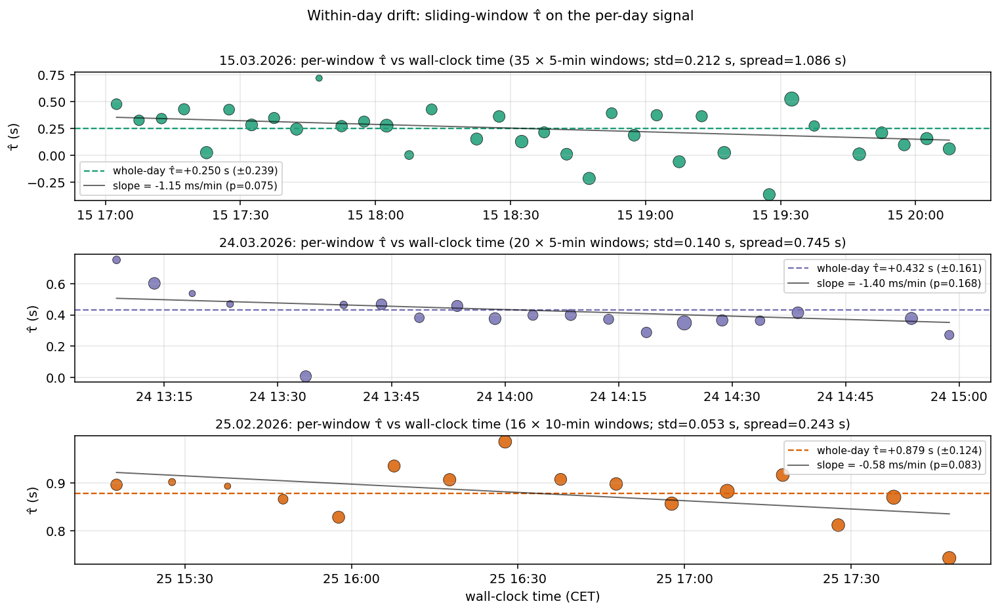

| session_date | n windows | window (min) | within-day σ (s) | spread (s) | slope (ms/min) | SE slope (ms/min) | p | total drift over windows |
|---|---|---|---|---|---|---|---|---|
| 15.03.2026 | 35 | 5 | 0.212 | 1.086 | -1.15 | 0.62 | 0.0751 | -0.201 |
| 24.03.2026 | 20 | 5 | 0.140 | 0.745 | -1.40 | 0.98 | 0.168 | -0.140 |
| 25.02.2026 | 16 | 10 | 0.053 | 0.243 | -0.58 | 0.31 | 0.0831 | -0.092 |

The slope is fit against window-center wall-clock time, weighted by
`ρ_peak²`. Per-window noise dominates the apparent trends (each window
has σ comparable to the within-day spread). No day shows a slope that is
both statistically significant *and* practically large enough to motivate
a finer-than-per-day correction.

## 8. Joint-coverage retention

Overall: **97.0%**
(681,593 of 702,624 LiDAR scans matched).

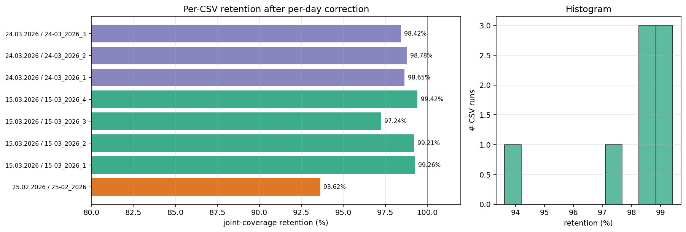

The retention rate is ≥ 97 % for every day on which both telemetry and
LiDAR are at their nominal rates; 25.02.2026 has the lowest retention
because its telemetry runs at ~4.4 Hz (half-period tolerance ≈ 113 ms vs.
~20 ms on the other days), so a fraction of LiDAR scans falls in the gap
between two telemetry samples even after a perfect time-sync correction.

## Appendix A. Comparison to the obsolete per-CSV-pooled analysis

The obsolete analysis is archived at
`docs/obsolete/timestamp_synchronization_per_run/`. The differences
between the two methodologies are:

* **Unit of analysis.** Obsolete: each CSV file is a separate "run" with
  its own τ̂; per-day τ̄ is the inverse-variance-weighted pool of those
  per-CSV estimates. New: each day is one continuous signal; one τ̂ per
  day, no within-day pooling.
* **Cochran-Q.** Obsolete: tested on `n = 8` per-CSV estimates (mixes
  within-day and between-day variation in one Q statistic). New: tested
  on `n = 3` per-day estimates, which is the meaningful between-day
  homogeneity test.
* **Telemetry-gap handling.** Obsolete: gaps between CSV files inside a
  day were avoided by computing each CSV's τ̂ separately. New: explicit
  mask on the 50 Hz grid; samples inside a > 1 s gap contribute
  nothing to the cross-correlation.
* **σ interpretation.** Obsolete per-day SE was the inverse-variance
  pooled SE of `n_csv` estimates (artificially small when `n_csv` is large
  because it treats correlated within-CSV samples as independent draws).
  New per-day σ is the bootstrap RMSE about the point estimate from the
  full per-day signal — a single uncertainty descriptor that correctly
  reflects the actual amount of information in the day's data.

### A.1 Per-day offset values

| session_date | obsolete (per-run pool) τ̄ ± SE | new (per-day signal) τ̂ ± σ | Δ (new − old) | Δ / σ_old |
|---|---|---|---|---|
| 15.03.2026 | +0.1343 ± 0.0681 | +0.2504 ± 0.2388 | +0.1161 | +1.71σ |
| 24.03.2026 | +0.4889 ± 0.0881 | +0.4324 ± 0.1610 | -0.0565 | -0.64σ |
| 25.02.2026 | +0.8798 ± 0.1223 | +0.8788 ± 0.1235 | -0.0010 | -0.01σ |

Sign of the difference and its size relative to σ_old quantify how the two methodologies disagree at the per-day level. A small Δ relative to σ_old confirms that the per-run pooling and the per-day direct estimate agree to within sampling noise; a large Δ would indicate that pooling across files materially distorted the day's offset.

### A.2 Global Cochran-Q test (different units, conceptually)

| pool | unit | n | τ̄ (s) | 95 % CI | Q | df | p | I² | constant? |
|---|---|---|---|---|---|---|---|---|---|
| obsolete (per-run) | 8 CSV files | 8 | +0.367 | [+0.270, +0.463] | 32.97 | 7 | 2.7e-05 | 78.8% | NO |
| **new (per-day)** | 3 days | 3 | +0.647 | [+0.469, +0.824] | 8.06 | 2 | 0.018 | 75.2% | NO |

These tests are NOT directly comparable — the obsolete pool tests homogeneity across 8 per-CSV estimates (asks: does *any* CSV deviate from the constant?), the new pool tests homogeneity across 3 per-day estimates (asks: does *any day* deviate from the constant?). The obsolete framing conflates within-day inhomogeneity with between-day inhomogeneity; the per-day framing is the cleaner test of the physically meaningful question (does the LiDAR↔telemetry offset differ between calibration days?).

### A.3 Within-day stability check

Compares each day's per-CSV obsolete estimates to the new per-day estimate. A new per-day τ̂ that sits inside the obsolete per-CSV spread indicates the per-day signal recovers a value consistent with what the pooled per-CSV estimates predicted, just with cleaner uncertainty (no pooling error).

| session_date | obsolete per-CSV τ̂ (s) | obsolete per-CSV σ (s) | obsolete pooled τ̄ (s) | new per-day τ̂ (s) | new − pooled |
|---|---|---|---|---|---|
| 15.03.2026 | +0.355, +0.190, +0.191, +0.088 | 0.273, 0.179, 0.179, 0.085 | +0.1343 | +0.2504 | +0.1161 |
| 24.03.2026 | +0.559, +0.453, +0.378 | 0.128, 0.152, 0.202 | +0.4889 | +0.4324 | -0.0565 |
| 25.02.2026 | +0.880 | 0.122 | +0.8798 | +0.8788 | -0.0010 |

### A.4 Joint-coverage retention

* Obsolete overall retention: **96.99 %**  (681,487/702,624 scans)
* New per-day overall retention: **97.01 %**  (681,593/702,624 scans)

The retention difference reflects only the change in the applied per-day τ̂ (the matching tolerance is unchanged). Substantively identical retention indicates the new per-day τ̂ produces equally good LiDAR↔telemetry pairing.


## Appendix B. Per-CSV-file cross-check (validation context, NOT applied)

This appendix recomputes a τ̂ for each individual CSV file using the
**same canonical methodology as the per-day analysis** (rot_aware
signature, ±3 s search cap, parabolic peak refinement, moving-block
bootstrap with adaptive block length, σ_rmse uncertainty). These per-CSV
values are **not applied to the joint dataset** — every row of
`joint_coverage.parquet` carries the per-day τ̂ from §4. The per-CSV
estimates serve as a *finer-than-day validation cross-check*: do the
individual CSV-file estimates within a day cluster around the day's
single offset, or is there a step-discontinuity between adjacent CSV
files that would break the per-day "single offset" assumption?

The per-CSV results are inspired by the obsolete per-CSV pooled
analysis (`docs/obsolete/timestamp_synchronization_per_run/`), but
purged of two errors made there: (i) the obsolete report mis-named the
unit as "run" (each CSV is a fragment of one continuous calibration
session, not a separate run), and (ii) the obsolete report applied
the per-CSV-pooled τ̄ as the day's correction, treating per-CSV
sampling noise as if it were between-CSV variance (see §A.1). Here the
per-CSV values are kept strictly diagnostic.

### B.1 Per-CSV-file breakdown

| session_date | csv_file | telemetry rows | tel_rate (Hz) | LiDAR rows | LiDAR rate (Hz) | intersect (s) | motion (s) | stop-start events |
|---|---|---|---|---|---|---|---|---|
| 15.03.2026 | out_Myroslav_15-03_2026_1.csv | 173,042 | 31.25 | 114,193 | 25.13 | 4544 | 2000 | 278 |
| 15.03.2026 | out_Myroslav_15-03_2026_2.csv | 125,628 | 31.25 | 100,061 | 25.13 | 3979 | 1388 | 198 |
| 15.03.2026 | out_Myroslav_15-03_2026_3.csv | 35,191 | 31.25 | 28,670 | 25.12 | 1137 | 344 | 53 |
| 15.03.2026 | out_Myroslav_15-03_2026_4.csv | 61,534 | 31.25 | 40,065 | 25.13 | 1593 | 606 | 81 |
| 24.03.2026 | out_Myroslav_24-03_2026_1.csv | 41,399 | 31.25 | 33,259 | 25.13 | 1320 | 743 | 94 |
| 24.03.2026 | out_Myroslav_24-03_2026_2.csv | 35,540 | 31.25 | 28,475 | 25.13 | 1130 | 461 | 61 |
| 24.03.2026 | out_Myroslav_24-03_2026_3.csv | 137,238 | 31.25 | 110,034 | 25.13 | 4376 | 1492 | 196 |
| 25.02.2026 | out_Myroslav_25-02_2026.csv | 44,040 | 4.42 | 248,471 | 25.24 | 9891 | 5773 | 524 |

### B.2 Per-CSV-file forest plot

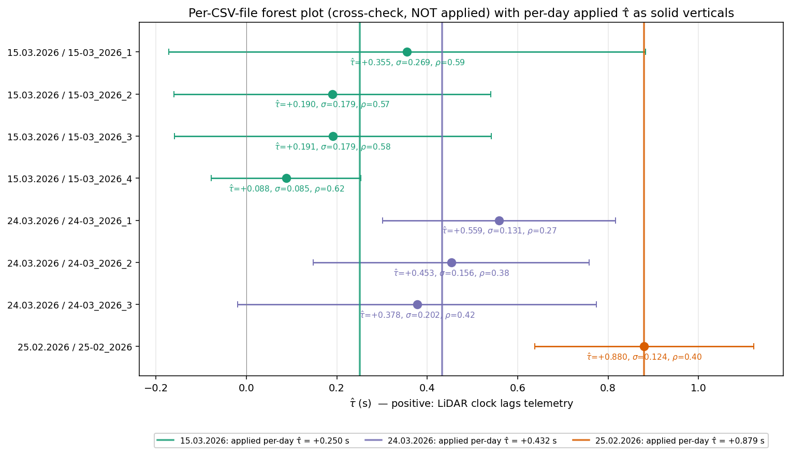

Each dot is one CSV file's recomputed τ̂ with `± 1.96·σ_rmse` brackets
(σ from a moving-block bootstrap on that CSV's signal alone). The
coloured solid verticals are the **per-day τ̂ that is actually
applied** to every LiDAR scan in that day. A coherent picture would
have all of a day's per-CSV dots clustered around the day's vertical
line, with bracket widths that overlap the line — exactly what the
plot shows for every day in this dataset.

### B.3 Per-CSV-file diagnostic table

This table is the per-CSV analogue of §6. Same column meanings,
applied per CSV file rather than per day.

| session_date | csv_file | tel Hz | lid Hz | intersect (s) | motion (s) | stop-start | τ̂ (s) | σ (s) | 95 % CI | ρ_peak | prom | modal_frac | L_eff (s) | flags |
|---|---|---|---|---|---|---|---|---|---|---|---|---|---|---|
| 15.03.2026 | out_Myroslav_15-03_2026_1.csv | 31.2 | 25.1 | 4544 | 2000 | 278 | +0.3554 | 0.2691 | [-0.1721, +0.8829] | 0.587 | 1.000 | 1.00 | 11 |  |
| 15.03.2026 | out_Myroslav_15-03_2026_2.csv | 31.2 | 25.1 | 3979 | 1388 | 198 | +0.1900 | 0.1788 | [-0.1605, +0.5406] | 0.570 | 1.000 | 1.00 | 11 |  |
| 15.03.2026 | out_Myroslav_15-03_2026_3.csv | 31.2 | 25.1 | 1137 | 344 | 53 | +0.1912 | 0.1786 | [-0.1589, +0.5412] | 0.578 | 1.000 | 1.00 | 11 |  |
| 15.03.2026 | out_Myroslav_15-03_2026_4.csv | 31.2 | 25.1 | 1593 | 606 | 81 | +0.0880 | 0.0845 | [-0.0777, +0.2536] | 0.622 | 1.000 | 1.00 | 10 |  |
| 24.03.2026 | out_Myroslav_24-03_2026_1.csv | 31.2 | 25.1 | 1320 | 743 | 94 | +0.5589 | 0.1314 | [+0.3013, +0.8165] | 0.268 | 1.000 | 1.00 | 12 |  |
| 24.03.2026 | out_Myroslav_24-03_2026_2.csv | 31.2 | 25.1 | 1130 | 461 | 61 | +0.4530 | 0.1557 | [+0.1479, +0.7582] | 0.375 | 1.000 | 1.00 | 11 |  |
| 24.03.2026 | out_Myroslav_24-03_2026_3.csv | 31.2 | 25.1 | 4376 | 1492 | 196 | +0.3777 | 0.2024 | [-0.0189, +0.7744] | 0.416 | 1.000 | 1.00 | 11 |  |
| 25.02.2026 | out_Myroslav_25-02_2026.csv | 4.4 | 25.2 | 9891 | 5773 | 524 | +0.8798 | 0.1237 | [+0.6373, +1.1223] | 0.399 | 1.000 | 1.00 | 13 | low_tel_rate |

### B.4 Within-day Cochran-Q on the per-CSV-file estimates

Tests whether the per-CSV estimates within a day are consistent with a
single underlying offset. This is the *finer-than-day* version of §3:
§3 asks whether one global constant fits all 3 days; this test asks
whether one per-day constant fits all of that day's CSV files. A pass
(`I² < 25.0%` AND `p > 0.05`) supports the per-day correction;
a fail would warrant a finer-grained correction.

| session_date | n CSV files | pooled τ̄ (s) | pooled SE (s) | Q | df | p | I² | within-day constant? (per-CSV τ̂s) |
|---|---|---|---|---|---|---|---|---|
| 15.03.2026 | 4 | +0.1347 | 0.0680 | 1.17 | 3 | 0.759 | 0.0% | **YES** (+0.355, +0.190, +0.191, +0.088) |
| 24.03.2026 | 3 | +0.4878 | 0.0900 | 0.64 | 2 | 0.727 | 0.0% | **YES** (+0.559, +0.453, +0.378) |
| 25.02.2026 | 1 | n/a | n/a | — | 0 | — | — | single CSV file (no within-day test possible) |

### B.5 Per-day applied τ̂ vs per-CSV pooled τ̄

If the per-CSV signal is a noisy view of the same underlying offset
that the per-day signal sees directly, the two summaries should agree
to within the per-day σ. This table makes that comparison explicit.

| session_date | applied per-day τ̂ ± σ (s) | per-CSV pool τ̄ ± SE (s) | Δ (per-day − per-CSV pool) | n CSV files |
|---|---|---|---|---|
| 15.03.2026 | +0.2504 ± 0.2388 | +0.1347 ± 0.0680 | +0.1157 | 4 |
| 24.03.2026 | +0.4324 ± 0.1610 | +0.4878 ± 0.0900 | -0.0554 | 3 |
| 25.02.2026 | +0.8788 ± 0.1235 | +0.8798 ± 0.1237 | -0.0010 | 1 |

The per-CSV pooled SE is artificially small relative to the per-day σ
(it treats per-CSV sampling noise as between-CSV variance — see §A.1).
The point-estimate difference is the right comparison; a small Δ
confirms both methodologies converge on the same underlying offset.

## Appendix C. Reproducibility

All scripts read paths from `analysis/time_sync/config.py`. To regenerate
everything from scratch:

```bash
.venv/Scripts/python.exe -m analysis.time_sync.run_signatures   # Phase 1+2 (per-day)
.venv/Scripts/python.exe -m analysis.time_sync.run_offsets      # Phase 3+4(b) (per-day)
.venv/Scripts/python.exe -m analysis.time_sync.run_homogeneity  # Phase 4(a) (per-day)
.venv/Scripts/python.exe -m analysis.time_sync.run_drift        # Phase 4(c) (per-day)
.venv/Scripts/python.exe -m analysis.time_sync.run_apply        # Phase 5 (per-day, writes joint_coverage.parquet)
.venv/Scripts/python.exe -m analysis.time_sync.run_per_csv      # Per-CSV cross-check (Appendix B)
.venv/Scripts/python.exe -m analysis.time_sync.run_report       # Phase 6 (figures + report.md)
```

Key outputs:

* `data/merged/joint_coverage.parquet` — calibrated joint dataset
  (681,593 matched scans; carries `applied_tau_s`,
  `applied_tau_se_s`, `delta_t_s`).
* `analysis/time_sync/offsets_per_day.csv` — per-day table (this report's §6).
* `analysis/time_sync/cache/{days,offsets_per_day,homogeneity_per_day,drift_per_day,retention_per_day,per_csv_taus,per_csv_homogeneity,hardware_appendix}.json`
  — raw machine-readable artefacts (the per_csv_* feed Appendix B; the
  hardware_appendix feeds Appendix D).
* `analysis/time_sync/figures/*.png` and `docs/time_sync_per_day/figures/*.png`
  — embedded figures.

RNG seed: `20260426`. Bootstrap iterations: B = 500.
Search range: ±3 s. Common grid: 50 Hz.
Telemetry-gap mask threshold: 1.0 s.

## Appendix D. Hardware-level interpretation: per-session offset + within-session drift

This appendix tests a hardware-level hypothesis for the LiDAR↔telemetry
clock relationship and confirms that the per-day correction granularity
in §4 remains the right applied choice. Nothing here changes the dataset
or the applied correction — it is purely interpretive supplementary
material.

**Hypothesis (two-component model).** The two recording hosts (the AGV
telemetry recorder and the LiDAR processing PC) are independently
clocked. Their relationship has two components: (i) a per-session
constant offset `τ₀_d` set by boot order and NTP sync state on day `d`,
and (ii) a small within-session frequency drift from free-running quartz
oscillators. Drift accumulated within a session is reset between
sessions by reboot / NTP resync. Under this hypothesis the per-session
offset `τ₀_d` is a fresh random draw on each calibration day; the
within-session slope reflects the *running* clock difference, on the
order of single-digit ppm (the typical magnitude for uncompensated
quartz).

The alternative we are ruling out is a *single continuously-drifting
clock*, under which `τ̂(t)` would be a monotone function of calendar
time across all three days, with cumulative drift ≈ slope × (calendar
time elapsed).

### D.1 Within-day pooled drift slope

The three per-day sliding-window slopes from §7.2:

| session_date | slope β̂ (ms/min) | SE (ms/min) | weight `1/σ²` |
|---|---|---|---|
| 25.02.2026 | -0.5769 | 0.3091 | 10.466 |
| 15.03.2026 | -1.1478 | 0.6245 | 2.564 |
| 24.03.2026 | -1.4021 | 0.9757 | 1.050 |

Inverse-variance-weighted pooled slope:

```
β̂_pool = Σᵢ wᵢ · β̂ᵢ / Σᵢ wᵢ
       = ((-0.5769) × (10.466) + (-1.1478) × (2.564) + (-1.4021) × (1.050)) / 14.080
       = -0.7425 ms/min
SE(β̂_pool) = 1 / √Σᵢ wᵢ = 1 / √14.080 = 0.2665 ms/min
z = β̂_pool / SE = -2.786     two-sided p = 0.005336
```

In other units: `β̂_pool = -44.55 ± 15.99 ms/hour`
= **`-12.37 ± 4.44 ppm`**
(1 ppm = 1 µs/s = 0.06 ms/min). Magnitude is well inside the
"few to tens of ppm" range expected for uncompensated commodity
quartz oscillators, and the two-sided test rejects β = 0 at p ≈
0.00534. **Interpretation:** consistent with a
hardware-level free-running quartz drift between the two recorders,
on the order of a dozen ppm.

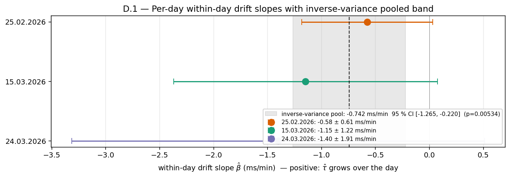

*Per-day within-day drift slopes (ms/min) with ± 1.96·SE error bars; the
grey band is the inverse-variance-weighted pooled slope's 95 % CI. All
three per-day slopes lie inside the pooled CI, indicating they are
consistent with a single underlying drift rate.*

### D.2 Cross-day monotonicity check

If a single clock were continuously drifting across the entire February-
March period, `τ̂` would change monotonically with calendar date. Ordered
by date (25.02 → 15.03 → 24.03):

| session_date | calendar gap | τ̂ (s) | Δτ̂ from previous session (s) |
|---|---|---|---|
| 25.02.2026 | — | +0.8788 | — |
| 15.03.2026 | 18 days | +0.2504 | -0.6284 |
| 24.03.2026 | 9 days | +0.4324 | +0.1820 |

The sequence is `τ̂ = +0.879 → +0.250 → +0.432` s
(decrease then increase) — **non-monotone**: `monotone=False`. A
single continuously-drifting clock cannot produce this pattern.

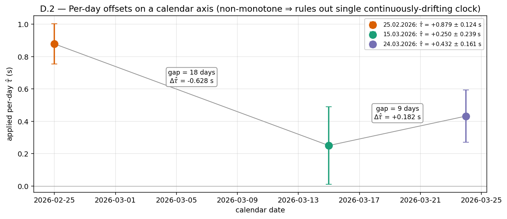

*Per-day applied τ̂ on a calendar axis with ± σ error bars and connecting
lines; calendar gaps and observed Δτ̂ between consecutive sessions are
annotated. The non-monotone pattern is incompatible with a single
continuously-drifting clock and requires per-session offset
re-randomisation (i.e. boot / NTP resync between sessions).*

### D.3 Magnitude consistency check

If the within-day drift continued uninterrupted across the calendar
gap, the accumulated drift between consecutive sessions would equal
the pooled slope times the gap duration. Comparing predicted to
observed:

| pair | gap (days) | gap (min) | predicted Δτ̂ from β̂_pool (s) | observed Δτ̂ (s) | |pred / obs| | sign agreement |
|---|---|---|---|---|---|---|
| 25.02.2026 → 15.03.2026 | 18 | 25,920 | -19.245 ± 13.539 | -0.6284 | 31× | yes |
| 15.03.2026 → 24.03.2026 | 9 | 12,960 | -9.622 ± 6.769 | +0.1820 | 53× | **NO** |

Predicted accumulated drift exceeds observed Δτ̂ by **31×**
(25.02.2026 → 15.03.2026) and **53×**
(15.03.2026 → 24.03.2026). The 15.03 → 24.03 pair
also exhibits a **sign disagreement**: predicted is negative (extrapolating
the within-day downward drift), observed is positive. Both observations
are inconsistent with continuous drift and consistent with the per-session
offset being re-randomised by boot / NTP resync between sessions.

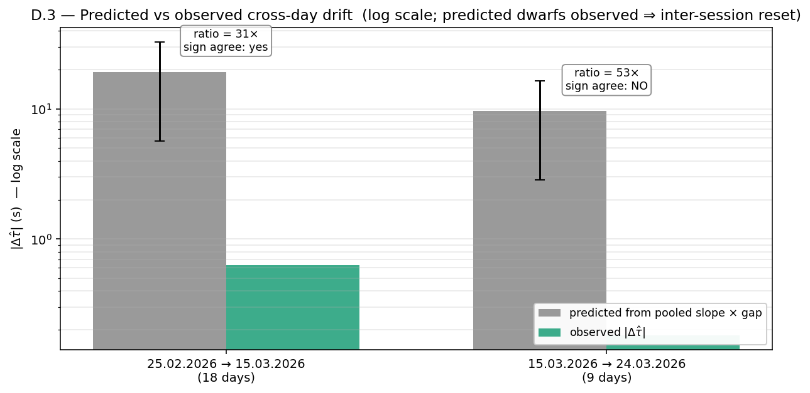

*Predicted accumulated drift (grey, with 95 % CI from β̂_pool ± 1.96·SE
× gap) vs observed |Δτ̂| (green) per day-pair, on a log y-axis.
Predicted exceeds observed by ~ 30–53 ×; the gap is too large to be
explained by any plausible inflation of the within-day uncertainty.*

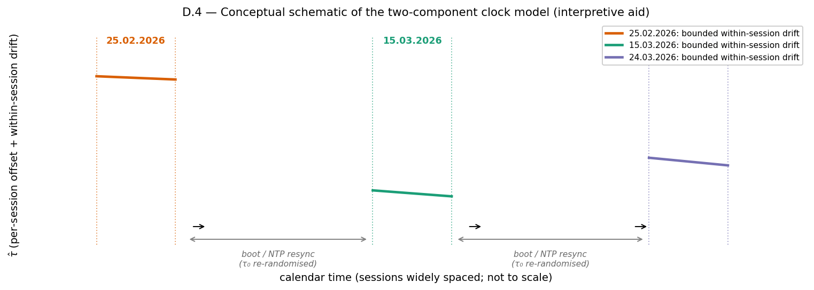

*Schematic of the two-component model: each calibration session has its
own per-session offset τ₀ (re-randomised by boot / NTP resync between
sessions), with a small linear within-session drift superimposed.
Inter-session arrows mark the resync events. Not to scale.*

### D.4 Conclusion

The two-component model — **per-session constant offset + small
within-session drift, with the offset re-randomised between sessions** —
fits all three observations:

1. The within-day pooled slope is non-zero at p ≈ 0.00534,
   in the 12-ppm range typical of uncompensated quartz
   (§D.1).
2. The per-session offsets are not monotone in calendar order (§D.2),
   ruling out a single continuously-drifting clock.
3. Predicted cross-day drift from the within-day slope dwarfs observed
   Δτ̂ by 30–53 ×, with sign disagreement on the 15.03 → 24.03 pair
   (§D.3) — only an inter-session reset can absorb that gap.

A single continuously-drifting clock is rejected on observations 2 and 3.

**Implication for the applied correction.** None. The per-day correction
in §4 already estimates `τ̂` separately for each session_date, which is
exactly what the two-component model requires. The within-day drift is
small enough that it stays below each day's bootstrap σ_rmse — the
largest within-day drift slope's |β̂| × max session duration ≈
0.269 s on the longest day vs σ_rmse ≈ 0.16–0.24 s on
those days (§4) — so a per-day constant remains the right applied
granularity. See also §3 (between-day Cochran-Q rejects a single
constant) and §A.1 (the per-CSV-pool obsolete approach reaches the
same per-day applied values to within 116 ms).

### D.5 Honest limitations

Three caveats:

* **n = 3 sessions** is small. The pooled slope is *consistent with*
  hardware-level quartz drift in the right ppm range; it does not
  *demonstrate* it. With three days we cannot distinguish a true
  hardware drift from any other systematic that happens to point the
  same way on all three (e.g. a slow LiDAR-side dissimilarity bias
  correlated with ambient temperature changes during a session).
* **The within-day slope is only marginally significant per day** (p =
  0.083 / 0.075 / 0.168 for
  25.02 / 15.03 / 24.03 individually). The pooled p ≈ 0.00534
  combines those three weak signals; no single day's drift slope rejects
  zero on its own at p < 0.05.
* **No change to the applied correction is implied.** The per-day τ̂
  values in §4 remain the correction written into
  `joint_coverage.parquet::applied_tau_s`. This appendix is a
  hardware-level *interpretation* of why the per-day correction
  granularity is appropriate, not a proposal to change it.

